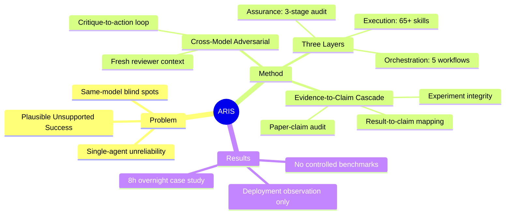

## Summary

ARIS 是一个开源的自主科研系统，核心洞察是"单 agent 执行长期任务不可靠"——会产生看似合理但缺乏证据支撑的 claims。解决方案是 **跨模型对抗协作**：executor 推进任务，来自不同模型家族的 reviewer 独立审计并要求修订，形成 critique-to-action 循环直至收敛。三层架构：Execution（65+ 可复用 skills）、Orchestration（5 个端到端 workflow）、Assurance（三阶段证据审计 + 五轮编辑 + 引用核查）。

## Problem & Motivation

现有自主科研系统存在三个核心缺陷：

1. **同模型自纠**：generator 和 validator 共享归纳偏置，相关错误无法被发现
2. **紧耦合工作流**：难以替换单个阶段或从保存状态恢复
3. **缺乏完整性检查**：很少有系统级检查实验完整性和论文质量

核心失败模式是 **"plausible unsupported success"**：长期运行的 agent 产生的 claims，其证据支持可能不完整、误报、或从 executor 的 framing 隐性继承。

核心假设：**"Any long-term task performed by a single agent is unreliable."**

## Method

### 三层架构

**Execution Layer：**
- 65+ Markdown 定义的可复用 skills（SKILL.md 文件，YAML frontmatter + 自然语言流程规范）
- MCP（Model Context Protocol）桥接模型集成
- 持久化 research wiki（跨 session 记忆）
- FigureSpec 渲染器（JSON → SVG，确定性图表生成）

**Orchestration Layer：**
- 5 个端到端 workflow：Idea Discovery、Experiment Bridge、Auto Review Loop、Paper Writing、Rebuttal
- 4 档 effort preset：lite (~0.4x)、balanced (1x)、max (~2.5x)、beast (~5-8x)
- 可配置 reviewer routing

**Assurance Layer：**
- 三阶段证据-claim 审计 cascade
- 五轮科学编辑 pipeline
- 数学证明验证
- PDF 视觉审查
- 引用审计

### Cross-Model Adversarial Collaboration

**核心机制：** critique-to-action 循环。executor 产出 artifact → 跨家族 reviewer 打分并返回结构化 action items → executor 处理 → 收敛检查。终止条件：分数 >6/10 且所有 critical items 解决，或最多 4 轮。

**Reviewer 独立性协议：** reviewer 直接读取被引用的 artifacts（而非 executor 的摘要），避免评估 executor 的 framing 而非底层工作。

**Reviewer 访问权限：** Document-only、Artifact-augmented、Repository-level 三档。

**Reviewer context 策略：** Fresh（每轮新线程，防止确认偏误）vs. Cross-round（保留状态以验证收敛）。

### Evidence-to-Claim Audit Cascade

**Stage 1 — Experiment-integrity audit：** 跨模型 reviewer 审计评估代码/输出，检查 5 种失败模式：模型生成的 reference labels、自归一化分数、phantom results、死代码/未使用指标膨胀、scope 膨胀。

**Stage 2 — Result-to-claim mapping：** 每个 claim 获得判定：supported、partially supported、invalidated。Stage 1 的 integrity_status 传播；"fail" 状态的 claims 不能被 fully supported。

**Stage 3 — Paper-claim audit：** 零上下文 reviewer（新线程，无历史）交叉检查稿件数值 claims 与 claim ledger 和原始文件。检查项：数值不匹配、best-seed cherry-picking、config 不匹配、聚合错误、scope overclaim。

### 五大设计原则

1. **异构模型优于单模型自纠** — 跨家族 executor/reviewer 配对（默认：Claude executor + GPT reviewer）
2. **模块化 skill 文件优于单体 agent** — 每个能力是一个 SKILL.md 文件
3. **可组合性优于固定 pipeline** — skills 链接成 workflow，支持 checkpoint 恢复
4. **可移植性优于 vendor lock-in** — 纯文本文件，同一 SKILL.md 跨 Claude Code/Codex CLI/Cursor 工作
5. **持久记忆优于短暂上下文** — per-project research wiki，4 种实体类型，8 种类型化关系

## Key Results

**仅提供观测性部署证据，无受控 benchmark 结果。**

部署数据（2026年4月）：
- 6 个 executor 平台（3 个测试 + 3 个适配）
- 6+ reviewer 模型（GPT、Gemini、GLM、MiniMax、Kimi、DeepSeek）
- 4 个 GPU backend
- 9 个 venue template families
- 65+ skills，30+ 社区贡献 skills
- Free-tier API 访问（ModelScope）

Overnight 运行案例（~8小时）：
- 4 轮 review-revise
- 内部 reviewer 分数：5.0 → 7.5/10
- 20+ GPU 实验启动
- 移除了 unsupported claims

Feature 对比（Table 4）：ARIS 是唯一具备默认跨家族策略、完整对抗审查、可组合 skills、端到端研究 workflow、完整 assurance stack、跨平台可移植性的系统。对比 AI Scientist（部分/无）、Agent Laboratory（无）、MetaGPT（部分/无）。

**作者承认局限**：无受控评估，依赖观测证据；未来计划按 Appendix E 协议进行 compute-matched controlled comparisons。

## Strengths & Weaknesses

**Strengths：**
- **洞察到位**："单 agent 长期任务不可靠" 的判断有洞察，cross-model adversarial 是直接的解决方案
- **系统完整**：三层架构清晰，Assurance Layer 设计了多层防御（实验完整性 → claim 映射 → 论文审计）
- **工程投入大**：65+ skills、6 个 MCP bridges、完整的审计 pipeline，开源可用
- **诚实**：明确承认无受控实验、correctness 无保证、安全问题

**Weaknesses：**
- **零定量评估**：全文没有一个 benchmark 对比，全是"部署了多少模块"的观察性证据
- **核心 claim 未验证**：cross-model adversarial 真的比 same-model self-critique 好吗？没数据
- **安全/隐私问题未解**：repository-level review 会把代码发给外部 API，对私有研究是硬伤
- **Reviewer 本身的可靠性**：如果 executor 和 reviewer 都有盲区怎么办？系统只转移了信任对象
- **Outer loop 是 prototype**：meta-optimization 只是原型，真正的 self-improvement 未实现

## Mind Map

## Notes

- 这个工作和 AI Scientist、Agent Laboratory 同赛道，差异点在 cross-model adversarial。但整个赛道的根本问题是：**谁来评判评判者？**
- Assurance Layer 的三阶段审计设计有参考价值，但没有实验证明它真正 catch 了多少问题
- Appendix E 提出的 benchmark 协议（12+ papers, 5 conditions, 3 blinded raters）是合理的，但为什么没做？算力？时间？
- Meta-optimization 的 outer loop 很有意思——如果真的能从 traces 中学习改进 harness，才是真正的 self-improving system。目前只是 prototype。