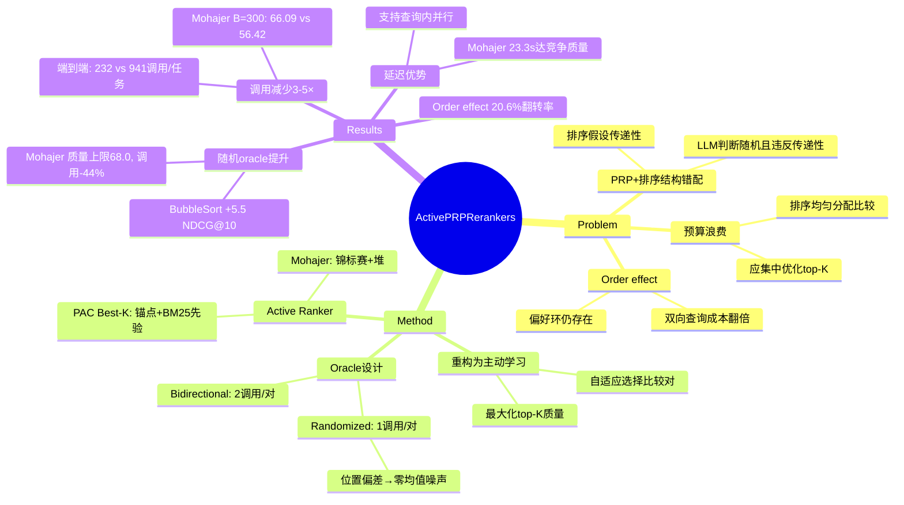

## Summary
将 Pairwise Ranking Prompting (PRP) 重排建模为带噪声的主动学习问题，用 active ranker 替代排序算法，在固定 LLM 调用预算下提升 NDCG@10；提出单向随机 oracle 将位置偏差转化为零均值噪声，成本减半且保持质量。

## Problem & Motivation
RAG 管线中的 LLM 重排通常用 PRP（成对比较）+ 排序算法聚合偏好。但这种配对存在结构性错配：排序假设传递性，而 LLM 判断是随机的且会违反传递性；排序将预算均匀分配给所有比较，在预算受限时浪费资源打磨不稳定的全局排列，而非集中优化 top-K。此外，LLM 存在 order effect（交换文档顺序会翻转判断），标准做法是双向查询（每对 2 次调用）来消除偏差，但成本翻倍且偏好环仍存在。

## Method
**核心重构**：将 PRP 重排建模为**带噪声成对比较的主动学习**，用 active ranker 自适应选择比较对，在固定预算内最大化 top-K 质量。

### 两种 Oracle 设计
1. **Bidirectional oracle**（每对 2 次调用）：标准 PRP 做法，查询两个方向并返回一致性结果。
2. **Randomized-direction oracle**（每对 1 次调用）：每次调用以 0.5 概率随机化文档顺序，将系统性位置偏差转化为零均值噪声。理论证明（附录 E）：尽管单次调用有偏，但 Pr[V_ij=1] = 1 - Pr[V_ji=1] 在期望上保持成对一致性。

### 两种 Active Ranker
选择标准：(C1) top-K 目标、(C2) 噪声容忍且不假设全局序、(C3) anytime 行为（比较累积时产生竞争性前缀）。

1. **Mohajer et al. (2017)**：基于锦标赛的方法，用堆提取识别 best-K，将比较集中在 top-K 边界附近的候选上。每场比赛 1 次 oracle 调用。
2. **PAC Best-K (Agarwal et al., 2022)**：基于锚点的方法，通过锚点和胜者集识别 best-K。锚点来自零成本的 BM25 先验，比较限制在 top K×m (m=3) 的 BM25 前缀内。返回无序集合，用 BubbleSort 产生有序 top-K。

**核心洞察**：排序将所有比较视为等信息量，在预算受限时这种均匀性是浪费的。

## Key Results
**实验设置**：N=100 个 BM25 候选重排为 top-K=10，预算 B ∈ {100, 150, ..., 500} 次 LLM 调用，数据集包括 BEIR 任务（Covid、Robust04、Touche、SciFact、DBPedia）和 TREC DL2019/2020，主要模型 Flan-T5-L/XL。

**Q1：固定预算下 active ranking 是否优于 PRP 重排？**
在调用受限区间内**是**。TREC DL2019/2020 + Flan-T5-XL + bidirectional oracle：
- B=300 时 Mohajer 达到 66.09 vs. BubbleSort 的 56.42（+9.67 NDCG@10）
- 优势在 B=200 到 B=450 区间持续
- 极低预算（B=100-150）时排序更优，因 Mohajer 有预热期（N=100, K=10 时约 100 次调用）
- 高预算（B=500）时 HeapSort (68.21) 略超 Mohajer+Bubble (67.02)，全局精炼开始回报

**Q2：随机方向提示是否改善 NDCG@10-成本权衡？**
**是**，对不同方法效果不同：
- 排序类 PRP：BubbleSort 在 B=300 时获得 +5.5 NDCG@10（56.4→62.0），通过减半每对成本
- Active ranker：Mohajer 质量上限从 66.96 升至 68.0，达到该质量的调用数从 B=450 降至 B=250（减少 44%）

**端到端效率**（表 2，Flan-T5-XL，BEIR 任务）：
- PRP baseline：941–1669 次调用/任务（平均 56.8–60.4 NDCG@10）
- Active ranker：184–345 次调用/任务（平均 55.0–57.3 NDCG@10）
- 调用减少约 **3–5×**
- 随机 oracle 下 Mohajer 从 399 降至 232 次调用/任务

**Order effect**：双向提示在 **20.6%** 的配对上翻转偏好文档，证实显著的顺序效应。翻转率在不同 BM25 排名距离上相对稳定（20.4–22.6%）。

**延迟**：Active ranking 在墙钟时间上更早达到强质量。Mohajer 在约 23.3s 达到竞争性质量，PAC 在约 10.1s，排序仅在更长运行时超越。两种 active ranker 都支持查询内并行（独立锦标赛/锚点比较），可能将墙钟时间减少一个数量级。

**统计显著性**：配对 bootstrap 检验（10,000 次查询重采样，p<0.05）确认：
- 随机 oracle 下：Mohajer+Bubble 在每个预算下显著优于 BubbleSort
- 双向 oracle 下：从 B=200 起显著
- 对比 HeapSort：根据预算，Mohajer+Bubble 显著更好或无显著差异

## Strengths & Weaknesses
**亮点**：
1. **问题重构清晰**：将 PRP 从排序问题重构为主动学习，理论动机充分（排序假设传递性 vs. LLM 判断随机性）
2. **实用价值高**：3-5× 调用减少在成本敏感场景（如生产环境 RAG）有直接价值，且给出明确的实践配方（预算超预热阈值用 Mohajer + 随机 oracle，极低/极高预算回退排序）
3. **随机 oracle 巧妙**：单向随机化将系统性偏差转零均值噪声，理论证明（附录 E）优雅，成本减半且质量不降
4. **实验扎实**：多数据集、多模型、统计检验、延迟分析、消融研究（top-K sweep、order effect 量化）

**局限**：
1. **理论-实践 gap**：随机 oracle 的 NDCG@10 提升"经验一致但无理论解释"（作者自述），缺少理论保证
2. **预热成本**：Mohajer 在极低预算（B<150）时劣于排序，限制了适用场景；PAC 虽预热快但引入超参数 m（默认 3）未系统消融
3. **假设脆弱**：Active ranking 理论假设 oracle 输出条件独立，但真实 LLM API 可能通过缓存或非平稳性违反此假设
4. **成本度量不全**：仅计数 LLM 调用，忽略系统级开销；延迟测量非完全端到端；未实现并行执行（虽算法天然支持）
5. **泛化性未知**：结果可能随 prompt 设计、模型家族、解码设置变化；仅在检索重排场景验证，其他成对比较任务（如 LLM-as-judge）泛化性未测试

**对领域影响**：为 LLM 重排提供了新范式（主动学习 vs. 排序），在预算受限场景有实用价值；随机 oracle 技巧可能启发其他 LLM 偏差缓解方法。但理论基础仍需加强，且需在更多模型/任务上验证鲁棒性。

## Mind Map

## Notes
- **与 PRP-Graph 对比**：表 A.3 显示在更大 Flan 模型上 Mohajer+Bubble 以更少比较获得更好结果，但 PRP-Graph 的自适应配对策略与本文 active ranking 有相似动机，值得深入对比两者的理论基础和适用边界
- **Randomized oracle 的理论 gap**：附录 E 证明了期望上的成对一致性，但为何在有限样本下 NDCG@10 提升？是否与 active ranker 的特定查询模式有关？这个 gap 可能是后续理论工作的切入点
- **跨任务泛化**：LLM-as-judge、偏好对齐（RLHF 中的 reward model）等场景也涉及成对比较，active ranking 是否适用？需要哪些适配？
- **与 listwise/setwise 方法的互补性**：作者提到 listwise 方法（如 Zhuang et al. 2024）操作不同原语，两者可能互补。能否设计混合方法，在预算充足时用 listwise 快速粗排，预算受限时用 active pairwise 精排 top-K？
