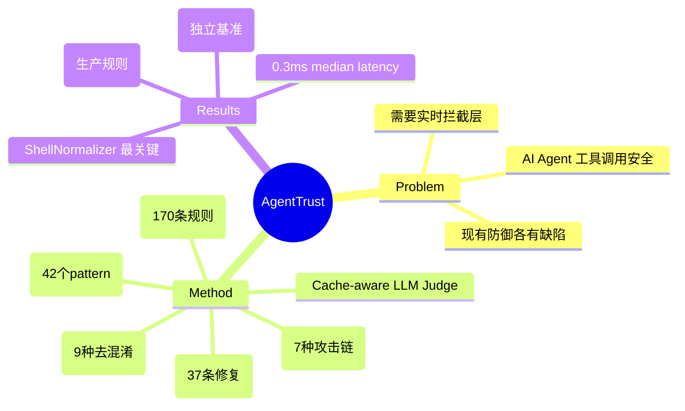

## Summary
一个针对 AI Agent 工具调用的运行时安全拦截框架，通过 shell 去混淆、多步攻击链检测、SafeFix 建议和缓存感知的 LLM 判断，在生产环境中实时拦截危险操作，在 300 场景内部基准上达到 95.0% 判决准确率。

## Problem & Motivation
现代 AI Agent（Claude Code、Cursor、OpenDevin、AutoGPT）通过工具调用执行真实世界的副作用操作，一次误判可能导致不可逆损害。现有防御各有缺陷：(1) 事后 benchmark 无法在生产中阻止伤害；(2) 静态规则易被简单混淆绕过；(3) 沙箱只限制运行环境，无法理解动作语义。需要实时、语义感知、多步感知的安全拦截层。

## Method
AgentTrust 在 Agent 和工具之间插入拦截层，每次工具调用前返回结构化判决（allow/warn/block/review）。核心组件：

**1. ShellNormalizer**：九种纯文本去混淆策略（变量展开、hex/octal 解码、alias 解析、命令替换、ANSI-C 引用等），不执行 eval，返回多个标准化变体供后续分析。

**2. ActionAnalyzer**：42 个正则模式提取风险特征，覆盖文件系统、shell、网络、凭证四类。

**3. PolicyEngine**：170 条 YAML 可配置规则，覆盖云 IAM、容器安全、Kubernetes、数据库提权、凭证文件、服务暴露、反取证等。

**4. RiskChain（SessionTracker）**：七种多步攻击链检测（数据渗出、凭证窃取、持久化、提权、供应链攻击、反向 shell、数据破坏），使用顺序感知的贪婪匹配。

**5. SafeFix Engine**：37 条修复规则，提供更安全的替代方案（如 chmod 777 → chmod 755，curl pipe bash → 先下载再检查）。

**6. Cache-aware LLM-as-Judge**：对模糊输入进行语义判断，使用 block-hash 增量检测减少 token 成本，在 session 增长时只发送变化部分。

**7. Safety Contracts**：四个故障安全不变量（LLM 不可用时返回 review/medium/0.3、拦截器错误返回 review/medium、无匹配返回 allow 可配置、benchmark 规则与生产规则隔离）。

## Key Results
**内部基准（300 场景，六类风险）**：
- 仅生产规则：95.0% 判决准确率，73.7% 风险等级准确率，0.3ms 中位延迟
- 加上 benchmark 兼容规则：97.0% 判决准确率，75.7% 风险准确率

**独立真实世界基准（630 场景，后补丁规则）**：
- 总体判决准确率：96.7%
- 混淆 payload 准确率：~93%
- 对抗性探测（30）：100%

**Baseline 对比**：
| Method | Verdict Acc. | FPR | FNR |
|--------|-------------|-----|-----|
| Trivial regex (50 patterns) | 49.3% | 0.0% | 88.4% |
| NeMo Guardrails (DeepSeek-V3) | 44.7% | 96.2% | 0.0% |
| DeepSeek-V3 zero-shot | 82.3% | 7.5% | 2.3% |
| AgentTrust (rules only) | 95.0% | 2.3% | 5.4% |

**消融**：ShellNormalizer 是最有价值的组件；SafeFix 按设计不影响判决；SessionTracker 在当前场景集中无 measurable 效果。

## Strengths & Weaknesses
**亮点**：
- 问题定义精准——填补了"事后评估"和"静态规则"之间的空白
- 工程完整度高——5000 行核心代码、192 单元测试、四个故障安全不变量
- ShellNormalizer 的纯文本设计避免了 eval 风险，是务实的工程选择
- Cache-aware LLM Judge 解决了真实部署中的成本问题

**局限**：
- 静态分析天花板——规则无法覆盖语义等价但形式不同的操作
- Shell 去混淆故意不完整（不执行 eval），存在绕过空间
- 规则库覆盖有限（170 条），依赖持续维护
- 风险等级主观性强，high/critical 边界模糊
- 仅英文模式
- 拦截器必须在同一信任边界内（in-process）

**批评**：
- baseline 对比不够公平——B1 只有 50 个 pattern vs AgentTrust 170+ 条规则，应该对比相同规则数量的效果
- 混合模式（rules + LLM）反而准确率下降（88% vs 95%），LLM Judge 的价值存疑
- 作者自承七项局限（L1-L7），诚实度可嘉，但也暴露方法的本质局限
- 630 场景基准是"后补丁"结果，不是 zero-shot，有 overfit 嫌疑

## Mind Map

## Notes
- 这篇论文的工程完整度很高，但方法论创新有限——本质上是一个精心设计的规则引擎 + 一些启发式组件
- RiskChain 在当前基准上无效果是个有趣的发现——是场景集问题还是多步攻击本身就是小概率事件？
- 适合作为 computer-use agent 安全层的基础设施，但不应过度依赖