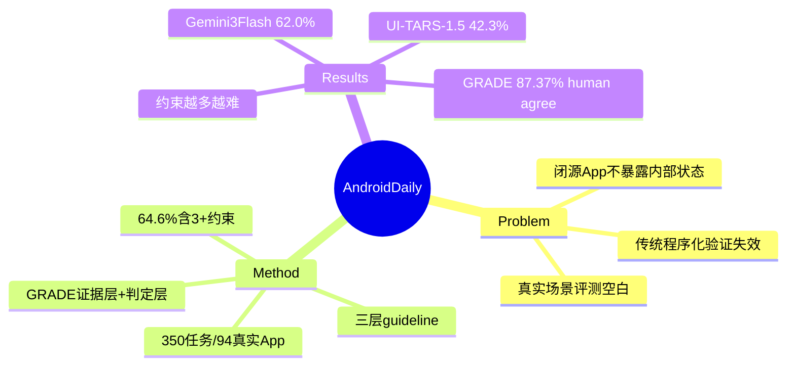

## Summary

AndroidDaily 是一个在**真实闭源商业 App**上评测 mobile GUI agent 的可验证 benchmark（350 任务 / 94 高频 App），核心是 GRADE 评测器——闭源 App 不暴露内部状态，于是从视觉轨迹提取证据 + 三层 guideline 判定完成度，把长程开放式移动交互变成可验证评测。最强 Gemini 3 Flash 仅 62.0% 成功率。

## Problem & Motivation

绝大多数 mobile agent benchmark 依赖 simulated environment 或 open-source App，而真实用户每天用的是**闭源商业 App**（淘宝、美团、抖音…）。这些 App 不暴露内部状态，传统的程序化 state verification（读数据库/accessibility）**不适用**，导致真实场景长期无法自动评测。这正是 benchmark 分数与真实可用性 gap 的一个具体来源（呼应 [[Papers/2606-XiaomiGUI0]] 的 real-device 动机与 vault 中"真实长程工作流未饱和" validated insight）。

## Method

**GRADE (Guideline-grounded Reviewer for Automatic Diagnostic Evaluation)**——两层 pipeline，不依赖隐藏内部状态：
- **Evidence Layer**：从视觉轨迹提取 task-relevant 信号，维护 working memory 捕捉易丢失的 transient cue
- **Verdict Layer**：三层 guideline 判定完成——
  - *Operational Obligations*（必需操作与约束）
  - *Output Quality*（生成内容质量标准）
  - *Negative Constraints*（禁止动作与边界违规）

**任务构成**：350 任务 / 94 App，域覆盖交通、外卖、电商、社交、短视频、娱乐、本地服务。任务类型 Information&Decision 49.4% / Execution&Operations 22.3% / Creation&Communication 28.3%；**64.6% 任务含 3+ 约束**。

## Key Results

**整体成功率**：
- **Gemini 3 Flash 62.0%**（最佳）
- Gemini 3 Pro 58.6%
- Seed1.8 46.3% / Seed2.0 Pro 45.4%
- **UI-TARS-1.5 42.3%**（最佳 GUI 专用模型）

**约束数（Gemini 3 Flash）**：≤2 约束 69.4% → 3+ 约束 58.0%（约束越多越难）
**App 范围**：single-app 62.7% vs multi-app 59.5%
**GRADE 可靠性**：与人类评测 **87.37% 一致**（879 个人工复核 session）

## Strengths & Weaknesses

**Strengths**：
- **直击闭源 App 评测空白**——这是 vault 中大量 benchmark（[[Papers/2606-OSWorld2]]/[[Papers/2605-SaaSBench]] 都用 self-hosted/open-source）回避的真实场景；GRADE 用"视觉证据 + guideline"绕过内部状态不可见，是务实的可验证性方案
- **约束数分层**（64.6% 含 3+ 约束）揭示真实任务的组合约束难度——比单纯 step 数更能刻画真实复杂度
- GRADE 87.37% human agreement 使 LLM-judge 在闭源场景可用（对照 [[Papers/2605-OpenComputer]] 程序化 verifier 94.1%，牺牲部分可靠性换取闭源可评）

**Weaknesses / 存疑**：
- **只有 pass@1、无 multi-seed variance**（作者承认，真机 rollout 单任务达 40 分钟）——真机成本使统计稳健性受限
- **环境漂移**：商业 App 持续 UI 更新/A-B test/个性化内容，使绝对成功率是时间敏感快照，可复现性弱（这是"真实"的固有代价）
- GRADE 是 LLM-based judge，87.37% agreement 意味着 ~13% 分歧——在高约束任务上可能系统性偏差，且视觉证据无法覆盖 App 后台真实状态（如订单是否真的提交）
- 仅用研究账号，真实部署（真实支付/账号风控）的可靠性未触及——与 [[Papers/2606-XiaomiGUI0]] 的支付终止/风控调度形成对比：AndroidDaily 评测但不执行高风险动作

**对领域的影响**：为"闭源真实 App 可靠性"提供首个可验证 benchmark 与 GRADE 评测范式；62.0% 天花板 + 约束数衰减，是 mobile agent 真实可用性的又一低水位实证。

## Mind Map

## Notes

- **GRADE = "视觉证据 + guideline judge" 的可验证性范式**，是 [[Papers/2605-OpenComputer]] 程序化 verifier 在闭源不可见状态下的退化替代——两者构成 verifier 谱系两端：可见状态用程序化（94.1%），不可见状态用视觉证据 LLM judge（87.4%）。这与 vault 的 "Verifier 角色迁移" validated insight 直接相关：verifier 形态随可观测性退化而变。
- **约束数（constraint count）作为难度维度**比 step 数更贴近真实——64.6% 任务 3+ 约束，且 3+ 约束成功率掉 11pp。可作为真实任务难度刻画的标准维度之一。
- 62.0% 天花板加入 vault 真实可靠性低水位证据链：[[Papers/2605-SaaSBench]] 3.8% resolved、[[Papers/2606-OSWorld2]] 20.6%、[[Papers/2604-WindowsWorld]] ~20%、[[Papers/2604-ClawEvalLive]] 66.7%、AndroidDaily 62.0%——不同任务/平台一致指向"真实长程未饱和"。
- 关联：[[Topics/CUA-Survey]]、[[Papers/2606-XiaomiGUI0]]、[[Papers/2500-MobileRL- Online Agentic Reinforcement Learning for Mobile GUI Agents]]。
