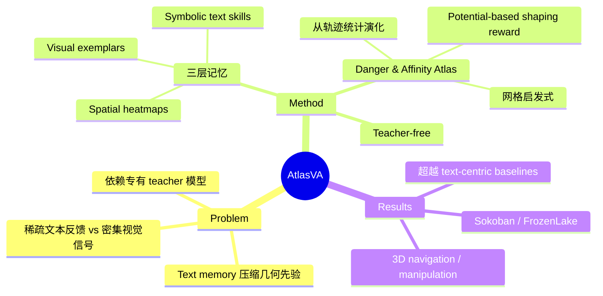

## Summary

> [未获取全文，仅基于 abstract 和 HuggingFace 页面]

AtlasVA 提出 teacher-free 的视觉技能记忆框架，用空间热力图、视觉样例和符号文本三层记忆替代纯文本记忆，直接从轨迹统计和网格启发式演化出 danger/affinity atlas 作为 potential-based shaping reward，在 Sokoban、FrozenLake、3D 导航和机械臂操作任务上超越文本记忆 baseline。

## Problem & Motivation

> [未获取全文，仅基于 abstract]

现有 memory-augmented RL for VLM agents 把记忆存为文本，依赖专有 teacher 模型（如 GPT-4）总结和精炼。这种设计不适合空间决策任务：几何先验被压缩成有损的语言表示，稀疏交互通过延迟的文本反馈监督而非密集的视觉 grounded 信号。AtlasVA 认为可复用经验应保持视觉 grounded，且不依赖外部 LLM 监督。

## Method

> [未获取全文，仅基于 abstract]

**三层记忆组织**：
1. **Spatial heatmaps**（空间热力图）
2. **Visual exemplars**（视觉样例）
3. **Symbolic text skills**（符号文本技能）

**核心机制**：
- 直接从**轨迹统计**和轻量级**网格启发式**演化出 **danger atlas**（危险地图）和 **affinity atlas**（亲和地图）
- 将这些自演化的 atlas 作为 **potential-based shaping rewards** 用于强化学习
- **统一感知、记忆和优化**，无需外部 LLM 监督（teacher-free）

## Key Results

> [未获取全文，仅基于 abstract]

在四类 benchmark 上评估：
- **Sokoban**（推箱子）
- **FrozenLake**（冰湖导航）
- **3D embodied navigation**（3D 具身导航）
- **3D robotic manipulation**（3D 机械臂操作）

**主要发现**：
- 在所有任务上**持续超越 text-centric memory baselines** 和竞争性 VLM agents
- 在**空间密集型任务**上优势尤其明显

## Strengths & Weaknesses

> [未获取全文，以下基于 abstract 推断]

**Strengths**：
1. **Teacher-free 设计**：不依赖 GPT-4 等专有模型，降低成本和 API 依赖
2. **视觉 grounded 记忆**：直接用空间热力图和视觉样例保留几何先验，避免语言压缩损失
3. **Potential-based shaping reward**：从轨迹统计自动演化 danger/affinity atlas，提供密集反馈信号
4. **跨任务验证**：覆盖 2D 网格、3D 导航、机械臂操作多种空间决策场景

**Weaknesses**：
1. **未获取全文，无法评估方法细节**：网格启发式的具体设计、atlas 演化算法、三层记忆如何协同等关键细节缺失
2. **Baseline 对比不明确**：abstract 只说"超越 text-centric memory baselines"，未指明具体对比方法（如 Reflexion、Voyager 等）
3. **适用边界未知**：方法强调空间决策，对非空间任务（如对话、推理）是否适用？三层记忆的开销如何？
4. **Teacher-free 的代价**：不用 LLM 监督可能牺牲语义理解能力，在需要高层推理的任务上可能不如 text-centric 方法

## Mind Map

## Notes

- **未获取全文**：arXiv HTML 页面返回 404，仅基于 abstract 和 HuggingFace 页面信息生成笔记。需要后续获取 PDF 补充 Method / Experiments / Ablation 细节。
- **与 OS-Atlas 的关系**：两篇论文都叫"Atlas"但方向完全不同——OS-Atlas 是 GUI grounding，AtlasVA 是空间记忆 for RL agent。名字相似纯属巧合。
- **Potential-based shaping reward**：这是 RL 中经典技术（Ng et al., 1999），用 potential function 提供密集 reward 同时保持最优策略不变。AtlasVA 的创新在于用视觉热力图自动构建 potential function，而非手工设计。
- **Teacher-free 的意义**：当前 agent 研究大量依赖 GPT-4 做 reflection / memory summarization（如 Reflexion、Ghost in the Minecraft），AtlasVA 试图用视觉表示 + 轻量启发式替代，降低对专有模型的依赖。这个方向值得关注，但需要看全文才能判断方法是否真正 scalable。
- **Rating 理由**：2 分（了解即可）——问题动机清晰（text memory 不适合空间任务），但未获取全文无法评估方法质量和实验充分性；且 benchmark 偏传统（Sokoban/FrozenLake 是经典 RL toy problem），与当前 GUI agent / embodied AI 主流评测（OSWorld / BEHAVIOR / RLBench）距离较远。待获取全文后可能上调。
