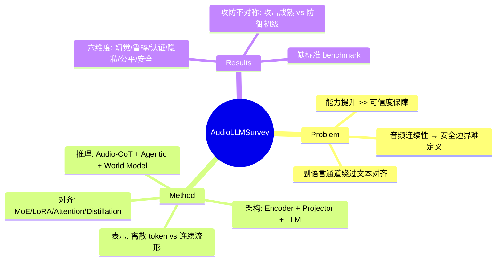

## Summary
一篇关于 Large Audio Language Model (LALM) 的全面综述，系统梳理了架构机制、对齐算法、涌现推理能力，并建立了六维度可信度分类体系（幻觉、鲁棒性、安全性、隐私、公平性、认证），揭示了攻击方法成熟但防御手段滞后的不对称现状。

## Problem & Motivation
LALM 的能力提升速度远超可信度保障框架的发展。现有综述要么将安全性视为边缘话题，要么停留在单一问题（如 deepfake 检测），缺乏从架构机制到安全隐患的系统性分析。音频模态的连续性使其比文本更难定义安全边界——对抗扰动往往与人类感知正交，且恶意意图可通过副语言特征（prosody、timbre）而非语义内容传递，导致文本 RLHF 对齐失效。

## Method
### 架构基础
LALM 由三个核心组件构成：**acoustic encoder**（感知接口）、**alignment projector**（跨模态桥接）、**LLM backbone**（认知推理）。领域已从任务特定的级联系统演进为统一的端到端多模态框架。

### 表示范式
关键设计选择：**离散音频 token vs. 连续时序流形**。离散化在压缩时可能丢失关键安全线索，连续表示保留丰富副语言信息但增加攻击面。

### 训练与对齐
- **Mixture of Experts adapters** 用于跨模态训练
- **Low Rank Adaptation (LoRA)** 用于领域特定适配
- **Attention rebalancing** 缓解模态偏差
- **Knowledge distillation** 将视觉推理能力迁移到音频
- **Full-duplex interaction** 从轮流对话演进为同步交互

### 涌现推理机制
**Audio Chain-of-Thought (Audio-CoT)** 强制模型在最终回答前生成中间推理轨迹。过程导向的 RL 奖励驱动多步逻辑推演。Agentic 框架和因果世界建模使模型具备自主工具使用和物理世界模拟能力。

## Key Results
### 六维度可信度分类

**1. 幻觉与忠实性**  
LALM 幻觉源于"声学-语义鸿沟"。关键失效模式：模态忽略（模型退化为文本捷径）、grounding 失败、注意力失衡。研究显示"将音频输入替换为静音或噪声，在某些 benchmark 上性能几乎无变化"。

**2. 鲁棒性**  
即使在良性条件下，LALM 也表现出脆弱性——微小的 prompt 扰动导致不一致响应。更严重的是不可感知的波形修改（"攻击者噪声"）可在真实场景中操纵模型。潜在声学后门触发器可在对齐阶段植入。

**3. 认证与 Deepfake 检测**  
LALM 正被集成到反欺骗系统。**部分 deepfake 检测**（定位语音中被篡改的片段）是新兴挑战。LlamaPartialSpoof benchmark 提供 130 小时部分伪造语音用于评估。

**4. 隐私与信息泄露**  
HearSay benchmark 证明"LALM 可能无意泄露音频信号中的敏感信息，包括说话人身份、位置线索"。音频地理定位构成严重威胁，模型可能转录非同意方的私人背景对话。

**5. 公平性与偏见**  
偏见通过说话人音色、口音、韵律等文本无对应物的通道显现。MedVoiceBias 显示声音特征可"系统性扭曲临床决策"。即使在 SOTA 模型中，多模态情感识别仍存在性别偏见。

**6. 安全性与越狱攻击**  
这是研究最密集的维度。攻击类别包括：利用副语言特征的风格攻击、利用跨语言安全对齐不均的多语言攻击、嵌入不可感知信号的对抗扰动攻击。防御方法包括表示空间优化（ALMGuard）和通过 PCA 的拒绝引导（SARSteer）。

### 核心安全挑战
**跨模态越狱**是中心安全挑战："非语义语音属性被利用以绕过以文本为中心的安全过滤器"。后门攻击通过数据投毒在训练期间植入不可感知的音频触发器。

### 攻防不对称
论文指出"攻击研究已在五个不同向量上成熟，而防御机制仍处于初级阶段，主要是被动的，且固着于越狱缓解"。这归因于连续音频模态的根本挑战——对抗扰动"通常与人类感知正交"，使安全边界定义在数学上困难。

缺乏标准化安全 benchmark 是结构性缺陷。不同于成熟的文本"Red Teaming"数据集，"LALM 社区缺乏全面的 Safety Leaderboard"。

## Strengths & Weaknesses
**亮点**：
- 首次系统性连接 LALM 架构机制与可信度隐患，建立六维度分类体系
- 明确指出攻防不对称的结构性问题，而非仅罗列攻击方法
- 提出 Defense-in-Depth 架构（输入层音频净化、隐私保护推理、全面安全评估框架）作为未来方向
- 识别出音频模态的独特挑战：副语言通道绕过文本 RLHF、对抗扰动与人类感知正交

**局限**：
- 作为综述，缺乏新方法的实证验证
- 六维度分类体系虽全面，但维度间交互（如隐私泄露如何加剧公平性问题）讨论不足
- 提出的 Defense-in-Depth 架构仍是概念框架，缺乏具体实现路径和可行性分析
- 对"为什么防御滞后"的根因分析不够深入——是技术难度、研究激励不对齐，还是评估标准缺失？

**影响**：
对 LALM 研究者有重要参考价值，但对 GUI Agent / VLM 方向的直接启发有限。音频模态的攻防不对称问题可能在视觉模态中有相似模式（如对抗 patch、视觉越狱），但论文未探讨跨模态的可迁移性。

## Mind Map

## Notes
- 音频模态的"与人类感知正交"特性值得关注——这在视觉模态中是否也成立？对抗 patch 是可见的，但 adversarial examples 在某些情况下人类也难以察觉
- 论文提到的"模态忽略"问题（模型在某些 benchmark 上即使输入静音也能答对）暴露了 benchmark 设计缺陷，这在 VLM benchmark 中是否也存在？
- Defense-in-Depth 的三层架构（输入净化、隐私推理、安全评估）可能对 VLM 安全也有借鉴意义
