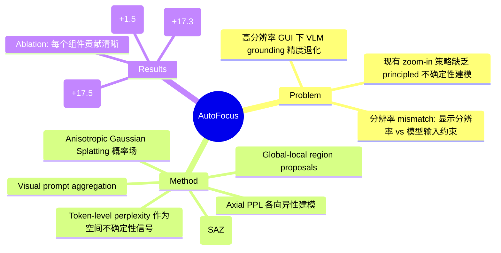

## Summary

提出 AutoFocus，一个 training-free 的 GUI grounding 细化框架：利用 VLM 坐标生成时的 token-level perplexity 作为空间不确定性信号，构建各向异性高斯概率场来指导自适应 zoom-in，在 ScreenSpot-Pro 上 UI-Venus-7B 从 50.3% 提升至 67.8%。

## Problem & Motivation

现代 GUI 界面分辨率高（1080p/4K），交互元素可能只占几十个像素，而 VLM 的输入 token 预算有限，导致高分辨率下 grounding 精度严重退化。现有 zoom-in 策略要么依赖固定锚点/启发式网格，要么用 RL 训练裁剪策略，缺乏一个 principled 的机制来判断"哪里需要细化"以及"不确定性的方向和幅度"。

## Method

1. **Error-Triggered Active Refinement**：对初始预测叠加视觉标记（pink star），用 VLM 自我验证"标记点是否正确对应目标元素"，决定是否需要细化。

2. **Gaussian Dynamic Focusing (GDF)**：
   - 从 VLM 的坐标生成过程中采样 N=5 个候选坐标（temperature=0.75）
   - 计算每个候选的 x/y 轴独立 perplexity（Axial PPL），建模方向性不确定性
   - 将 perplexity 转换为各向异性高斯核的方差（σ_z = β * PPL_z），splatted 成连续 2D 概率场
   - 基于概率场生成 global（覆盖大范围）和 local（3σ 置信区间）region proposals
   - **Shape-Aware Zooming (SAZ)**：加入 squareness factor λ 控制裁剪区域的长宽比，平衡定位精度和上下文保留

3. **Visual Prompt Aggregation**：对各 region proposal 的 zoom-in 预测，通过结构化视觉比较选择最一致的预测作为最终结果。

整个流程 training-free，推理时无需参数更新。

## Key Results

### ScreenSpot-Pro（高分辨率专业软件界面）

| Model | Baseline | +AutoFocus | Δ |
|:------|:---------|:-----------|:--|
| UI-TARS-7B | 35.7% | 45.1% | +9.4 |
| UI-TARS-72B | 38.1% | 52.6% | +14.5 |
| Qwen2.5-VL-7B | 26.8% | 35.4% | +8.6 |
| Qwen2.5-VL-72B | 47.8% | 65.1% | +17.3 |
| GTA1-Qwen-7B | 45.2% | 51.4% | +6.2 |
| GTA1-Qwen-32B | 53.6% | 63.0% | +9.4 |
| UI-Venus-7B | 50.3% | **67.8%** | **+17.5** |

### ScreenSpot-V2（通用 GUI 场景）

| Model | Baseline | +AutoFocus | Δ |
|:------|:---------|:-----------|:--|
| Qwen2.5-VL-7B | 88.8% | 93.7% | +4.9 |
| Qwen2.5-VL-72B | 94.0% | 95.5% | +1.5 |
| UI-Venus-7B | 94.1% | 95.3% | +1.2 |

### Component Ablation（Qwen2.5-VL-7B on SS-Pro / SS-V2）

| Variant | SS-Pro | SS-V2 |
|:--------|:-------|:------|
| Baseline (no zoom) | 26.8% | 88.8% |
| + Multi-sample only | 27.5% | 89.4% |
| + Global proposals | 31.6% | 90.9% |
| + Local proposals | 33.1% | 92.3% |
| w/o Axial PPL | 34.1% | 92.9% |
| w/o SAZ | 33.8% | 92.4% |
| w/o Vis-Aggregation | 31.6% | 91.1% |
| **AutoFocus (Full)** | **35.4%** | **93.7%** |

## Strengths & Weaknesses

**Strengths**：
- **Core insight 有价值**：token-level perplexity 与 grounding 正确率的关联有实证支撑（Figure 2 的分布分离清晰），将其转化为不确定性信号是自然且 elegant 的做法
- **SS-Pro 上增益显著**：UI-Venus-7B +17.5%、Qwen2.5-VL-72B +17.3% 是 genuinely impressive 的提升，说明框架对高分辨率场景确实有效
- **Ablation 扎实**：每个组件（Axial PPL、SAZ、Visual Aggregation）的贡献都有量化验证，w/o Vis-Aggregation 掉 3.8% 说明多区域聚合是关键
- **Training-free、model-agnostic**：即插即用，对 general-purpose 和 GUI-specialized VLM 都有效

**Weaknesses**：
- **计算开销完全未讨论**：每个 sample 需要一次完整 VLM forward pass（N=5 次采样 + 验证 + 各 region proposal 的 zoom-in 预测 + 聚合），总推理成本可能是 baseline 的 10-20x，论文对此只字不提
- **Self-consistency 隐患**：验证模块和聚合模块用 Qwen2.5-VL（与 base model 同家族），"model confirms its own prediction" 存在系统性偏差风险。虽然 4.0.4 节声称 decoupled，但实际用的是同系列模型
- **β 需要 per-model 调参**：GTA1 系列用 β=80，其他用 β=50——"training-free" 的 claim 在实践中需要 per-model hyperparameter tuning，不够 plug-and-play
- **SS-V2 上增益有限**：已达 90%+ 的 benchmark 上只提升 1-5%，说明方法主要在 hard case 上有效，但论文未分析"哪些 case 从 zoom 中获益、哪些反而被破坏"
- **Gaussian machinery 复杂度高但收益有限**：全框架比"仅用 local proposals"在 SS-Pro 上只高 2.3%，大部分增益来自 zoom-in 本身而非精巧的概率场建模
- **缺乏与简单 baseline 对比**：没有 random cropping、uniform grid、或简单 center-crop zoom 的对比，无法判断不确定性引导是否真正优于 naive zoom

## Mind Map

## Notes

- Perplexity 作为不确定性信号的 idea 可以推广到其他 token-based 定位任务（如 3D grounding、robot manipulation 的 action token）
- 关键问题：能否用更轻量的方式近似 perplexity-based uncertainty？比如 hidden state 的 entropy 或 attention distribution，避免多次采样的开销
- Shape-Aware Zooming 的 squareness factor λ 是一个有趣的设计，但论文没有给出 λ 与 UI 元素几何形状的关联分析
