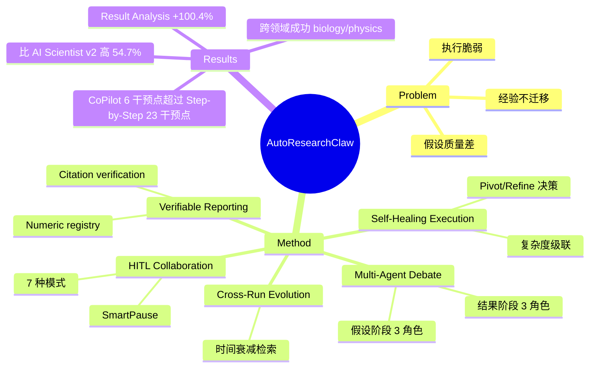

## Summary

提出 AutoResearchClaw，一个多 agent 自主科研系统，通过五大机制（多 agent 辩论、自愈执行、可验证结果报告、人机协作、跨 run 演化）解决现有系统的假设质量差、执行脆弱、经验不迁移三大问题。在 ARC-Bench（25 个 ML 主题）上比 AI Scientist v2 高 54.7%，比 AIDE-ML 高 26.8%，最大提升在结果分析维度（+100.4%）。

## Problem & Motivation

现有自主科研系统（AI Scientist、AIDE-ML、Agent Laboratory）把研究当作线性 pipeline，存在三个相互依赖的问题：假设质量差（单 agent 推理缺乏多角度挑战）、执行脆弱（遇错即停）、经验不迁移（每次 run 从零开始）。这三个问题互相强化：差假设导致实验失败，失败后无法恢复，失败经验无法传递给下次 run。作者认为必须联合解决这三个问题，因为"改进一个挑战会帮助其他挑战"。

## Method

### 五大核心机制

**1. Multi-Agent Debate（多 agent 辩论）**

在两个阶段部署辩论 panel，每个 panel 包含 K=3 个角色 agent + 1 个 synthesizer：

- **假设阶段**：Innovator（提出高风险假设）、Pragmatist（评估可行性）、Contrarian（寻找弱点），synthesizer 产出 2-4 个可证伪假设及可测性标准
- **结果阶段**：Optimist、Skeptic（挑战统计显著性）、Methodologist（检查可复现性和数据泄漏），synthesizer 产出最终结论

**2. Self-Healing Execution（自愈执行）**

- **Cascading code generation**：复杂度评分器对实验打分（6 个维度：架构深度、文件数、领域难度、依赖链、历史失败率、控制流复杂度），产出标量 c∈[0,1]。c > τ=0.6 的实验交给外部 AI coding agent（Beast Mode），否则用内置多阶段 agent 处理
- **Sandboxed execution**：Docker 容器 + 三阶段网络策略（Phase 0 允许装依赖，Phase 1 允许下载数据，Phase 2 执行时断网）
- **Pivot/Refine 决策**：失败后选择 Proceed、Refine（调整重试，最多 N_r=10 次）或 Pivot（换方向，最多 N_p=2 次，记录失败作为证据）

**3. Verifiable Result Reporting（可验证结果报告）**

- **Numeric registry**：白名单记录所有实验数值（per-condition 均值、标准差、seed 测量值）。预构建 LaTeX 表格从 registry 注入；事后验证重新提取所有数值 claim。严格 section 中不匹配的 claim 触发文档拒绝
- **Citation verification**：四层 pipeline（DOI resolution via CrossRef → fuzzy title matching via OpenAlex → arXiv lookup → Semantic Scholar fallback）+ LLM 相关性检查，分类为 Verified / Suspicious / Hallucinated

**4. Human-in-the-Loop Collaboration（人机协作）**

七种干预模式，跨越自主性光谱：

| 模式 | 描述 | 干预点数 |
|------|------|---------|
| Full-Auto | 无人类输入 | 0 |
| Gate-Only | 三个固定检查点 | 3 |
| **CoPilot** | 六个高杠杆决策点 | 6 |
| Thorough | 所有阶段边界 | ~8 |
| Step-by-Step | 每个 stage 需批准 | ~23 |
| Pre-Experiment | 仅早期 pipeline | 3 |
| Post-Experiment | 仅后期 pipeline | 3 |

**SmartPause** 监控系统不确定性，超过学习阈值时暂停，基于历史批准模式自适应。

**5. Cross-Run Evolution（跨 run 演化）**

每次 run 提取的 lessons 存储为（类别、严重性分数 s(l)∈(0,1]、推荐缓解措施）。检索使用时间衰减权重：

w(l) = s(l) · exp(-ln2 · Δt / T_{1/2})

默认半衰期 T_{1/2}=30 天。Lessons 以自然语言 overlay 注入 prompt。

### Pipeline 架构

23 个 stages 分三阶段：
- **Discovery**（stages 1-8）：scoping、文献搜索、多 agent 假设生成
- **Experimentation**（stages 9-15）：代码生成、执行、自愈、结果分析、Pivot/Refine
- **Writing**（stages 16-23）：起草、审查、修订、引用验证

复杂度级联选择代码生成模式：Beast Mode（外部 agent）→ CodeAgent（多阶段）→ Legacy 单次生成。

## Key Results

### 主要对比（Table 2，25 个主题）

| 系统 | Code Dev | Code Exec | Result Analysis | Overall |
|------|----------|-----------|-----------------|---------|
| AutoResearchClaw (CoPilot) | 0.968 | 0.578 | 0.523 | **0.648** |
| AutoResearchClaw (Full-Auto) | 0.938 | 0.562 | 0.442 | 0.596 |
| AIDE-ML | 0.958 | 0.415 | 0.336 | 0.511 |
| AI Scientist v2 | 0.712 | 0.442 | 0.261 | 0.419 |

AutoResearchClaw (CoPilot) 比 AI Scientist v2 高 54.7%，比 AIDE-ML 高 26.8%。最大差距在 Result Analysis：比 AI Scientist v2 高 100.4%。

即使 Full-Auto 模式（0.596）也超过两个 baseline，说明增益主要来自系统设计而非人类输入。

**失败模式**：AutoResearchClaw 在 2/25 主题上失败（复杂多文件实现）。AI Scientist v2 在 6/25 上失败，集中在需要迭代优化的主题。

### 跨领域覆盖（Table 4）

| 系统 | Biology | Statistics | HEP-ph | Overall |
|------|---------|------------|--------|---------|
| AutoResearchClaw (CoPilot) | 0.912 | 0.898 | 0.489 | **0.867** |
| AIDE-ML | ✗ | 0.452 | ✗ | 0.090 |
| AI Scientist v2 | ✗ | 0.418 | ✗ | 0.084 |

两个 baseline 在 biology 和 physics 上完全失败，因为缺少领域特定软件栈。

### Ablation Studies

**HITL Ablation（Table 3，10 个主题，7 种模式）**

| 模式 | Valid | Mean Quality | Accept Rate | Interventions |
|------|-------|-------------|-------------|---------------|
| Full-Auto | 8/10 | 4.03 | 25.0% | 0 |
| Gate-Only | 10/10 | 5.03 | 50.0% | 3 |
| **CoPilot** | 8/10 | **7.27** | **87.5%** | 6 |
| Thorough | 7/10 | 4.86 | 42.9% | 8 |
| Step-by-Step | 10/10 | 5.19 | 50.0% | 23 |

关键发现：**更多干预不单调提升质量**。CoPilot 用 6 个目标干预点达到 7.27 质量和 87.5% 接受率，大幅超过 Step-by-Step 的 23 个干预点（5.19 质量，50% 接受率）。Pre-Experiment vs. Post-Experiment 对比揭示互补贡献：早期干预修复设计可行性，后期干预修复 claim 真实性。

**组件 Ablation（Table 5，best-of-3 协议）**

| 配置 | Completion | Quality | Accept | Fabrication |
|------|-----------|---------|--------|-------------|
| Full system | 10/10 | 5.62 | 3/10 | ✗ |
| w/o Debate | 10/10 | 4.25 | 1/10 | ✗ |
| w/o Self-Healing | 6/10 | 4.83 | 1/6 | ✗ |
| w/o Evolution | 9/10 | 5.14 | 2/10 | ✗ |
| w/o Verification | 10/10 | 5.48‡ | 5/10‡ | **✓** |
| w/o Debate & Healing | 4/10 | 3.47 | 0/4 | ✗ |

多 agent 辩论是最大质量贡献者（-1.37，p=0.003）。自愈是最大完成率贡献者（10/10 → 6/10）。移除验证会虚增表观接受率但引入捏造数值。同时移除辩论和自愈是超加性的，完成率降至 4/10，零接受率。

**设计空间探索**

- **辩论 agent 数**：K=3 最优；K=2 退化为正反方（-23% 多样性）；K=5 增加 +67% tokens 但仅 +8% 多样性增益
- **演化半衰期**：T_{1/2}=30 天最优；T_{1/2}=7 天过快过期有用 lessons；T_{1/2}=∞ 在 ~15 次 run 后积累矛盾建议

### Case Study: Topic T10

T10 研究小样本模型选择的交叉验证策略。Full-Auto 完成手稿但所有 8 个 CV 策略坍缩为相同的零偏差输出——论文无法支撑实质性比较。CoPilot 避免了这个问题，因为人类引导针对实验瓶颈，产出 9 个 pipeline 的非零对比和明确陈述的局限性。

三个观察：即使执行成功，辩论质量也很重要；验证是必要但不充分的（零值通过数值检查但科学上无信息量）；CoPilot 通过"在正确决策点放置干预"提升质量。

### 失败分析

13 个无效 HITL runs 中有 11 个在 stage 17（paper_draft）失败，这是第一个硬反捏造检查点。四种重复失败子类型：无真实指标、环境/依赖崩溃、数据集/资源失败、设计/聚合病理。

**写作质量审计**

20 个交付物的常见缺陷：
- Abstract 出现在 \maketitle 之前：20/20
- Markdown 风格图片标题提升为 section 标题：17/20
- 重复图片文件：16/20
- 跨领域内容泄漏：9/20
- LaTeX 编译通过率：4/5（step-by-step），3/5（full-auto）

引用数量：full-auto 在 5 个主题上平均 94 条引用，step-by-step 59 条，per-paper 最小值偶尔低于会议规范。

## Strengths & Weaknesses

**Strengths**

1. **系统性解决三大问题**：首次联合解决假设质量、执行鲁棒性、经验迁移，而非孤立优化某一环节
2. **HITL ablation 的反直觉发现**：CoPilot（6 个干预点）大幅超过 Step-by-Step（23 个干预点），证明"精确的高杠杆协作"优于全面监督或完全自主两个极端
3. **可验证性设计**：numeric registry + citation verification 是对 AI Scientist 捏造问题的直接回应，ablation 证明移除验证会引入捏造
4. **跨领域泛化**：在 biology/physics 上成功而 baseline 完全失败，证明系统设计的泛化性
5. **Result Analysis 维度的巨大提升**（+100.4%）：说明多 agent 辩论 + 可验证报告在科学推理上的价值，而非仅工程实现

**Weaknesses**

1. **写作质量缺陷普遍**：20/20 论文有 abstract 位置错误，17/20 有 Markdown 标题泄漏，16/20 有重复图片——说明 writing stages（16-23）的质量控制远弱于 experimentation stages
2. **Stage 17 失败混杂异质原因**：11/13 无效 runs 在同一 stage 失败，但原因包括无真实指标、环境崩溃、数据集失败、设计病理——缺乏 graceful degradation 和细粒度诊断
3. **验证是必要但不充分的**：T10 case 显示零值通过数值检查但科学上无意义——验证能抓捏造，但无法判断测量是否回答研究问题
4. **引用广度低于会议规范**：full-auto 平均 94 条引用看似多，但 per-paper 最小值偶尔不达标，且 step-by-step 仅 59 条——说明 citation verification 保证真实性但不保证覆盖度
5. **领域覆盖需要预配置**：跨领域成功依赖"预配置软件栈和领域适配器"——不是零样本泛化，而是工程准备
6. **23-stage 设计的任意性**：作者承认这是"迭代到达而非最优"的平衡——粒度和上下文重建开销的 tradeoff 缺乏原则性指导
7. **ARC-Bench 是自建 benchmark**：25 个 ML 主题 + 20 个科学领域任务，但没有与社区 benchmark（如 MLAgentBench）对齐，可比性受限

**对领域的潜在影响**

- **HITL 范式转变**：从"全自动 vs. 全监督"二元对立 → "高杠杆决策点的精确协作"，CoPilot 模式可能成为实用自主科研的主流范式
- **可验证性成为一等公民**：numeric registry + citation verification 可能成为未来 AI scientist 系统的标配
- **跨 run 演化的启发**：时间衰减的 lesson 检索（T_{1/2}=30 天）是简单但有效的经验迁移方案，可推广到其他 agent 系统
- **暴露写作质量短板**：20/20 论文有格式错误，说明当前 LLM 在 LaTeX 生成和长文档一致性上仍有系统性弱点

## Mind Map

## Notes

**与 [[2603-EvoScientist]] 的对比**

- **演化机制**：EvoScientist 用 genetic algorithm 演化 agent 角色和决策策略（跨 task 演化 agent 本身），AutoResearchClaw 用时间衰减的 lesson 检索（跨 run 演化知识）——前者更激进，后者更实用
- **HITL 设计**：EvoScientist 未系统探索 HITL，AutoResearchClaw 的 7 种模式 ablation 和 CoPilot 的反直觉发现是独特贡献
- **验证机制**：AutoResearchClaw 的 numeric registry + citation verification 是对捏造问题的直接回应，EvoScientist 未强调这一点
- **Evaluation**：EvoScientist 锚定外部 venue（ICAIS 2025，6/6 接收），AutoResearchClaw 用自建 ARC-Bench——前者更可信但样本量小，后者可控但可比性受限

**与 [[2604-AutoResearchBench]] 的关系**

- AutoResearchBench 评估文献发现能力（找论文），AutoResearchClaw 评估端到端科研能力（做实验 + 写论文）——互补而非竞争
- 两者都暴露 frontier models 的能力缺口：AutoResearchBench 显示最强模型仅 9.39% Deep Research accuracy，AutoResearchClaw 显示 AI Scientist v2 仅 0.419 overall score

**开放问题**

1. CoPilot 的 6 个高杠杆决策点是如何选出的？是否有原则性方法识别高杠杆点？
2. 时间衰减的 T_{1/2}=30 天是否对所有领域都最优？快速迭代领域（如 LLM）vs. 慢速领域（如生物）可能需要不同半衰期
3. 写作质量缺陷（20/20 有格式错误）是否可以通过更强的 post-processing 或 LLM 微调解决？
4. numeric registry 能抓捏造但抓不到"科学上无意义的真实数值"（如 T10 的零值）——如何设计更高层的科学有效性检查？
