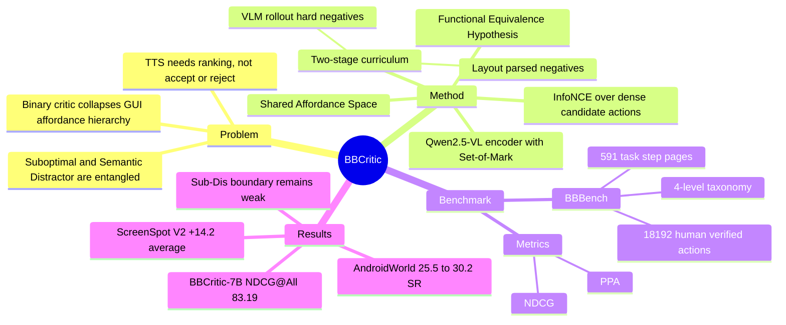

## Summary

BBCritic 把 GUI agent 的 critic 从 binary classification 改写成 instruction-action continuous semantic alignment：用共享 VLM encoder 把用户意图和候选 GUI action 投到同一个 Affordance Space，再用 cosine similarity 做排序分数。论文同时提出 BBBench，用 dense action space 和 Optimal / Suboptimal / Semantic Distractor / Unrelated Error 四级 taxonomy 检查 critic 是否真的学到了 GUI affordance 的连续层次，而不是只会给 correct / wrong。

## Problem & Motivation

这篇文章针对的是 Test-Time Scaling (TTS) GUI agent 中的 critic bottleneck。TTS 会让 policy model 采样多个候选动作，再让 critic 排序选择下一步；如果 critic 只能输出二分类 correct / wrong，它很容易把 “有效但冗余” 的动作和 “看似相关但实际上无效” 的 distractor 混在一起。

作者把这个问题概括为两个结构性缺陷。第一是 **Affordance Collapse**：二分类监督把 GUI action 的层次空间压成 0/1，丢掉 Optimal vs. Suboptimal、Semantic Distractor vs. Unrelated Error 这些距离关系。第二是 **Noise Sensitivity**：GUI 操作天然存在灰区，例如点击 reviews 可能和查看 specifications 有语义相关性但不一定推进任务，BCE 会把这种模糊边界硬压成负例，容易过拟合 noisy boundary。

这篇的关键动机不是“再训练一个更强 verifier”，而是重新定义 GUI critique：critic 应该度量 action 与 instruction 的 functional alignment，而不是判断一个动作是否落在离散标签上。这个 framing 对 GUI agent 很重要，因为 long-horizon execution 中错误通常不是完全无关的点击，而是语义上很像、功能上差一点的动作。

## Method

**Functional Equivalence Hypothesis.** 作者假设用户的 language instruction 和 optimal GUI action 是同一个底层 affordance 的两种表达：前者是语言意图，后者是操作执行。因此 critic 的目标应该是把二者映射到共享的 **Affordance Space**，并计算它们的连续相似度。

**BBCritic architecture.** BBCritic 使用 Qwen2.5-VL-Instruct 作为共享 VLM backbone，采用 Siamese-style encoding：

- **Intent Anchor**：输入 user instruction + current screenshot，得到意图 embedding。
- **Action Candidate**：输入 candidate action + screenshot；对 click / long_press 这类空间动作使用 Set-of-Mark，在目标坐标处画红圈，得到 action embedding。
- **Critic score**：用两个 embedding 的 cosine similarity 作为 action 的连续评分。

这个设计本质上把 GUI critic 改成 multimodal retrieval / metric learning：instruction 是 query，candidate actions 是 documents，排序分数来自 shared embedding space。

**Topology-aware optimization.** 训练目标使用 InfoNCE，而不是 BCE。关键差异是 InfoNCE 会在同一个 dense candidate set 中做相对排序，负例梯度取决于它相对正例的 confusion probability；因此 hard negative 会自动得到更大权重。作者认为这比独立处理每个负例的 BCE 更适合 GUI 场景，因为一个页面上通常只有少数正确动作和大量 easy negatives，真正难的是 semantic hard negatives。

**Two-stage curriculum.**

1. **Stage 1: Coarse-Grained Topology Initialization**。用 AndroidControl 和 GUIOdyssey 的 ground-truth actions 作为 positives，用 OmniParserV2 解析页面上所有可交互元素作为 dense negatives，并用规则补充 scroll / type 等非 click 动作。
2. **Stage 2: Fine-Grained Boundary Sharpening**。用 Qwen2.5-VL-7B policy 做 heuristic rollouts，收集 high-confidence 但失败的动作作为 semantic hard negatives，专门强化 Suboptimal / Semantic Distractor 这类灰区边界。

训练仍然是 weak supervision：只用已有 navigation trajectories 和自生成 rollouts，没有为训练额外标四级标签。四级 taxonomy 只用于 BBBench evaluation。

**BBBench.** BBBench 建在 MobiBench 之上，目标是评估 critic 的 fine-grained ranking ability，而不是单步 binary accuracy。它包含 18,192 个 human-verified candidate actions，591 个 task-step pages，102 个 distinct tasks，覆盖 50+ Android apps。每页平均 30.78 个候选动作，标签分为：

- Optimal：最有效、严格对齐意图的动作。
- Suboptimal：能推进任务但有冗余或额外成本。
- Semantic Distractor：语义相关但不推进任务。
- Unrelated Error：与任务无逻辑或功能关联。

评估指标包括 **NDCG@8 / @16 / @All** 和 **Pairwise Preference Accuracy (PPA)**。NDCG 检查整体排序质量，PPA 检查相邻层级边界是否单调满足 `s_opt > s_sub > s_dis > s_unr`。

## Key Results

**BBBench semantic ranking.** BBCritic-3B 在 open-source models 中表现很强：NDCG@All 为 80.56，接近 GPT-4o 的 80.68，高于 Qwen2.5-VL-7B 的 77.78、Qwen3-VL-8B 的 75.23、GAIA 的 63.48 和 GUI-Critic-R1 的 38.51。BBCritic-7B 进一步到 NDCG@All 83.19，仅低于 GPT-5 的 84.52。最值得关注的是 PPA：BBCritic-3B 的 PPAopt-sub 为 80.99，PPAsub-dis 为 51.20，说明它对最细的 Suboptimal / Distractor 边界仍然只是略高于 chance，但已经优于许多 binary critic。

**AndroidControl / GUI Odyssey TTS.** 在 Qwen2.5-VL-7B policy 上加 BBCritic-3B，AndroidControl-High SR 从 57.9 到 66.5（+8.6），AndroidControl-Low SR 从 81.2 到 86.9（+5.7），GUI Odyssey SR 从 47.2 到 62.3（+15.1）。在 UITARS-1.5-7B policy 上，BBCritic-3B 也把 AndroidControl-High SR 从 56.6 提到 69.2（+12.6），GUI Odyssey SR 从 50.5 提到 64.5（+14.0）。

**Cross-platform transfer.** 虽然训练数据来自 mobile，BBCritic-7B 在 ScreenSpot V2 上仍把 Qwen2.5VL-7B baseline 的 average 从 66.8 提到 81.0（+14.2），其中 Web Icon 从 50.7 到 76.7（+25.9）。在 Mind2Web 上，不用 website data 训练时从 57.5 到 61.9（+4.4）；加入 website data 后到 64.8（+7.3）。

**AndroidWorld online evaluation.** 在动态 AndroidWorld 中，Qwen2.5-VL baseline success rate 为 25.5；GUI-Critic-R1 multi-turn 到 29.4（+3.9），GAIA ranking 只有 26.8（+1.3），BBCritic-3B ranking 到 29.8（+4.3），BBCritic-7B 到 30.2（+4.7）。这个结果支持 continuous ranking score 比 binary reject/accept 更适配 online TTS，但 absolute gain 仍然不大。

**Ablations.** Two-stage curriculum 是有贡献的：BBCritic-3B 完整模型在 AndroidControl-High SR 为 66.5、margin 0.99；去掉 Stage 1 后 SR 64.3、margin 0.53；去掉 Stage 2 后 SR 61.3、margin 0.72。InfoNCE vs. BCE 的 ablation 显示，随着 negative density 从 2 到 16 增加，BCE 的 SR 从 54.4 降到 50.8、margin 从 +0.24 崩到 -0.30；InfoNCE 则从 SR 65.6 到 66.4、margin +0.78 到 +0.96。VLM-rollout hard negatives 也比 model-ranked mining 更有效：Recall@1 从 60.5 到 66.2，NDCG@All 从 69.8 到 80.5。

## Strengths & Weaknesses

**Strengths**

1. **问题定义比单纯刷榜更有 insight。** 它指出 GUI critic 的核心不是 binary accuracy，而是能否在 dense action space 中保持 affordance topology。这个观点和 GUI agent 长程失败模式高度吻合：很多错误不是离谱点击，而是“差一点但不推进”的 semantic distractor。
2. **方法很简洁。** BBCritic 没有设计复杂 agent loop，而是把 critic 改造成 VLM-as-encoder + InfoNCE retrieval problem。这个 formulation 简单、可扩展，也自然适配 test-time candidate ranking。
3. **BBBench 的 taxonomy 有诊断价值。** Optimal / Suboptimal / Semantic Distractor / Unrelated Error 比 binary label 更能暴露 critic 是否真的理解任务进展。尤其 Suboptimal vs. Distractor 的 execution-grounded annotation 是这篇最有价值的数据贡献。
4. **实验覆盖面比较完整。** 论文不只在 BBBench 上报 ranking，还测了 AndroidControl、GUI Odyssey、ScreenSpot V2、Mind2Web 和 AndroidWorld，能初步说明 metric-learning critic 的收益不是单一 benchmark 偶然性。

**Weaknesses**

1. **Suboptimal 样本过少。** BBBench 中 Suboptimal 只有 652 个，占 3.6%。这恰好是论文最强调的关键边界，但数据最稀缺；PPAsub-dis 只有 51.20 / 52.67，也说明这个边界并没有真正被解决。
2. **训练仍然依赖 mobile 数据和 VLM rollout。** 作者把 zero-shot transfer 解释为学习到了 invariant action semantics，但训练数据来自 AndroidControl / GUIOdyssey，Stage 2 hard negatives 的质量又受 Qwen2.5-VL-7B policy 限制。更强 policy 生成的 hard negatives 是否会改变结论，还需要验证。
3. **online gain 有但不大。** AndroidWorld 上 BBCritic-7B 只从 25.5 提到 30.2。这个结果说明 critic 排序确实有用，但还不足以解决真实动态 GUI task 中的 planning、state tracking、recovery 问题。
4. **语义 embedding 可能牺牲空间精度。** 作者自己指出 Mobile-Icon split 上 BBCritic 的 gain 略低于 GAIA，可能因为 semantic embedding 压缩了 fine-grained positional information。对 GUI grounding 来说，semantic alignment 和 pixel-level localization 之间仍然有 trade-off。
5. **代码释放状态不完全清楚。** arXiv comments 写的是 "Code and BBBench benchmark to be released"。我检索到一个疑似作者账号的 Hugging Face dataset `9211sun/ccbb`，其中包含 `data/bbbench` 和 `weights` 目录，但论文正文没有把它作为官方链接列出；因此这里不能把它当成已确认的正式代码仓库。

**Impact**

这篇对当前 GUI agent 研究的价值在于把 verifier / reward model 的问题重新放回 action semantics 上：如果 verifier 只学二分类，它可能在局部 benchmark 上有效，但无法成为 TTS 需要的稳定排序器。对后续研究来说，更有意思的方向不是复刻 BBCritic，而是把这种 continuous affordance score 接入 online RL reward、trajectory filtering、self-correction trigger，以及与 explicit state verifier 结合，解决当前 online gain 仍然偏小的问题。

## Mind Map

## Notes

- **代码/数据**：论文没有给 GitHub；arXiv metadata 写 "Code and BBBench benchmark to be released"。疑似相关 Hugging Face dataset: https://huggingface.co/datasets/9211sun/ccbb ，里面已有 `data/bbbench` 和 LoRA-style `weights` 目录，但官方关系需要后续复核。
- **和 [[2606-OSOracle]] / GUI critic 方向的关系**：OS-Oracle / GUI-Critic-R1 更偏 binary verifier，这篇的核心挑战正是 binary verifier 在 dense action ranking 下不够用。
- **和 [[2500-UiGenieSelfImproving]] / GAIA 的关系**：UI-Genie / GAIA 强调通过数据飞轮训练 critic 或 reward model；BBCritic 的补充点是 objective design，即相同弱监督下用 InfoNCE 保留 action topology。
- **对自己的启发**：GUI agent 的 reward / verifier 不应该只看最终正确性，也不应该只看单步 exact match。更有用的是构造可执行、可校验的 action-progress lattice：哪些动作推进任务、哪些只是语义相关、哪些无关。BBBench 的四级 taxonomy 是一个可复用的评测模板。
