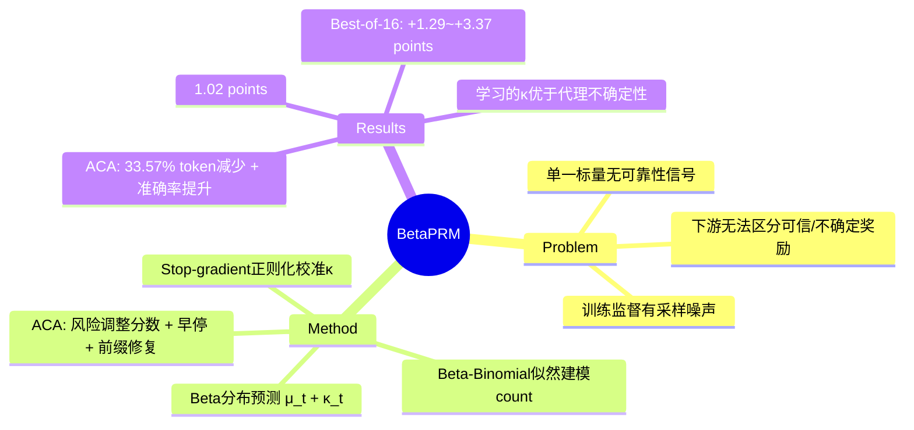

## Summary
提出 BetaPRM，用 Beta 分布预测 process reward 的均值和可靠性，解决现有 PRM 只输出单一标量、无法区分可信与不确定奖励的问题；配合 Adaptive Computation Allocation (ACA) 在 Best-of-N 推理中减少 33.57% token 消耗的同时提升准确率。

## Problem & Motivation
现有 Process Reward Models (PRMs) 只输出单一标量奖励，下游方法必须将不完美的 step-level 预测当作可靠信号，但无法知道何时应该信任这些预测。两个核心问题：(1) **缺乏不确定性量化**：因果 PRM 在推理时看不到未来延续，即使局部无错误也不确定前缀是否通向正确答案；(2) **训练监督有噪声**：Monte Carlo step supervision 从前缀采样 N 次得到 K 次成功，K/N 只是有限样本估计，标准 PRM 将其作为点目标回归可能过拟合采样噪声。

## Method

### 核心思想
BetaPRM 预测 Beta 分布而非单一标量，参数化为：
- **均值 μ_t**：预测的成功概率，作为标准 PRM 分数
- **浓度 κ_t**：置信度集中程度，表示可靠性

### Beta-Binomial Count Model
生成模型假设：
- K_t | q_t ~ Binomial(N, q_t)  — 给定潜在概率的成功计数
- q_t ~ Beta(α_t, β_t)  — 对潜在概率的 Beta 先验

重参数化为 α_t = μ_t · κ_t 和 β_t = (1 - μ_t) · κ_t。边缘化 q_t 得到 Beta-Binomial 分布，为计数观测提供似然而非点目标。

### 架构与参数化
在每个 `<prm>` 标记处，语言模型产生隐状态 h_t 和词表 logits z_t。成功概率 μ_t 通过 Yes/No reward-token logits 的 softmax 计算：

μ_t = exp(z_t^Yes) / (exp(z_t^Yes) + exp(z_t^No))

浓度由独立的轻量线性头预测：

κ_t = softplus(g_φ(h_t)) + κ_min

这将奖励通道（来自 reward-token logits）与可靠性通道（来自额外的头）分离。

### 训练目标
**Beta-Binomial loss** — Beta-Binomial 分布下观测计数的负对数似然：

ℒ_Beta-Binomial = -1/|𝒫| Σ_t log p(K_t | N, α_t, β_t)

**辅助证据正则化器** — 当 μ_t 与观测比率 K_t/N 不一致时惩罚高浓度：

ℒ_reg = λ_reg · 1/|𝒫| Σ_t |sg(μ_t) - K_t/N| · κ_t

μ_t 上的 stop-gradient 至关重要：防止该项变成另一个软标签回归，而是专注于校准 κ_t。

**总损失**：ℒ = ℒ_Beta-Binomial + ℒ_reg

### 超参数
- AdamW 优化器，LR 1×10⁻⁵，weight decay 0.05，cosine decay with warmup (ratio 0.05)
- 1 epoch，global batch size 512，max sequence length 8192
- Vision encoder 冻结；LLM + multimodal projector 可训练
- κ_min = 1×10⁻³，初始 κ = 4.0，λ_reg = 5×10⁻²
- Concentration-head LR 倍数：10.0
- 训练：4-8 A100 GPUs 约 48 小时

### 推理：Adaptive Computation Allocation (ACA)
ACA 使用 BetaPRM 的可靠性信号在 Best-of-N 推理中自适应分配计算。

**风险调整候选分数**：
- Beta 标准差：σ_t = √(μ_t(1-μ_t)/(κ_t+1))
- 风险调整步骤分数：r_t = μ_t - λ·σ_t
- 候选分数：S(y) = (1/T) Σ_t r_t

**渐进批次生成与早停**：
ACA 分批生成候选（初始 n₀=4，后续每批 m=4，最大 N=16）。每阶段：
- **停止测试**：LCB(y*) > max_{y≠y*} UCB(y)，其中 LCB/UCB 由 S(y) ± c_stop · U(y) 构造，U(y) 为平均步骤级不确定性。若最佳候选的悲观界超过所有竞争者的乐观界，则停止。

**不确定性引导的前缀修复**：
若停止失败，ACA 针对最高 UCB 的非获胜候选进行修复。识别切点为最早使 μ_t - c_cut · σ_t 低于 p_bad（阈值 0.3）的步骤，或最不确定的步骤。从该切点前的前缀采样新延续。

## Key Results

### 训练数据
VisualPRM400K-v1.1：565,096 rollouts，3,174,394 标注步骤（过滤后）。每个前缀报告 N=16 Monte Carlo 样本中的 K 次成功。覆盖 38 个子集，包括图表理解、chart/document QA、通用 VQA、科学推理和几何推理。

### Best-of-16 选择（表 1）
BetaPRM 在所有 backbone-benchmark 组合上达到最高准确率。相比 Standard PRM 的平均提升：
- InternVL3-14B：+1.29 points
- InternVL3-8B：+1.46 points
- InternVL2.5-8B：+3.37 points
- Qwen2.5-VL-7B：+2.66 points

BetaPRM 使用"风险预算选择器"，对具有许多高不确定性步骤的候选进行折扣。

### 步骤级错误检测（表 2）
BetaPRM 在 VisualProcessBench 上与 Standard PRM 保持竞争力：
- InternVL3-14B 上匹配 Standard PRM（61.90 micro-F1）
- InternVL3-8B（61.85 vs 60.69）和 Qwen2.5-VL-7B（62.91 vs 62.23）略有改进
- InternVL2.5-8B 上略低（60.97 vs 61.54）

### ACA 结果（表 4）
ACA 相比 vanilla Best-of-16 改善了准确率-token 权衡：

**InternVL2.5-8B**：token 减少 16.76%–33.57%，同时在所有 benchmark 上提升准确率（例如 MathVerse：45.58 准确率 vs 44.47，token 减少 33.57%）。

**Qwen2.5-VL-7B**：token 减少 19.39%–33.00%，所有 benchmark 上准确率提升。

无早停的消融显示，仅自适应扩展主要节省 token 但可能引入干扰候选；结合早停产生最强权衡。

### ACA 不确定性来源消融（表 5）
比较三种 ACA 不确定性来源：
- **BetaPRM（学习的不确定性）**：最佳准确率-token 权衡
- **Standard PRM（代理不确定性）**：使用 σ_t = √(μ_t(1-μ_t))，达到中等结果
- **Standard PRM（仅奖励）**：使用 σ_t=0，节省最多 token 但准确率明显下降

BetaPRM 学习的 κ_t 提供独特信号，在两个维度上优于代理不确定性——更高准确率和更少 token。

### 辅助正则化器消融（表 3）
从 InternVL2.5-8B 上的 BetaPRM 移除 ℒ_reg 在所有四个 benchmark 上降低准确率，平均下降 -1.02 points。stop-gradient 防止 μ_t 向噪声 K/N 漂移，同时有效校准 κ_t。

### κ 的训练动态（图 4）
在所有 backbone 上，κ_t 的均值和 90th 百分位在训练早期急剧下降（模型变得保守，因为 μ_t 不可靠），然后逐渐恢复。90th 百分位比均值恢复更强，形成高置信度的上尾——对区分可信与不确定奖励很重要。

## Strengths & Weaknesses

**Strengths**：
- **理论优雅**：Beta-Binomial 建模自然分离了"预测什么"和"有多确定"，stop-gradient 设计巧妙防止 μ_t 退化
- **实用价值**：ACA 在多个 VLM backbone 上一致性地实现 accuracy-token Pareto 改进，token 节省高达 33.57% 且准确率提升
- **可靠性信号有效**：学习的 κ_t 优于代理不确定性（表 5），训练动态（图 4）显示模型确实学会区分高低置信度预测
- **实验全面**：覆盖 4 个 backbone、4 个 benchmark、多个消融，结论稳健

**Weaknesses**：
- **数据依赖强**：需要保留 Monte Carlo count (K, N) 的监督，而非二值化标签。作者承认 VisualPRM400K-v1.1 是唯一公开可用的此类数据集，限制了评估范围（仅多模态 PRM）。文本 PRM 数据集（如 PRM800K）通常只提供二值标签，无法直接应用
- **计算开销**：额外的 concentration head 和 Beta-Binomial 似然计算增加训练成本（48 小时 4-8 A100），推理时 ACA 的 UCB/LCB 计算和前缀修复也有额外开销
- **ACA 超参敏感**：c_stop、c_cut、p_bad、λ 等超参需要调优，论文未充分讨论对不同任务的鲁棒性
- **可靠性非保证**：作者明确指出"学习的可靠性是额外信号而非正确性保证"，高风险应用仍需人工监督

**潜在影响**：
- 为 PRM 引入不确定性量化的新范式，可能启发其他 reward model（outcome RM、preference model）的分布式建模
- ACA 的自适应计算分配思想可推广到其他 Best-of-N 场景（代码生成、对话、规划）
- 数据依赖问题可能推动社区构建更多保留 count 信息的 PRM 数据集

## Mind Map

## Notes
- **与 ORM 的对比**：Outcome Reward Model (ORM) 只在最终答案处给奖励，PRM 在每步给奖励。BetaPRM 的不确定性量化思想是否可迁移到 ORM？最终答案的不确定性可能更容易通过 self-consistency 等方法估计，但 step-level 的细粒度不确定性对 process supervision 更关键
- **与 Bayesian RL 的联系**：κ_t 类似 epistemic uncertainty，但这里是监督学习而非探索-利用权衡。是否可以将 BetaPRM 用于 active learning，优先标注高不确定性的 step？
- **Scaling 潜力**：论文在 8B-14B 模型上验证，更大模型（70B+）是否能学到更精细的可靠性信号？κ_t 的动态范围是否会随模型规模变化？
- **与 Constitutional AI 的结合**：可靠性信号能否用于识别需要人类反馈的 critical step，实现更高效的 RLHF？
