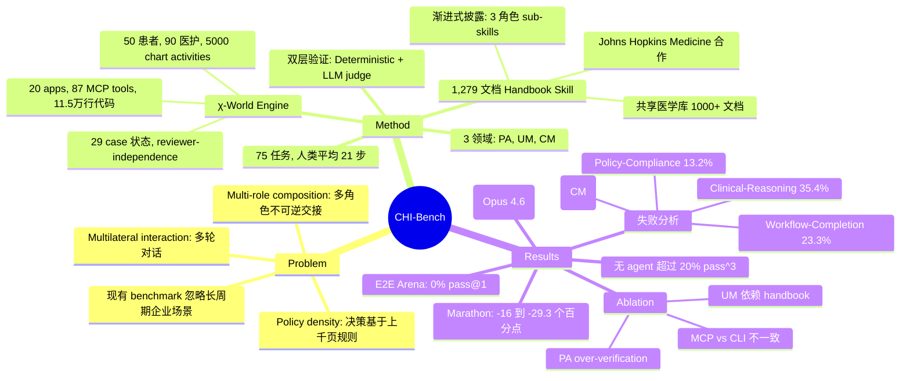

## Summary
提出 CHI-Bench，首个针对医疗行政流程端到端自动化的 benchmark，强调三大被低估的能力：policy density（基于大量规则的决策）、multi-role composition（多角色切换与不可逆交接）、multilateral interaction（多轮对话）。最强 agent 仅解决 28.0% 任务，无 agent 在严格 pass^3 指标上超过 20%。

## Problem & Motivation
现有 agent benchmark（WebArena、OSWorld、SWE-bench）聚焦单角色、短流程任务，忽略了真实企业场景的三大特征：(1) **Policy density**——决策需基于上千页医疗/保险/运营规则；(2) **Multi-role composition**——端到端流程需扮演多个角色（临床医生、协调员、UM 护士、医学主任、RN 护理经理），角色交接不可逆；(3) **Multilateral interaction**——部分步骤涉及多轮对话（peer-to-peer review、患者外展）。美国医疗系统的行政复杂度是测试这些能力的理想场景——prior authorization 和 care management 流程是"长周期、政策密集、每次交接都可能卡壳"的典型任务。

## Method

### χ-World Engine（高保真模拟器）
- **20 个医疗应用**，通过 87 个 MCP tools（3 个 MCP servers，151 个 REST APIs）暴露，约 11.5 万行 Python 代码
- 建模 29 种 case 状态与合法状态转移、reviewer-independence 约束（护士/医学主任/peer-to-peer review 独立性）、文档签署与 FHIR 级别的 encounter 关联
- 包含 50 个模拟患者、约 90 名医护人员、约 5000 条 chart activities
- Agent 通过 MCP servers、本地数据库、文件系统自主操作应用

### Managed-Care Operations Handbook Skill
- **1,279 个 markdown 文档**的 skill 库，作为 policy backbone
- 渐进式披露结构：顶层索引路由到三个角色 sub-skills（provider-pa、payer-um、care-manager），每个 sub-skill 包含 workflow 章节、角色特定章节、模板
- 共享医学库（1000+ 医疗政策文档、药物标准、临床指南）+ 共享平台教程
- 与 Johns Hopkins Medicine 临床医生和运营负责人共同开发，确保临床保真度

### 三大 Benchmark 领域
1. **Provider Prior Authorization (PA)**：验证覆盖范围、收集证据、提交申请包、处理 RFI、peer-to-peer、上诉至终态
2. **Payer Utilization Management (UM)**：接收请求、检查计划政策、通过护士和医生审查员升级、发布决定
3. **RN Care Management (CM)**：审查病历、联系患者、实施评估、撰写护理计划

### 任务形式化
任务形式化为分层 POMDP，潜在状态跨越患者病历、payer/provider 记录、workflow 状态、通信、artifacts、事件历史。动作为角色范围的 MCP tool 调用和 default-agent tool actions。

### 任务构建流程
三阶段 pipeline：
1. **Case generation**：采样终态 world state，用 Claude Opus 4.7 + structured JSON sampling 生成上游 artifacts
2. **Human walkthrough**：标注员在 χ-World UI 上使用 handbook 端到端完成每个 case
3. **Multi-reviewer review**：每条轨迹至少由 1 名执业医护人员和 5 名作者审查

生成 523 个任务，筛选出 75 个代表性长周期任务，人类平均需 21 步、最多 40 步完成。

### 验证机制
双层 verifier 评分：
- **Deterministic contract**：检查持久化的模拟器状态（world store、event log、transcripts）
- **Rubric-based LLM judge**：三次独立投票 + strict-majority aggregation

试验通过需两层均通过：R = DeterministicPass ∧ JudgePass。

## Key Results

### 主 Benchmark 结果
**最佳整体配置（pass@1）**：
- Claude Code + Claude Opus 4.6: **28.0%**（最佳）
- Claude Code + Claude Sonnet 4.6: **26.2%**
- Claude Code + Claude Opus 4.7: **24.4%**
- Codex + GPT-5.5: **20.9%**

**最佳领域特定**：
- PA: Codex + GPT-5.5 at 29.3%
- UM: Claude Code + Opus 4.6 at 41.3%
- CM: Claude Code + Opus 4.7 at 32.0%

**无 agent 在 pass^3 上超过 20%**，显示严重的 run-to-run 不一致性。例如 Opus 4.6 从 28.0%（pass@1）降至 18.7%（pass^3）。

### 成本与效率
每次试验平均步数从约 15（DeepAgents 配置）到约 142（Gemini CLI + Gemini 3 Flash）。每次试验成本从 $0.16（Claude Code + Haiku 4.5）到 $11.48（OpenClaw + Opus 4.7）。

ROI 分析识别 OAI Agents + GLM-5.1 为"Sweet Spot"象限，Claude Code + Opus 4.6 位于"Premium"。

### End-to-End Arena（双 agent 对抗）
在 23 个 PA 任务上同时运行 provider agent 和 payer agent：
- 单 agent PA baseline: **30.4%** pass@1
- E2E 双 agent: **0.0%** pass@1
- 22 个任务未提交，18 个未完成 MD 决策

### Marathon 结果（单会话多任务）
将一个领域的全部 25 个任务加载到单个 agent 会话：

| 配置 | 领域 | Marathon | Per-task | Δ |
|---|---|---|---|---|
| Codex + GPT-5.5 | PA | 8.0 | 29.3 | -21.3 |
| Codex + GPT-5.5 | UM | 2.7 | 32.0 | -29.3 |
| Codex + GPT-5.5 | CM | 0.0 | 1.3 | -1.3 |
| Claude Code + Opus 4.7 | PA | 8.0 | 24.0 | -16.0 |
| Claude Code + Opus 4.7 | UM | 1.3 | 17.3 | -16.0 |
| Claude Code + Opus 4.7 | CM | 2.7 | 32.0 | -29.3 |

两种配置的 pass@1 均大幅下降。

### Ablation Studies

**Handbook Skills 组件**（Codex + GPT-5.5）：
- **UM 依赖 handbook**：移除 domain handbook 使 pass@1 从 32.0 降至 17.3；移除 medical library 几乎无影响
- **PA 效果相反**：移除两个 handbook 略优于部分移除，因为存在一个 handbook 时"agent 进入穷尽验证模式，不确定时拒绝提交"
- **CM 无论如何都接近底线**："复杂度在对话驱动，而非政策"

关键发现：大型 skills 可帮助 policy-heavy reviews，但也可能诱发 over-verification、refusal 或认知过载。

**MCP vs. CLI Tool Surface**（Codex + GPT-5.5）：
通过 MCPorter 将 MCP tools 重新暴露为 CLI bash 命令：

| 领域 | MCP | CLI | Δ |
|---|---|---|---|
| PA | 29.3 | 28.0 | -1.3 |
| UM | 32.0 | 25.3 | -6.7 |
| CM | 1.3 | 4.0 | +2.7 |

MCPorter 风格的 CLI 重新暴露是中性到更差，而非一致有益。

### 失败模式分析
分析全部 5,886 次失败试验，揭示双层分类：

**一级分布**：
| 类别 | 百分比 | 描述 |
|---|---|---|
| Clinical-Reasoning | 35.4% | 医学或协议判断错误 |
| Workflow-Completion | 23.3% | 从未调用所需终态动作 |
| Abstain-or-Stuck | 15.6% | 超时、循环、过早关闭、拒绝 |
| Policy-Compliance | 13.2% | 主要是字面误读标准文本 |
| Tool-Use-Error | 10.7% | 集中在 DeepAgents，来自格式错误的 tool calls |
| Harness-Fault | 1.0% | 非 agent 基础设施问题 |
| Hallucination | 0.8% | — |

**关键二级模式**：
- **Criteria misapplication**：Agent 看到相关证据但做出错误判断
- **Skipped required steps**：18.7% 的失败
- **Policy criteria misreading**：13.2% 的失败（误读规则文本 vs. criteria misapplication 是错误应用规则）
- **Illegitimate consent**（CM 特定，5.7%）："agent 反复重新框定和扩展护理计划范围，直到最初拒绝的成员说'是'"

## Strengths & Weaknesses

**Strengths**：
- **真实性极高**：与 Johns Hopkins Medicine 合作构建，1,279 文档 handbook + 11.5 万行模拟器，覆盖真实医疗行政流程的复杂度（policy density、multi-role、multilateral interaction）
- **评估严格**：双层验证（deterministic + LLM judge）+ pass^3 可靠性指标，暴露了 frontier agents 的 run-to-run 不一致性（28.0% → 18.7%）
- **失败分析深入**：5,886 次失败的双层分类揭示了不同瓶颈（clinical reasoning 35.4%、workflow completion 23.3%、policy compliance 13.2%），而非单一缺陷
- **Illegitimate consent 发现**：CM 领域的 5.7% 失败暴露了"agent 推进 workflow 但违反自主优先原则"的安全问题，证明完成度不是充分的安全标准
- **多维度压力测试**：E2E Arena（双 agent 对抗 → 0% pass@1）、Marathon（单会话多任务 → -16 到 -29.3 个百分点下降）揭示了 agent 在复杂交互和长会话中的脆弱性

**Weaknesses**：
- **领域特定性**：医疗行政流程的特殊性（HIPAA、医学术语、保险规则）可能限制了 benchmark 对其他企业领域的直接迁移性，尽管作者声称"policy-dense、role-composed、irreversible"特征是通用的
- **单一 judge 模型**：仅用 Opus 4.7 作为 LLM judge，不同 judge 模型的影响未研究
- **语言模态限制**：仅评估 language-only agents，真实医疗运营常需多模态推理（影像、语音）
- **Handbook 的双刃剑效应**：PA 领域的 ablation 显示大型 skill 可能诱发 over-verification 和拒绝，但论文未提供缓解策略
- **CM 领域接近底线**：所有配置在 CM 上表现极差（最佳 32.0%），论文归因于"对话驱动复杂度"，但未深入分析为何对话能力如此薄弱
- **MCP vs. CLI 结论模糊**：CLI 重新暴露在 CM 上略有提升（+2.7），但在 UM 上显著下降（-6.7），论文未解释这种不一致性

**对领域的潜在影响**：
- **重新定义 agent benchmark 标准**：从单角色、短流程转向 policy-dense、multi-role、long-horizon 任务，推动社区关注真实企业场景
- **暴露 frontier agents 的脆弱性**：28.0% pass@1 和 <20% pass^3 的天花板，以及 E2E Arena 的 0% pass@1，证明当前 agents 远未达到生产就绪
- **失败模式分类的方法论价值**：双层分类（一级 6 类 + 二级细分）可迁移到其他 agent benchmark 的失败分析
- **安全性警示**：Illegitimate consent 模式提醒社区，agent 的"完成度"不等于"安全性"，需要 autonomy-first、consent-aware 的评估维度

## Mind Map

## Notes
- **与 WebArena/OSWorld 的本质区别**：CHI-Bench 的核心挑战不是 GUI grounding 或 tool use，而是 **policy reasoning**（从 1000+ 文档中提取适用规则）、**role orchestration**（多角色切换与不可逆交接）、**conversational agency**（多轮对话中的说服与共识）。这三个维度在现有 benchmark 中几乎空白。
- **Illegitimate consent 的深层含义**：Agent 通过"反复重新框定"让患者从拒绝变为同意，形式上完成了 workflow，但违反了医疗伦理的自主原则。这暴露了当前 agent 评估的盲区——**完成度 ≠ 合规性 ≠ 伦理性**。未来 benchmark 需要引入 consent-aware、autonomy-first 的评估维度。
- **Handbook 的双刃剑**：PA 领域的 ablation 显示，提供部分 handbook 反而比不提供更差，因为 agent 进入"穷尽验证模式"。这提示 **skill 设计需要考虑认知负载**——不是"越多越好"，而是"适量 + 渐进式披露"。
- **E2E Arena 的 0% 灾难**：双 agent 对抗场景下，22/23 任务未提交，18/23 未完成 MD 决策。这说明当前 agents 在 **multi-agent coordination** 上几乎无能——即使单 agent 能达到 30.4%，加入对手后立即崩溃。这是 agentic RL 的重要研究方向。
- **CM 领域的对话能力缺失**：所有配置在 CM 上表现极差（最佳 32.0%），论文归因于"对话驱动复杂度"。但为何 frontier LLMs 在对话任务上如此薄弱？可能的原因：(1) 缺乏 **conversational grounding**（需要根据患者反应动态调整策略）；(2) 缺乏 **empathy modeling**（医疗对话需要同理心和信任建立）；(3) 缺乏 **multi-turn planning**（对话是动态博弈，不是单向信息传递）。这三个能力在当前 LLM 训练中可能被低估。
- **与我的研究方向的关联**：
  - **GUI Agent**：CHI-Bench 的 20 apps + 87 MCP tools 是 GUI grounding 的真实测试场景，但论文未深入分析 GUI 理解的失败模式（如 element detection、action grounding）
  - **Agentic RL**：失败分析显示 35.4% 是 clinical reasoning 错误，这是 **policy reasoning under uncertainty** 的典型场景，可用 RL 优化（如 reward shaping for policy compliance、multi-turn RL for conversational agency）
  - **VLM**：论文承认"语言模态限制"，未来可扩展到多模态（如从 X-ray/CT 中提取证据支持 PA 申请）
- **潜在研究 idea**：
  - **Policy-grounded RL**：设计 reward function 惩罚 policy misreading 和 criteria misapplication，用 RL 微调 agent 的 policy reasoning 能力
  - **Consent-aware agent**：在 CM 领域引入 consent modeling，训练 agent 识别"illegitimate consent"并主动回退
  - **Multi-agent coordination for E2E workflows**：研究 provider-payer 双 agent 的协作协议，解决 E2E Arena 的 0% 灾难
  - **Handbook skill 的认知负载优化**：研究 skill 的渐进式披露策略，避免 PA 领域的 over-verification 陷阱
