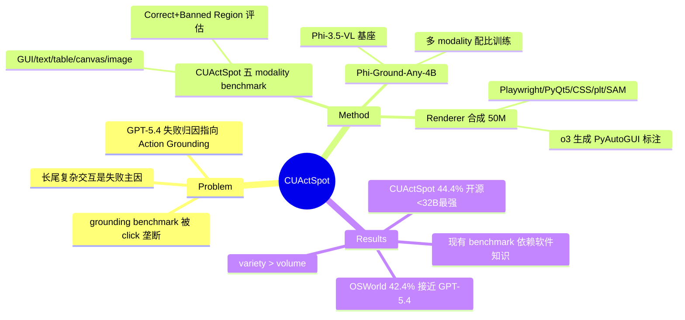

## Summary
指出现有 GUI grounding 数据与 benchmark 被"点击标准控件"垄断、无法覆盖真实 computer use 中的长尾复杂交互（拖拽、画线、表格/画布/图像操作），提出覆盖五种 modality 的 CUActSpot benchmark（206 样本）和基于 renderer 的 50M 规模合成数据管线，训出的 Phi-Ground-Any-4B 在 <32B 开源模型中最强（CUActSpot 44.4%）。

## Problem & Motivation
- 现有 grounding benchmark（ScreenSpot-Pro、UI-Vision 等）几乎全是标准 GUI widget 上的单点 click，而真实 computer use agent 需要在 table、document、chart、image 上做 drag、draw 等复杂交互。
- 作者对 GPT-5.4 在工作场景的失败案例分析发现：Action Grounding 是最主要的错误来源，且复杂操作上的坐标误差远高于简单点击。
- 核心观察是 GUI 操作的 long-tail pattern：少量低频复杂交互贡献了不成比例的任务失败——即当前模型的短板恰好在 benchmark 覆盖不到的地方。

## Method
**CUActSpot benchmark（206 样本）**：覆盖五种 modality——GUI（click/drag/draw）、text（文本选择与编辑）、table（单元格/边界/角点操作）、canvas（形状与连接线）、natural image（轮廓追踪、区域编辑）。评估规则用 Correct Region + Banned Region 组合，支持 order-sensitive 与 unordered 的多步坐标输出。

**Renderer-based 数据合成管线（共 50M 样本）**：核心思路是"渲染器天然掌握 ground-truth 坐标"，逐 modality 用不同 renderer 合成：
- GUI（30M）：CommonCrawl 网页 → Playwright 渲染 → 规则过滤/去重（每域 ≤50 页）→ o3 标注；
- Text（5M）：PyQt5 随机渲染 2500 种字体文本，逐字符记录坐标；
- Table（5M）：16k 种子表 GPT 变异 ×10，配 1k CSS 模板随机参数组合渲染；
- Canvas（5M）：matplotlib 随机放置 15 种形状，几何标注；
- Image（5M）：SAM 数据集采样区域 + GPT-4o 生成描述 + contour 多边形标注。
- 指令合成用 o3：给定元素坐标与空间 metadata，输出 PyAutoGUI 代码（允许中间坐标计算），使标注覆盖 drag/draw 等复合动作。

**Phi-Ground-Any-4B**：基座 Phi-3.5-VL（4B，无 GUI 预训练），混合数据配比 GUI 6.8M(0.34) / Text 5M(0.25) / Table 2M(0.10) / Canvas 2M(0.10) / Image 3M(0.15) / OpenCUA 1.2M(0.06)，训练约 100B tokens，80×H100 × 30 小时。

## Key Results
- **CUActSpot**：Phi-Ground-Any-4B 总体 44.4%（GUI 44.7 / Text 34.4 / Table 68.8 / Canvas 40.6 / Image 33.3），超过 OpenCUA-32B 之外的所有 <32B 开源模型；GPT-5.4 为 63.6% 仍显著领先；现有专用 GUI grounder（MAI-UI-8B 15.3%、GUI-Owl-1.5-8B 15.4%）在长尾动作上接近崩溃。
- **OSWorld 端到端**：作为 grounder 接入后成功率 42.4%，接近 GPT-5.4（44.1%），高于 GUI-Owl-1.5-8B（37.7%）。
- **Variety scaling ablation**：固定预算下增加 modality 多样性比单一 modality 堆量有效得多——仅 GUI 2M 时 CUActSpot 14.8%，逐步加入 Text/Table/Canvas/Image 后升至 ~31.6%。
- **组合泛化**：训练只覆盖 20 个细分任务，评测 33 个中 27 个可完成，存在有限的跨任务泛化。
- **Benchmark 批判性发现**：用 app 特定数据微调后 ScreenSpot-Pro 从 26.3% 升到 41.5%、但 CUActSpot 反降至 36.5%；且新一代模型在 ScreenSpot-Pro 与 UI-Vision 间分差 >20 个百分点（早期模型 <10），说明现有 grounding benchmark 的高分越来越依赖软件特定知识而非真实 grounding 能力。

## Strengths & Weaknesses
**亮点**
- Problem formulation 好：从 agent 失败归因出发定位"动作空间覆盖"这一被 benchmark 盲区掩盖的瓶颈，而非再刷一个 click grounding 榜。
- Renderer-based 合成是 simple & scalable 的标注思路：坐标真值由渲染器免费产生，绕开人工标注和 VLM 伪标注的噪声；variety > volume 的 ablation 是本文最有信息量的结论。
- 对 ScreenSpot-Pro 等现行 benchmark 的"知识 vs grounding 能力"混淆分析，本身就是对社区评测惯例的有效批判。

**局限**
- CUActSpot 仅 206 样本，单条 modality 只有 16-38 例，分项结论统计功效有限。
- 合成数据全部来自 renderer 的规则化分布，与真实软件中复杂控件（如专业软件的自绘 canvas）仍有 domain gap；GPT-5.4 与 44.4% 之间约 19 点的差距说明数据合成路线尚未闭环。
- 指令标注依赖 o3/GPT-4o，质量上限受闭源模型能力与成本约束（推测：50M 全量标注实际只用于部分子集，正文未完全说明抽样策略）。

## Mind Map

## Notes
- 与 2605-GUIRobustEval、2605-OmniGUI 等同期工作可对照：本文把"benchmark 盲区"问题落在 action space 维度，前者多在鲁棒性/感知维度。
- "renderer 即免费标注器"的思路可迁移到 embodied 场景（仿真器坐标真值）。
