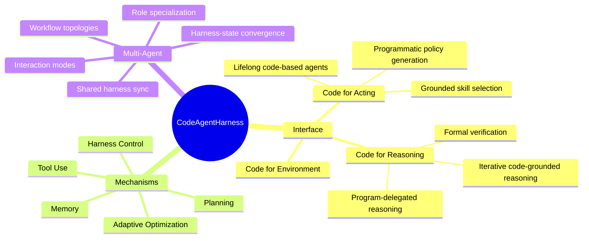

## Summary
一篇 survey，将代码重新定位为 agent 的"操作基底"（agent harness），而非仅仅是 LLM 的输出。提出三层分类法：harness interface（代码作为推理/行动/环境建模的接口）、harness mechanisms（规划/记忆/工具使用/反馈控制）、multi-agent orchestration（多 agent 协同与状态同步）。

## Problem & Motivation
现有 agent 研究多聚焦模型能力（reasoning、tool use）或系统基础设施（API、sandbox），但忽略了 **agent 主动生成的代码制品**（agent-initiated code artifacts）作为连接模型输出与长期行动的关键层。代码不仅是输出，更是可执行、可检查、有状态的操作载体。本文系统化梳理"代码作为 agent harness"这一视角下的已有工作，识别设计模式与开放问题。

## Method
这是一篇 survey，不提出新方法，而是组织现有文献。核心贡献是三层分类法：

### Layer 1: Harness Interface（§2）
代码作为模型与环境的接口，承担三种角色：

**Code for Reasoning（§2.1）**
- **Program-delegated reasoning**: 将计算外化为可执行代码（如 PAL、Program-of-Thoughts），分离推理与计算
- **Formal verification interfaces**: 使用 Lean、Isabelle、Coq 作为机器可验证的证明语言（如 DeepSeek-Prover、Goedel-Prover-V2）
- **Iterative code-grounded reasoning**: 生成-执行-验证-修正循环，利用执行反馈（如 CodeRL、EG-CFG）

**Code for Acting（§2.2）**
- **Grounded skill selection**: 将语言意图映射到可执行技能，带可行性约束（如 SayCan、KnowNo）
- **Programmatic policy generation**: 生成代码作为机器人/GUI agent 的控制策略（如 CaP、RoboCodeX、Code-BT）
- **Lifelong code-based agents**: 持久化技能库，随时间积累（如 Voyager、LYRA）

**Code for Environment（§2.3）**
- 结构化世界表示、执行轨迹建模、代码驱动的评估环境、可验证环境构建

### Layer 2: Harness Mechanisms（§3）
**Planning（§3.1）**: 线性分解、结构驱动规划、基于搜索的规划（如 CodeTree）、编排式规划

**Memory（§3.2）**: 六类子类别——工作记忆、语义记忆、经验记忆、长期记忆、多 agent 记忆、上下文压缩/状态卸载

**Tool Use（§3.3）**: 函数导向、环境交互、验证驱动、工作流编排四类工具使用

**Harness Control（§3.4）**: "plan, execute, and verify" 循环，包括调试级控制、"规划即合约形成"、沙盒执行与权限状态转换、通过确定性传感器验证

**Adaptive Harness Optimization（§3.5）**: 深度遥测作为优化基底、进化 agent 自我改进、受治理的 harness 变异

### Layer 3: Multi-Agent Orchestration（§4）
- **角色专业化**: manager、planner、coder、reviewer、tester agents
- **交互模式**: 协作合成、批评/修复、对抗验证、推理辩论
- **工作流拓扑**: 预定义启发式 vs. 目标驱动自适应拓扑
- **共享 harness 同步**: 共享黑板、并行分支与合并、层次化内存
- **Harness-state 收敛**: 正确性、安全性、性能、基于分数、共识、隐式收敛

## Key Results
作为 survey，本文无实验结果。主要贡献是：
- 识别出 **agent-initiated code artifacts** 这一相对未被充分探索的层次
- 提出三层分类法，系统化组织 200+ 篇文献
- 总结设计模式：代码作为 harness 的三大属性——**executable**（模型输出成为可形式化验证的操作）、**inspectable**（中间计算暴露为结构化轨迹）、**stateful**（演化的程序表示任务进展，持久且可修改）
- 识别七大开放问题（§5.2）：harness 级评估、语义验证、自演化 harness 无回归、事务性共享程序状态、人类在环安全、多模态 code-harness 系统、harness 工程学

## Strengths & Weaknesses
**Strengths**:
- **视角新颖**: 将代码从"LLM 输出"重新定位为"agent 操作基底"，填补了模型能力与系统基础设施之间的概念空白
- **分类清晰**: 三层分类法（interface / mechanisms / orchestration）结构合理，覆盖面广
- **实用价值**: 识别的设计模式（如 "context management is the tax of implicit shared state"、"topology complexity inversely correlates with harness-state formality"）对 agent 系统设计有指导意义
- **开放问题聚焦**: 七大挑战（尤其是 harness-level evaluation、semantic verification、self-evolving harnesses）指向真实痛点

**Weaknesses**:
- **Survey 通病**: 无实验验证，分类法的有效性未经实证检验。三层划分是否是最优组织方式？
- **边界模糊**: "agent-initiated code artifacts" 与 "system-provided harness infrastructure" 的边界在实际系统中往往模糊（如 Voyager 的 skill library 是 agent 生成的，但也是系统提供的持久化机制）
- **深度不足**: 对每个子类别的讨论较浅，更像是文献列表而非深度分析。例如 Memory（§3.2）列出六类，但未深入讨论它们之间的权衡与设计选择
- **缺少量化**: 未提供各类方法的成功率、适用场景的统计分析，难以判断哪些模式更有效
- **开放问题泛泛**: 七大挑战虽然重要，但缺少具体的解决方向或初步尝试，更像是"待办清单"而非研究 roadmap

**对领域的影响**:
- 提供了一个组织 agent 系统设计的新框架，可能影响后续 agent benchmark 和评估方法的设计
- GitHub repo（Awesome-Code-as-Agent-Harness-Papers）可能成为该方向的文献入口
- 但作为 survey，其影响力取决于社区是否接受"code as harness"这一概念框架

## Mind Map

## Notes
- **与我的研究相关性**: 中等。GUI agent / computer-use agent 是我的核心方向，本文 §2.2（Code for Acting）和 §5.1（GUI/OS Agents）直接相关。但作为 survey，更多是文献索引而非方法创新
- **可借鉴的点**: 
  - "代码作为可执行、可检查、有状态的操作载体"这一视角，可用于重新审视 GUI agent 的 action space 设计
  - §3.4 的 "planning as contract formation" 和 "sandboxed execution with permissioned state transitions" 对构建安全的 computer-use agent 有启发
  - §5.2 的 "harness-level evaluation beyond final task success" 指向一个真实痛点：现有 GUI agent benchmark 只看最终成功率，忽略中间步骤的质量
- **疑问**: 
  - 三层分类法是否过于复杂？是否存在更简洁的组织方式？
  - "agent-initiated code artifacts" 与 "prompt engineering"（如 ReAct、chain-of-thought）的边界在哪里？后者也是"代码化"的推理结构
  - 多 agent orchestration（Layer 3）是否应该独立成层？感觉更像是 Layer 2 mechanisms 的组合应用
