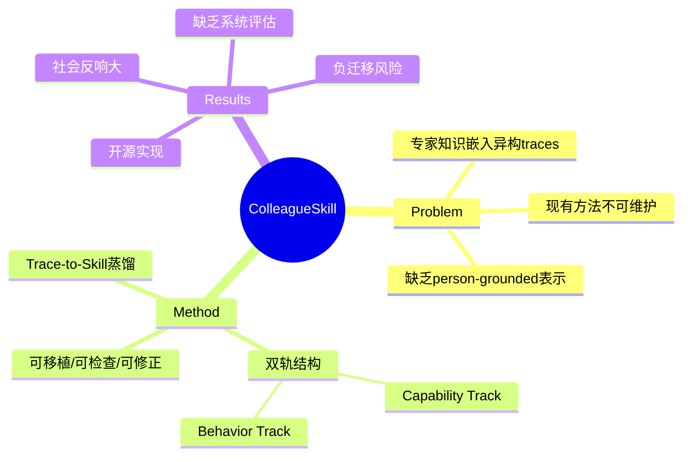

## Summary
通过 trace-to-skill 自动蒸馏系统，将异构专家数据（聊天记录、代码审查、访谈等）转化为可移植、可检查、可修正的 person-grounded AI skill 包，包含能力轨（实践、心智模型、决策启发）和行为轨（交流风格、交互规则）双轨表示。

## Problem & Motivation
现有 LLM agent 缺乏对特定领域专家知识的结构化表示，专家经验通常嵌入在异构的工作痕迹（trace）中而非干净的指令。传统方法要么依赖 opaque prompts 或隐藏记忆，要么需要手工编写 skill，难以规模化且不可维护。COLLEAGUE.SKILL 旨在自动化地从专家材料中提取 person-grounded skills，使 agent 不仅完成任务，还能模仿专家的思维方式和交互风格。

## Method
**Trace-to-Skill Distillation 系统**：将来自目标人物或角色的异构 traces（聊天记录、代码审查、访谈记录、个人消息等）自动转化为版本化的 skill 包。

核心设计包含两个协调的 track：
1. **Capability Track（能力轨）**：捕获实践方法、心智模型（mental models）、决策启发式（decision heuristics）
2. **Bounded Behavior Track（边界行为轨）**：捕获沟通风格、交互规则（interaction rules）、修正历史（correction history）

Skill 包特性：
- **可移植**：可跨不同 agent host 安装使用
- **可检查**：skill 内容结构化、透明，非黑盒
- **可修正**：支持版本化更新和迭代改进
- **有边界**：明确表示为 bounded representation，不企图完整复制人类身份

系统输入：异构专家材料；输出：可直接用于 agent 系统的 skill 包。

## Key Results
> [未获取全文，仅基于搜索结果和公开讨论]

- 开源实现：GitHub 仓库 github.com/titanwings/colleague-skill
- 项目在中国科技圈引发广泛讨论，被 MIT Technology Review 报道，反映出对 AI 替代职场角色的社会焦虑
- 据报道，作者 Tianyi Zhou（24 岁工程师）在 4 小时内快速原型开发，源于 agent security 研究的副产物
- 相关研究 Trace2Skill 在 spreadsheet 任务、VisionQA、math reasoning 等 challenging domains 表现出显著提升

缺乏具体 benchmark 指标（成功率、任务完成度、skill 质量评估等），论文侧重系统设计而非大规模实证评估。

## Strengths & Weaknesses
**Strengths**：
- 问题切入点新颖：将 agent skill 与 person-grounded expertise 结合，不止于通用任务完成
- 系统设计清晰：双轨结构（能力 + 行为）明确分离了"会做什么"和"怎么交互"
- 工程实现完整：开源系统，支持实际部署
- 社会影响力：引发关于 AI 与职场关系的广泛讨论

**Weaknesses**：
- **评估不足**：缺乏系统性 benchmark 和定量指标，难以判断 skill 质量和迁移效果。相关研究 SkillsBench 显示 self-generated skills 常无益甚至负面，本文未证明其蒸馏的 skills 可靠性
- **Trace 质量依赖**：方法高度依赖输入 traces 的质量和代表性，"messy, real-world work traces" 如何有效提取仍是挑战
- **表示局限性**：系统自身承认"无法捕获完整人类专业知识"，尤其是隐含的业务逻辑、资源约束下的权衡、人际关系网络等复杂因素
- **负迁移风险**：如 SkillsBench 和相关工作所示，model-generated skills 存在 non-trivial negative transfer，且"strong extractor ≠ strong consumer"，本文未充分讨论失效模式
- **Skill 粒度与泛化**：unclear 蒸馏出的 skills 在多大程度上能跨任务、跨场景泛化，还是仅限特定工作流

该工作开辟了有趣的研究方向，但需要更严格的实证研究和失效案例分析才能评估其实际可行性。

## Mind Map

## Notes
- 与 Claude Code 的 skill 系统设计理念有相似之处：结构化、可检查、可维护的 skill 包
- 关键疑问：如何验证蒸馏出的 skill 真正捕获了专家的 mental model 而非表面行为模式？
- Trace2Skill (arXiv 2603.25158) 似为相关或前置工作，值得对比阅读
- 社会维度：中国科技公司鼓励员工"document workflows"以便自动化，引发职场焦虑，这是技术采纳的真实阻力
