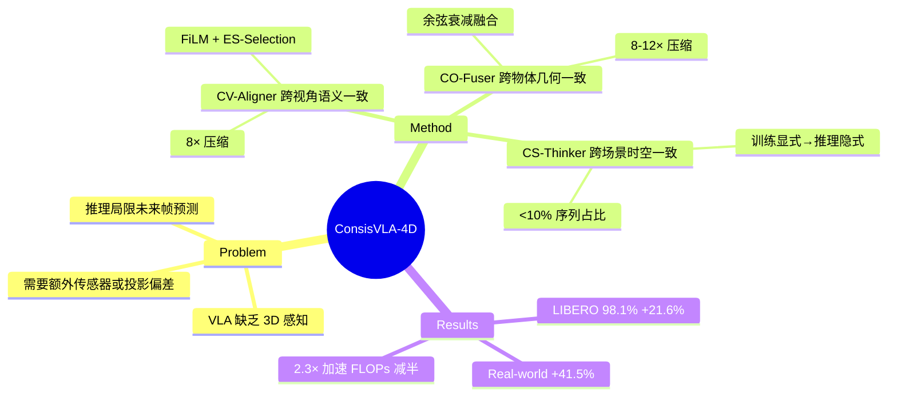

## Summary
ConsisVLA-4D 提出 VLA 框架，通过三级一致性（跨视角语义、跨物体几何、跨场景时空）实现高效 3D 感知和 4D 推理，在 LIBERO 达到 98.1% 成功率（+21.6% vs OpenVLA），同时推理速度提升 2.3×，FLOPs 减半。

## Problem & Motivation
现有 VLA 模型存在两大局限：（1）2D→Action 映射缺乏空间感知，需要额外传感器或存在投影偏差；（2）推理能力局限于未来帧预测，缺乏对场景动态演化的理解。作者受人类操作启发——通过双目视觉维持跨视角一致的空间感知，同时进行视觉推理——提出统一框架同时解决 3D 感知和 4D 推理问题。

## Method
框架包含三个组件，逐层构建一致性：

**1. CV-Aligner（Cross-View Object Semantic Consistency）**
- FiLM 调制：instruction embedding 逐层调制 SigLIP 视觉特征
- ES-Selection：计算 visual token 与 instruction 的余弦相似度，保留 Top-K=32 相关 token（压缩 8×）
- Single-Fusion：4 层 Transformer 跨注意力，注入 VGGT 3D 特征，建立跨视角物体身份关联
- 输出：**z**^{obj-3D}（指令相关的物体表示）

**2. CO-Fuser（Cross-Object Spatial Geometric Consistency）**
- Group-Fusion：逐层加权融合 DINOv2 几何特征与 VGGT 3D 特征，α_l 按余弦衰减（浅层强几何先验→深层学习特征）
- Aggregation Token：64 个可学习 token 拼接（压缩 8-12×）
- IG-Aggregation：块内因果自注意力，几何信息流入聚合 token
- 输出：**z**^{agg-3D}_{L'}（紧凑隐式空间关系表示）

**3. CS-Thinker（Cross-Scene Spatiotemporal Consistency）**
- 两条学习路径：（a）多视角物体→单视角动态物体预测；（b）抽象关系→全局深度解码
- SC-Attn：物体、几何、指令、动态、深度、action token 统一注意力窗口
- 训练时显式监督动态/深度预测，推理时仅依赖隐式知识（无需生成中间表示）
- 损失：L_total = L_action + L_dyn-4D + L_dep-4D

**效率关键**：视觉输入压缩至原始 1/8，CS-Thinker 仅占 observation-instruction 序列 <10%。

## Key Results
**LIBERO（单臂）**：98.1% 平均成功率（Spatial 98.8%, Object 99.8%, Goal 98.0%, Long 95.6%），相比 OpenVLA +21.6%，超越 π₀.₅（96.9%）。

**ManiSkill2**：94.3% 平均（Pick 93%, Stack 95%, Push 95%），vs OpenVLA-OFT 88.7%。

**RoboTwin 2.0（双臂）**：7 任务均超越 OpenVLA-OFT。

**Real-world（双臂）**：4 长程任务平均 +41.5% vs OpenVLA，微波炉/剥香蕉/抽屉/叠衣均表现优异。

**效率**：相比 OpenVLA，仿真环境 2.3× 加速（72.7 vs 3.9 Hz），真实双臂 2.4× 加速（108.2 vs 1.8 Hz），FLOPs 减半（4.59T vs 8.48T）。

**消融**：余弦衰减 α_l 策略优于线性（LIBERO 98.1% vs 94.4%/95.9%）；E3D 模块关键，移除后 FLOPs 激增至 16.83T，延迟翻倍。

## Strengths & Weaknesses
**亮点**：
- 问题定义清晰：从"3D 感知"延伸至"4D 推理"，三级一致性框架逻辑自洽
- 效率设计巧妙：通过显式语义筛选+隐式几何聚合实现压缩，推理时不生成中间表示
- 实验扎实：多 benchmark（LIBERO/ManiSkill2/RoboTwin/Real-world）+ 消融完整
- 余弦衰减 α_l 策略有洞见：浅层保持强几何先验，中间层过渡，深层学习语义

**局限**：
- 多视角依赖：CV-Aligner 需要至少双视角，单目场景不适用
- 3D 标注成本：VGGT 和 CoTracker 监督需要深度/跟踪标注，数据获取成本未讨论
- 长程任务性能下降：LIBERO Long（95.6%）低于 Spatial/Object（98.8%/99.8%），双臂真实任务中叠衣（60 demo）性能未公开具体数字
- 推理范围有限：CS-Thinker 学习的是"固定视角 i* 的动态预测"，跨视角泛化能力未验证

**潜在影响**：
- 为 VLA 模型的 3D/4D 能力提供了可复现基线（CVPR 2026，代码开源）
- "训练显式监督→推理隐式知识"的设计思路可迁移至其他模态
- 效率-性能权衡对实时机器人系统有实践价值

## Mind Map

## Notes
- 灵感来源：人类双目视觉维持空间一致性同时进行推理
- VGGT（Vision-Guided Geometric Transformer）作为 3D 先验来源，未细述其架构
- "Top-K=32" 的选择依据？消融未涉及 K 的敏感性
- 双臂任务 chunk=25 vs 单臂 chunk=8，如何处理时序对齐？
- 与 SpatialVLA 的本质区别：隐式 3D 表示 vs 显式点云