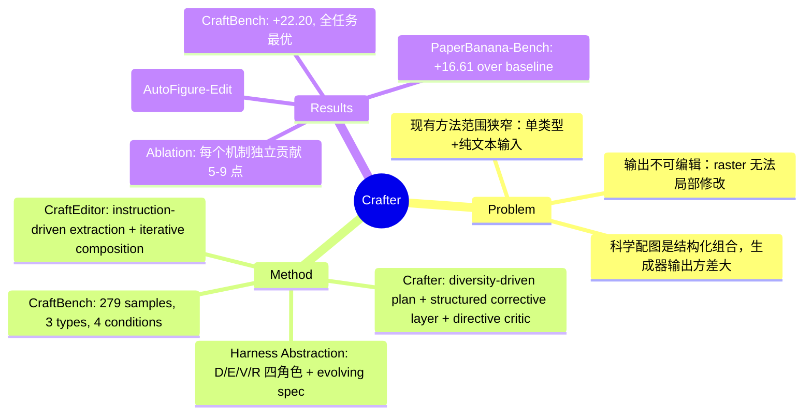

## Summary

提出 Crafter 和 CraftEditor，用 multi-agent harness 架构生成可跨类型、跨输入条件的科学配图，并将 raster 转换为可编辑 SVG，在 PaperBanana-Bench 和新提出的 CraftBench 上全面超越现有方法。

## Problem & Motivation

现有科学配图自动生成系统存在两个根本问题：(1) 范围狭窄——每个系统只针对单一图表类型（如 methodology diagram）和单一输入条件（纯文本），无法处理研究者实际使用的多样化场景（从草图、参考图标、部分布局迭代）；(2) 输出不可编辑——raster 输出无法局部修改，code-generation 方法（如 TikZ）缺乏视觉丰富度。科学配图是结构化组合（labeled boxes、arrows、icons），生成器在这种复杂布局上输出方差大，产生局部错误（garbled labels、misaligned connectors），单纯提升 backbone 无法解决——需要的是 orchestration 层（harness）来包装生成器，通过结构化规范、定向修正和闭环验证来修复失败模式。

## Method

**核心思想：Harness Abstraction**  
不修改 executor（image generator），而是用 orchestration 层包装它，围绕共享的 evolving specification $\mathcal{S}$ 运行四角色循环：
- Designer $\mathcal{D}$：生成 actionable plan $p_t$
- Executor $\mathcal{E}$：执行 plan 渲染 artifact $a_t$
- Verifier $\mathcal{V}$：产出 directive diagnostic $d_t$（per-dimension scores + identified defects + corrections）
- Reviser $\mathcal{R}$：将 $d_t$ 转化为 typed edits 直接修改 $\mathcal{S}$，而非堆积 free-text

**Crafter：Figure Generation Harness**  
五个 agent 实现四角色（Intent Reasoner 初始化 $\mathcal{S}_0$，其余四个对应 $\mathcal{D/E/V/R}$），加一个 Convergence Judge 管理循环。三个关键机制：

1. **Diversity-Driven Plan Exploration**：$\mathcal{D}$ 生成 $K$ 个候选 plan（不同视觉 framing，如 banner layout vs. multi-column grid），$\mathcal{E}$ 并行渲染，Convergence Judge 选最优作为 refinement 起点。逃离结构不适配的 compositional choice，plan-level branching 比 refinement 更高效。

2. **Structured Corrective Layer**：$\mathcal{R}$ 将 $d_t$ 转化为 typed edits（添加 layout constraint、禁用 artifact category、resize element），直接修改 $\mathcal{S}_{t-1}$ 中的字段，保持规范内部一致。避免 free-text revision 累积时出现的指令矛盾（"enlarge title" + "reduce whitespace"）和 faithfulness 退化。

3. **Verify-then-Refine Loop with Directive Critic**：$\mathcal{V}$ 输出 directive diagnostic（6 维度评分 + defects + corrections + revised description），而非 scalar score。$\mathcal{R}$ 据此修改 $\mathcal{S}$。Early-exit gate 在首轮已达标时跳过；best-so-far checkpoint 在退化时回滚（LM-driven iterative editing 非单调）。最多 $T=3$ 轮。

所有任务特定行为在 agent prompts 中，executor 可插拔 → 跨类型、跨条件泛化无需架构改动。

**CraftEditor：Raster-to-Vector Harness**  
将同一 harness pattern 用于 raster → editable SVG 转换，三阶段：

1. **Extraction**（instruction-driven canvas cleaning）：$\mathcal{D}$（VLM agent）生成 keep/delete plan，$\mathcal{E}$（image editor）执行像素级清理，$\mathcal{V}$ 验证 cleaned canvas。最多 $T=3$ 轮。Hallucination filter 过滤 blank/mismatched/text-only extractions。

2. **Processing**：对每个 element caption、grounding、分类（vector/raster）。

3. **Composition**（iterative SVG assembly）：$\mathcal{D}$ 生成 2 个候选 SVG skeleton（不同 temperature），Judge 选优；$\mathcal{E}$ 将 extracted assets 注入 placeholder；$\mathcal{V}$（hybrid critic = VLM + programmatic checkers）评估 rendered SVG vs. original raster。Programmatic checkers 审计 text overflow、arrow endpoint、element overlap、missing components（VLM 容易漏）。$\mathcal{R}$ 修改 SVG source。最多 $T=4$ 轮，best-so-far reversion。

**CraftBench**  
279 samples，3 figure types（academic、poster、infographic），4 input conditions（text-to-image、mask-completion、sketch-conditioned、key-element composition）。Referenced VLM-as-judge evaluation（Gemini 3.5 Flash），独立评分 candidate 和 target（移除 position bias），task- and content-type-specific aspects（0-10），lenient win-rate。

## Key Results

**PaperBanana-Bench**：Crafter（w/ Nano Banana 2）overall 50.34% vs. PaperBanana 33.73%（+16.61），vs. standalone Nano Banana 2 的 11.13%（+39.21）。Crafter（w/ Nano Banana Pro）50.00% vs. PaperBanana 35.96%（+14.04）。

**CraftBench**：Crafter（w/ Nano Banana 2）overall 50.20% vs. PaperBanana 28.00%（+22.20），vs. standalone 19.90%（+30.30）。Per-task：T2I 48.30%，Mask 45.00%，Sketch 70.00%，KeyEl 40.00%——全部任务最优。Crafter（w/ Nano Banana Pro）52.30%。

**Mechanism Ablation**（PaperBanana-Bench）：  
- w/o plan exploration：-8.56（Readability 受损最严重）
- w/o corrective layer：-8.90（最大下降，验证 free-text 累积导致 faithfulness 崩溃）
- w/o refinement loop：-5.48
- w/o directive critic：-5.04

每个机制独立贡献 5.04-8.90 点。

**CraftEditor**（80 Crafter outputs）：Overall 8.04/10 vs. AutoFigure-Edit 6.91 vs. Edit-Banana 3.69。Text 和 Arrow 维度优势最大（结构推理 + iterative correction）。Ablation：w/o iterative composition -2.15，w/o agentic cleaning -0.33。

## Strengths & Weaknesses

**Strengths**:
- **Harness 设计可迁移**：四角色抽象 + typed edits + directive critic 是通用 pattern，可扩展到其他 structured-output domains（scientific writing、data viz、UI design）
- **真实泛化能力**：唯一在所有 dimension 和所有 task 上全面超越 backbone 的方法。PaperBanana 在 CraftBench 上增益从 22.60 降至 8.10，sketch task 甚至低于 backbone，暴露单任务优化的脆弱性
- **Executor-agnostic**：更换 backbone（Nano Banana 2→Pro）几乎不影响性能（PaperBanana-Bench 仅差 0.34 点），证明 orchestration 贡献独立于生成器能力
- **完整工作流**：Crafter + CraftEditor 构成首个 end-to-end generation-to-editing pipeline，CraftEditor 在所有 7 个评估维度领先

**Weaknesses**:
- **成本高**：Crafter 需要 $K$ 个 plan 并行渲染 + $T$ 轮 refinement，CraftEditor 需 extraction + composition 两轮 harness 迭代。虽有 early-exit gate，但 worst-case latency 和 API cost 显著高于 one-shot generator（论文未报告详细 cost breakdown）
- **CraftBench 覆盖有限**：279 samples，text-to-image 占 64%（179/279），reference-conditioned tasks 样本少（mask 30、sketch 40、key-element 30）。Infographic 仅 30 samples。且 benchmark 依赖 VLM-as-judge，可能与人类偏好不完全对齐（虽有 blind human study 验证，但仅 random sample）
- **Typed Edits 的泛化性存疑**：论文未详述 $\mathcal{R}$ 支持的 typed edits 完整列表（"adding layout constraint、banning artifact category、resizing element" 是例子，但实际操作集合多大？）。如果 edit types 需要人工设计 per figure type，harness 的 "prompt-level adaptation" 说法会打折扣
- **失败模式分析浅**：Appendix L 提到 failure cases 但未量化何时失败（哪些 input 特征导致 harness 失效？complex layouts? rare figure types?）
- **对比不完全公平**：PaperBanana 和 AutoFigure 都换成 Nano Banana 2 backbone 以 "isolate orchestration effect"，但这些方法原本可能针对不同 backbone 调优。虽合理，但削弱了与 original published systems 的可比性

**潜在影响**：  
Harness pattern 为 structured generation 提供了新范式——不依赖更强 model，而是用 orchestration 修正 failure modes。如果 typed edits 能标准化（类似 tool-use schema），可能催生 "harness-as-a-service" 的生态。但当前实现高度 domain-specific（scientific figures 的 layout constraints、arrow endpoints 等），迁移到其他 domains 需要重新设计 specification schema 和 edit types。

## Mind Map

## Notes

- **Harness vs. Agentic Framework 的区别**：论文强调 harness 是 orchestration layer，不修改 executor。但 PaperBanana 本身也是 agentic pipeline（planning agent + generator）。区别在于 Crafter 用 **structured specification as memory**（typed edits 直接修改字段）+ **directive critic**（per-dimension + corrections），而非 free-text prompt chaining。这种 "structured memory" 思路类似 ReAct 的 scratchpad，但更 domain-specific。
- **Typed Edits 是关键创新**：ablation 显示 w/o corrective layer 掉 8.90 点（最大）。但论文未给出完整 edit schema。如果 schema 需要人工设计 per domain，harness 的可迁移性会受限。未来工作可探索 **learned edit schema**（让 LM 自己发现合适的 edit types）。
- **Convergence Judge 的决策逻辑未详述**：如何判断 accept / refine / revert？基于 $\mathcal{V}$ 的 score threshold？还是 heuristic（如 consecutive regression）？这对 harness 的鲁棒性至关重要。
- **与 Self-Refine 的联系**：论文 cite Madaan et al. 2023（Self-refine: iterative refinement with self-feedback），但区别在于 Crafter 用 **structured spec + typed edits** 避免 prompt drift。Self-Refine 的 free-text feedback 在 multi-turn 后会累积矛盾，Crafter 的 corrective layer 解决了这个问题。
- **CraftEditor 的 Hybrid Critic 值得关注**：VLM + programmatic checkers 的组合是实用的 pattern（VLM 擅长 global layout，programmatic 擅长 structural properties）。但论文未说明 how to weight 两者（simple ensemble? VLM as primary + programmatic as hard constraints?）。
