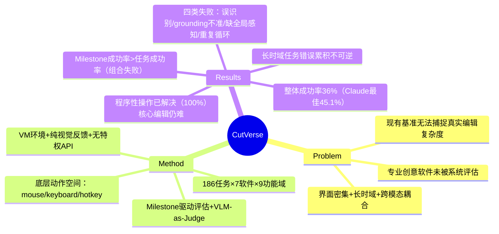

## Summary
提出 CutVerse，首个针对专业媒体后期制作的 GUI agent 基准，覆盖 7 个专业软件（Premiere Pro、Photoshop、After Effects 等）的 186 个长时域任务，评估发现现有 agent 在真实编辑任务上仅达到 36% 成功率，核心瓶颈在长时域可靠性和领域特定规划。

## Problem & Motivation
现有 GUI agent 基准主要聚焦 web 导航和基础 OS 任务，但专业创意工作流（如视频剪辑、图像处理）的能力尚未被系统评估。媒体后期制作环境具有独特挑战：界面布局极度密集、操作序列长时域、需要编排时间轴操作、图层合成、参数调优和跨模态对齐等紧密耦合的操作。评估此类任务面临系统级挑战：内存占用高、系统状态复杂演化、动作轨迹远长于典型 GUI 基准。

## Method
**CutVerse** 包含 186 个任务，覆盖 7 个专业应用（Premiere Pro、Photoshop、After Effects、DaVinci、剪映、ComfyUI、可灵），涵盖 9 个功能域，共 3,484 个原子 GUI 交互。

**核心设计：**

1. **Windows VM 执行环境**：agent 在可重置虚拟机中交互，仅通过模拟鼠标/键盘事件和实时视觉反馈驱动，无特权 API，强制施加与人类专业人员完全相同的系统和认知约束。

2. **多模态解析管线**：同步高帧率屏幕录制与底层 I/O 事件日志，提取时空对齐的动作序列，将连续专家工作流转化为结构化多模态轨迹。

3. **Milestone 驱动评估**：将整体任务轨迹分解为层次化语义 milestone，每个 milestone 代表可验证的视听状态转换。使用 VLM-as-a-Judge 管线通过 grounded QA 对评估进度。

**动作空间**：限定为底层 GUI 操作：`moveTo`、`click`、`dragTo`、`scroll`、`write`、`keyDown`、`keyUp`、`keyPress`、`hotkey`，加控制状态（`WAIT`、`DONE`、`FAIL`）。环境建模为 POMDP，观测由原始截图和动作历史组成，无 DOM 或 accessibility tree。

**任务分布**（9 类）：
- 特效与视觉调优（51 个，27.4%）
- 导出与交付（29 个，15.6%）
- 素材导入与管理（24 个，12.9%）
- 音频与节奏编辑（23 个，12.4%）
- 时间轴编辑（18 个，9.7%）
- 预览/检查/验证（14 个，7.5%）
- 遮罩、抠图与跟踪（10 个，5.4%）
- 启动与设置（9 个，4.8%）
- 生成式工作流（8 个，4.3%）

## Key Results
**评估模型**：Claude-Opus-4.6、Gemini-3-flash、Qwen3-32B、UI-TARS-1.5-7B、EvoCUA-32B。所有模型接收任务指令 + 最近 5 张截图（含描述和 pyautogui 代码）+ 当前截图。

**整体任务成功率**：
- Claude: 0.451 task / 0.673 milestone
- Gemini: 0.504 task / 0.604 milestone
- EvoCUA: 0.358 task / 0.437 milestone
- Qwen3: 0.267 task / 0.400 milestone
- UI-TARS: 0.222 task / 0.346 milestone

**程序性操作 vs 核心编辑**：所有模型在生成式工作流上达到 1.000 成功率，程序性任务平均成功率 0.750-0.890，但核心媒体编辑任务大幅下降。遮罩/抠图/跟踪任务最难，UI-TARS 仅 0.095。

**按软件分类**：After Effects 和 Photoshop 最具挑战性，After Effects 上最佳模型（Gemini）仅 0.500。可灵和 ComfyUI 相对简单，Claude 分别达到 0.815 和 0.667。

**Milestone-Task 一致性差距**：milestone 成功率持续高于任务成功率，表明 agent 能完成单个步骤但在完整组合上失败。音频编辑中，Claude 达到 0.929 milestone 成功率但仅 0.333 任务成功率。

**长时域难度**：遮罩/跟踪任务平均 73 秒、25 步，而预览任务平均 22 秒、6 步。"微小的感知或规划错误随时间不可逆地累积"。

**人类对齐验证**：自动 milestone 评估器与人类专家在 300 条轨迹上达到 98.3%（GPT-5.4）和 99%（Claude-4.6-Opus）一致性。

## Strengths & Weaknesses
**亮点：**
- **真实性强**：首个针对专业创意软件的 GUI agent 基准，任务来自真实编辑工作流，界面密度和操作复杂度远超现有基准
- **评估严谨**：milestone 分解 + VLM-as-a-Judge 设计巧妙，既能细粒度诊断失败点，又通过多模型验证保证评估可靠性（99% 人类一致性）
- **系统级约束**：VM 环境 + 纯视觉反馈 + 无特权 API，强制 agent 面对与人类相同的认知负载，避免 shortcut
- **诊断深入**：识别出四类关键失败模式（组件误识别、细粒度 grounding 不准、缺乏全局感知、重复动作循环），为后续改进指明方向

**局限：**
- **任务长度偏短**：平均 18.73 步，虽峰值达 239 步，但与真实专业工作流（数百步）仍有差距，长时域挑战未充分暴露
- **平台单一**：仅 Windows，未覆盖 macOS 上的 Final Cut Pro、Logic Pro 等主流工具
- **动作空间受限**：作者自己承认当前动作空间"根本性限制了复杂编辑工作流的可执行性"，缺乏组合性原语（如 key-mouse 联合缩放）
- **评估依赖 VLM**：尽管一致性高，但 VLM judge 的潜在偏差（如对某些视觉细节的盲区）未被充分探讨
- **缺少 ablation**：未系统消融 context window 长度、action history 格式、screenshot 分辨率等设计选择对性能的影响

**对领域影响：**
- 填补了 GUI agent 评估在专业创意领域的空白，为 "Vibe Cutting"（生成 + agent 端到端多媒体制作）范式提供实践基础
- 暴露了当前 agent 在长时域可靠性、细粒度 grounding、全局感知上的系统性短板，这些问题在 web agent 基准中被低估
- 36% 成功率表明专业软件是比 web 导航更难的 frontier，但也意味着巨大改进空间

## Mind Map

## Notes
- **与现有 GUI benchmark 对比**：OSWorld、AndroidWorld 等聚焦通用 OS/移动任务，CutVerse 专注垂直领域（媒体后期），界面复杂度和操作耦合度更高。可对比 [[2500-MegaGuiMultiStage]]（多阶段 GUI 规划）和 [[2600-UiMemSelfEvolving]]（UI 记忆演化）的方法在此基准上的表现。
- **Milestone 设计启发**：层次化 milestone 分解 + VLM judge 的评估范式可迁移到其他长时域任务（如机器人操作、游戏 agent），比端到端成功率提供更细粒度诊断信号。
- **动作空间问题**：作者承认当前动作空间"根本性限制可执行性"，但未提出解决方案。可能方向：(1) 引入组合原语（如 `zoom(center, factor)` 封装 key-mouse 联合操作）；(2) 学习 macro action（从专家轨迹中提取高频子序列）；(3) 允许 agent 定义临时 skill。
- **"Vibe Cutting" 愿景**：生成模型提供多模态素材 → agent 通过真实软件交互转化为结构化输出。这需要 agent 具备 (1) 理解生成内容语义的能力（如判断 AI 生成视频的节奏点）；(2) 将高层创意意图分解为底层编辑操作的规划能力。当前 36% 成功率表明距离此愿景尚远。
- **失败模式中的"重复动作循环"**：agent 无法从截图中识别状态转换（如弹窗已打开但视觉变化微小），反复执行相同动作。可能需要引入 (1) 更细粒度的状态表示（如 diff between screenshots）；(2) 显式的"等待-验证"机制；(3) 从失败中学习的 RL 信号。
- **相关工作连接**：[[2604-DAERT]]（GUI agent 的 error recovery）的方法可能对解决"重复循环"和"错误累积"问题有启发。
