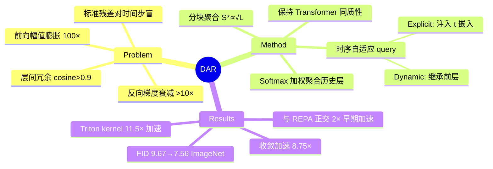

## Summary
提出 Diffusion-Adaptive Routing (DAR)，用时序自适应的跨层聚合机制替换 Diffusion Transformer 中的标准残差连接，解决前向幅值膨胀、反向梯度衰减和层间冗余问题，在 ImageNet 256×256 上将 SiT-XL/2 的 FID 从 9.67 降至 7.56，收敛速度提升 8.75 倍。

## Problem & Motivation
Diffusion Transformer (DiT) 直接继承了标准 Transformer 的残差连接设计，但作者发现三个严重问题：(1) **前向幅值膨胀**：隐状态幅值从第 1 层的 ~15.5 增长到第 28 层的 ~1576，增长约 100 倍；(2) **反向梯度衰减**：浅层梯度约 5×10⁻⁷，深层梯度再衰减一个数量级以上，优化信号极弱；(3) **层间冗余**：相邻层输出的 per-token cosine 相似度始终高于 0.9，表征高度冗余。这些问题随去噪时间步 t 系统性变化，但标准残差连接对 t 完全不敏感——这是 DiT 与标准 Transformer 的本质区别维度，却被忽略了。

## Method
**核心机制**：DAR 用 softmax 加权聚合替换累加式残差连接。对于第 l 层，不再是 h_{l+1} = h_l + f_l(h_l; t)，而是 h_l = Σ α_{i→l}(t) · v_i，其中 α 是通过 attention 机制计算的路由权重，query 来自当前层，key 来自所有历史子层输出的 RMSNorm。这使得聚合变为**可学习、时序自适应、非增量式**。

**Query 参数化**：探索了三种变体：
- **Static**：q_l = w_l（可学习向量，对时间步盲）
- **Dynamic**：q_l(t) = W_q^(l) · v_{l-1}（从前一子层输出继承时间步信息）
- **Explicit injection**：q_l(t) = w_l + e(t)（直接注入时间步嵌入）

**分块聚合 (Chunked Aggregation)**：为控制内存开销，将子层划分为大小为 S 的块，每块用最后一个子层输出作为摘要，路由在块摘要 + 当前块内源上运行。这将源内存从 O(Ld) 降至 O((S+N)d)。理论分析表明最优块大小 S* ∝ √L，对于 SiT-XL/2 (L=56) 预测 S* ∈ [3.7, 4.9]，与实验结果（S=4 最优）吻合。

**设计特性**：DAR 保持了"各向同性、同质化的 Transformer 堆栈"，纯粹沿深度维度操作，不引入手工层配对（区别于 U-Net 式跳跃连接）。

## Key Results
**质量与收敛速度**（ImageNet 256×256，SiT-XL/2 基座）：
- DAR Static c4 在 600K 迭代达到 FID 7.56（ODE），相比 baseline 的 9.67（1.75M 迭代）提升 2.11 FID
- DAR Dynamic c4 在 500K 迭代达到 FID 8.07，匹配 baseline 收敛质量但仅用 **1/8.75 训练量**
- 加 CFG 后 FID 降至 2.05-2.08，优于 baseline 的 2.15
- 加宽的 SiT-Plus baseline（752M 参数，匹配 DAR 参数量）训练 2 倍迭代仍落后 DAR，证明增益非来自参数规模

**时序感知消融**：
- 无时序注入的 Static 在 400K 迭代 FID 11.51
- Dynamic 和 Static w/ t-injection 分别达到 8.10 和 7.97，证明**时序感知是关键成分**
- 线性探针确认时间步在所有层的隐状态中可线性解码（R² > 0.95）

**与 REPA 的正交性**：
- DAR+REPA 在 100K 迭代达到 FID 7.09，超过 REPA 单独 200K 的 9.89，实现 **2 倍早期训练加速**

**块大小选择**：呈 U 型曲线，S=4 最优（FID 8.39），S=1 和 S=8 分别为 10.41 和 11.14，与理论预测一致。

**大规模应用**：在 Qwen-Image 的 Distribution Matching Distillation (DMD) 中用 LoRA 微调（rank 64），帮助保留"高频细节、锐利边缘和精细纹理"，这些在激进的少步蒸馏中容易衰减。

## Strengths & Weaknesses
**亮点**：
- **问题诊断扎实**：用幅值、梯度、相似度三个维度量化了 DiT 残差连接的病症，且发现它们随时间步系统性变化——这个观察直接指向解决方案
- **方法简洁且通用**：drop-in 替换，不破坏 Transformer 同质性，理论上可迁移到任何 DiT 架构
- **实验全面**：从小规模消融到大规模 T2I 蒸馏，覆盖训练加速、质量提升、与其他方法（REPA）的正交性
- **工程落地**：自研 Triton kernel 实现 11.5× 前向加速和 78.7% 内存节省，证明方法可实用化
- **理论指导实践**：块大小的理论预测（S* ∝ √L）与实验结果高度吻合，增强可信度

**局限**：
- **机构信息缺失**：论文未披露作者单位，无法判断工业界还是学术界背景，影响对资源投入和后续支持的预期
- **代码未开源**：虽然提到 Triton kernel，但未提供代码链接，复现门槛高
- **大规模预训练验证不足**：主实验在 ImageNet 256×256 的 675M 模型上，对于 billion-scale T2I/T2V 模型（作者自己提到"PreNorm-dilution 症状应更严重"）缺乏直接证据。Qwen-Image 实验仅是 LoRA 微调，不是从头训练
- **与 U-Net 式方法的对比浅**：虽然提到优于 U-ViT/U-DiT，但未深入分析为什么"保持同质性"比"引入层配对"更优——这个 claim 需要更强的理论或实证支撑
- **时序感知的必要性边界不清**：Dynamic 和 Static w/ t-injection 效果接近（8.10 vs 7.97），但前者参数量更大。何时该用哪种变体？论文未给出选择指南
- **Failure case 分析缺失**：没有展示 DAR 在哪些情况下会失效或退化到 baseline 水平

**对领域的影响**：
- 短期：为 DiT 训练提供了一个即插即用的加速方案，尤其对资源受限的研究者有吸引力
- 中期：可能推动社区重新审视 diffusion model 中"时序"这个维度的建模——不仅在 UNet 中，也在 Transformer 中
- 长期：如果在 billion-scale 模型上验证有效，可能成为下一代 T2I/T2V 基座的标配组件；但若无开源代码，工业界采用会滞后

## Mind Map

## Notes
- **与 REPA 的协同**：REPA 对齐表征空间，DAR 优化信息路由，两者在不同维度发力。这种正交性值得在其他架构（如 VLA、video LLM）中探索
- **块大小的理论**：S* ∝ √L 这个结论很优雅，但推导依赖的 cost decomposition 在论文中未详细展开。如果理论成立，对设计更深的 DiT（如 100+ 层）有直接指导意义
- **时序感知的泛化性**：DiT 的时间步 t 是连续的去噪进度，其他序列模型（如 autoregressive LLM）没有这个维度。DAR 的思想能否迁移到"位置"或"层级"等其他结构化维度？
- **与 Mamba/SSM 的关系**：DAR 的"聚合历史"机制让人联想到 state space model 的递归状态。两者在信息流建模上有无共通之处？
- **开源预期**：论文提交时间 2026-05-20，非常新。如果是工业界工作，代码开源可能需要等产品落地；如果是学术界，应该会在会议接收后放出
