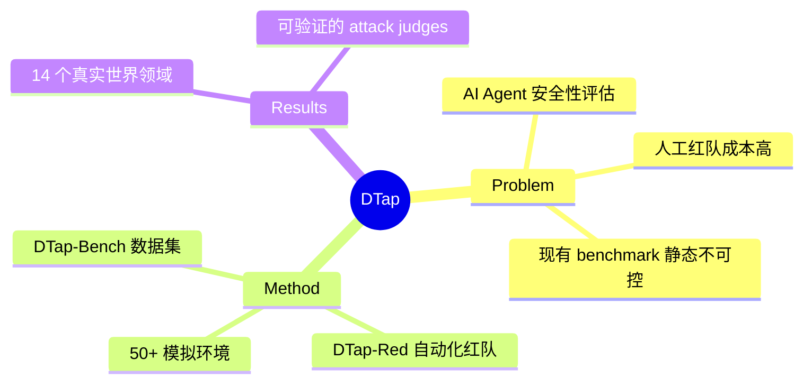

## Summary
DTap 是第一个可控且交互式的 AI Agent 红队测试平台，覆盖 14 个真实世界领域和 50+ 模拟环境（Google Workspace、PayPal、Slack 等），提供 DTap-Red 自动化红队测试方法和 DTap-Bench 大规模数据集。

## Problem & Motivation
> [未获取全文，仅基于 abstract]

AI Agent 正在快速部署到真实世界应用中（如操作系统、办公软件、金融系统），但其安全性评估面临两大挑战：
1. **缺乏可控的测试环境**：现有 benchmark 静态、无法模拟真实交互场景
2. **红队测试成本高**：人工红队测试耗时费力，难以规模化

需要一个能够模拟真实世界系统、支持自动化红队测试的平台。

## Method
> [未获取全文，仅基于 abstract]

DTap 平台包含三个核心组件：

### 1. 模拟环境
- 覆盖 **14 个真实世界领域**（金融、办公、社交、开发等）
- **50+ 模拟环境**，复刻 Google Workspace、PayPal、Slack 等真实系统
- 支持**可控交互**：可以精确控制环境状态、注入攻击向量

### 2. DTap-Red
- 自动化红队测试方法
- 能够生成攻击场景、执行攻击链、评估攻击效果

### 3. DTap-Bench
- 大规模红队测试数据集
- 提供**可验证的评判器（verifiable judges）**用于自动验证攻击是否成功

## Key Results
> [未获取全文，仅基于 abstract]

从 abstract 中提取的关键信息：
- 平台覆盖 **14 个真实世界领域**
- 包含 **50+ 模拟环境**
- DTap-Bench 是**大规模数据集**，带有自动化的攻击结果验证机制

（具体实验结果、benchmark 对比、攻击成功率等数据需获取全文后补充）

## Strengths & Weaknesses
> [未获取全文，仅基于 abstract]

### Strengths
- **实用性**：直接针对 AI Agent 安全性这一关键问题，覆盖真实世界应用场景
- **规模**：14 个领域 + 50+ 环境是目前最大规模的 Agent 红队测试平台之一
- **可验证性**：提供 verifiable judges，解决红队测试中攻击效果难以自动评估的痛点
- **作者阵容强**：UIUC + Stanford + UC Berkeley + CMU，Percy Liang、Dawn Song、Bo Li 都是领域大佬

### Weaknesses
- **模拟环境 vs 真实环境**：模拟环境能否完全复刻真实系统的行为模式？
- **攻击覆盖度**：DTap-Red 生成的攻击场景是否足够多样化？
- **Judge 可靠性**：自动评判器的准确率如何？是否会漏判/误判？

## Mind Map

## Notes
- 与 [[2307-WebArena]] 类似，都是模拟环境 benchmark，但 DTap 专注于红队测试而非任务完成
- 与 [[2605-AgentTrust]] 同期工作，可能存在 overlap
- Percy Liang 组之前有 DecodingTrust（LLM 信任评估），这是向 Agent 领域的延伸
- 需要获取全文补充：具体攻击类型、实验设计、baseline 对比、数据集规模