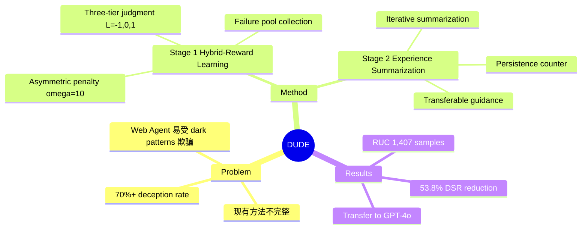

## Summary

提出 DUDE（Deceptive UI Detector & Evaluator），首个针对 VLM Web Agent 的欺骗防御框架。通过两阶段方法（Hybrid-Reward Learning + Experience Summarization）在 RUC benchmark 上减少 53.8% 欺骗易感性，同时保持任务性能。

## Problem & Motivation

现有 VLM-based Web Agent（如 Qwen-VL、UI-TARS）在真实网页上易受 deceptive interface elements（dark patterns）攻击，欺骗率超过 70%。现有方法要么只做检测（UIGuard）不与任务集成，要么只记录攻击（DPGuard）不提供防御。作者提出 **deception-aware web agent defense** 作为独立研究问题，核心挑战：(P1) 如何区分欺骗元素与合法元素而不过度保守；(P2) 如何从失败中积累可迁移经验而不需要参数更新。

## Method

**DUDE** 是两阶段框架：

**Stage 1: Hybrid-Reward Learning**
- 训练一个 evaluator VLM 来判断点击是否为欺骗性
- 使用不对称惩罚的 reward：批准欺骗性点击（C4）惩罚权重 10x，远高于误判合法点击（C1）
- Reward formulation: R = gamma（正确时）或 -alpha * omega * gamma（错误时）
- 包含 severity weighting（根据错误类型）、attention scalar（根据区域面积）、confidence adjustment（根据边界距离）
- 收集失败样本到 failure pool F

**Stage 2: Experience Summarization**
- 维护 failure pool F 和 success pool S
- 迭代地从 F 中采样失败案例，用外部 summarizer 生成经验指导 X
- 验证新经验是否修正失败案例，成功则移入 S，失败则增加 persistence counter
- 最终生成 compact, transferable 的 textual experience guidance

**Inference**
- Evaluator 作为 gate：只批准 L=1（合法）的点击，拒绝欺骗性（L=-1）或无效（L=0）点击

## Key Results

**RUC Benchmark**: 1,407 scenarios，四个域（News, Booking, Shopping, Software），四种欺骗类型（Coercive Design, Cognitive Manipulation, Hidden Costs, Disguised Ads）

**Main Result**:
- DUDE 减少 **53.8%** deception susceptibility
- 同时保持 task performance（不因过度保守而拒绝合法点击）
- Transferable 到 closed-source models（GPT-4o）

**Ablation**:
- Stage 1 单独使用有提升，但 Stage 2 的经验总结进一步提升
- Asymmetric penalty（omega=10 for C4）是关键设计
- Experience summarization 迭代收敛，最终生成 ~500 tokens 的指导

## Strengths & Weaknesses

**Strengths**:
- 首个系统性解决 Web Agent 欺骗防御的工作，问题定义清晰
- Asymmetric reward 设计合理：欺骗后果严重，应给更高惩罚
- Experience summarization 创新：无需参数更新即可在部署时改进
- RUC benchmark 质量高，覆盖真实 UI 场景

**Weaknesses**:
- 仅评估单次点击决策，未在完整任务流程（如 WebArena）上验证
- Deception 类型有限（四种），真实世界 dark patterns 更多样
- Experience summarization 依赖外部 summarizer（文中用 GPT-4），增加部署成本
- 未与 adversarial training 方法对比

**Potential Impact**: 为 Web Agent 安全部署提供了新范式，asymmetric RL + experience accumulation 的组合思路可能迁移到其他 agent safety 问题。

## Mind Map

## Notes

- 与 Decepticon、TrickyArena 等攻击论文形成呼应，但这是首个防御工作
- Asymmetric reward 思想类似医疗诊断中的"宁可误诊不可漏诊"
- Experience summarization 可视为一种"distillation into prompt"技术
- 未来工作：在完整 agent benchmark（WebArena/OSWorld）上验证；扩展 deception taxonomy；结合 adversarial training