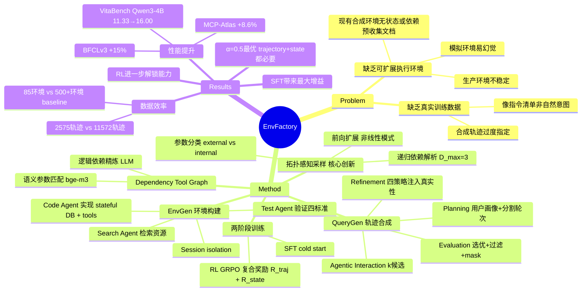

## Summary

EnvFactory 通过自动构建可执行环境和拓扑感知采样生成真实多轮轨迹，用 85 个环境和 2,575 条轨迹训练 tool-use agent，在 BFCLv3 上提升 +15%、MCP-Atlas +8.6%，数据效率远超现有方法。

## Problem & Motivation

Agentic RL 训练 tool-use LLM 面临两大瓶颈：**缺乏可扩展的执行环境**（生产环境不稳定、模拟环境易幻觉、现有合成环境要么无状态要么依赖预收集文档），以及**缺乏真实训练数据**（合成轨迹过度指定，像指令清单而非自然人类意图）。现有方法需要数百个环境和上万条轨迹才能达到有限效果，数据效率低下。

## Method

### 环境构建（EnvGen）

三个 agent 协作自动生成可执行环境：

1. **Search Agent**：分析现有环境覆盖缺口，检索真实在线资源（API 文档、技术报告），生成结构化元数据
2. **Code Agent**：用 Pydantic 定义 stateful database schema D，为每个 tool 实现可执行 Python 代码 π
3. **Test Agent**：创建单元测试验证四个标准（接口一致性、成功导入执行、正确执行结果、正确数据库状态转换）

Test 和 Code agent 迭代修订直到所有测试通过。每个环境定义为 **e = (m, D, π, V_e)**，其中 m 是元数据，D 是状态数据库，π 是实现，V_e 是工具接口（默认 MCP）。关键设计是 **session isolation**——每个对话独立数据库实例，避免跨会话污染。

### 依赖工具图（Dependency Tool Graph）

构建有向图 G = (V, E) 捕获工具间关系：

- **语义参数匹配**：用 BAAI/bge-m3 embedding 计算工具输出参数与其他工具输入参数的余弦相似度，超过阈值则添加边
- **逻辑依赖精炼**：LLM 分析每个环境内的工具，补充缺失边、剪除虚假边（必要，因为"无参数工具会被孤立"）

### 拓扑感知采样（Topology-Aware Sampling）

**核心创新**。不同于随机游走只捕获顺序逻辑，该策略确保采样的每个工具的所有必需输入都可满足。

**参数分类**：LLM 将每个输入参数分类为 *external*（用户提供，如城市、姓名）或 *internal*（系统派生，如先前搜索返回的 hotel_id）。

**递归依赖解析**：采样工具 v 时，输入参数"有效"当且仅当它是可选的、可外部提供、或可从链中先前工具内部满足。对任何依赖（未满足）参数，采样器沿 G 的逆边递归回溯找生产者工具，递归深度上限 D_max = 3。随机覆盖（p = 0.1）偶尔添加额外先验工具增加多样性。

**前向扩展**：依赖解析后，沿出边随机选择 1–k 个邻居，支持"超越简单顺序链的非线性工具使用模式"。

### 轨迹合成（QueryGen）

给定采样的工具链 τ，QueryGen 通过以下步骤合成轨迹：

1. **Planning**：构建用户画像/场景，派生初始数据库状态，随机将工具链分割为多个对话轮次（每轮 1–5 个工具）
2. **Generation & Refinement**：每轮先 subgoal decomposition 再 goal articulation。四个校准精炼注入真实性：
   - *Implicit reference*：用上下文引用替换显式标识符
   - *Action compression*：压缩可推断的中间步骤
   - *Ambiguity introduction*：添加指代歧义
   - *Goal expansion*：添加合理的次要目标
3. **Agentic Interaction**：部署沙盒环境与 agent 和模拟用户；生成 k 个候选轨迹
4. **Evaluation**：选择最优轨迹，过滤冗余调用，mask 不影响正确性的参数值

### 模型训练

两阶段 post-training：

- **Stage 1 (SFT)**：用 LlamaFactory 在用户交互轨迹上初始化
- **Stage 2 (RL)**：用 VeRL 框架的 GRPO，复合奖励：

**R = α·R_traj + (1-α)·R_state - γ·P_length**

其中 R_traj 衡量轨迹级工具调用匹配，R_state 评估最终数据库状态等价性，P_length 惩罚不必要的长序列。

## Key Results

**数据**：7 个领域（商务、金融、旅行、办公、生活、研究、工具）85 个 MCP 环境，842 个工具。生成 1,622 SFT + 953 RL 轨迹（共 2,575），平均每对话 4.82 轮，每轮 3.29 步。

**Backbone**：Qwen3-1.7B、4B、8B

**Benchmark**：BFCL v3、τ²-Bench、VitaBench、MCP-Atlas（子集：30/36 服务器，291/500 任务，因连接限制）

**主要发现**：

1. **SFT cold start 带来最大相对增益**。仅 SFT 就显著提升所有 benchmark。BFCL multi-turn：Qwen3-1.7B 从 16.75→23.25，Qwen3-4B 从 33.50→44.25。MCP-Atlas pass rate 几乎翻倍。

2. **SFT 后 RL 进一步解锁能力**。完整 EnvFactory 提升整体分数：Qwen3-1.7B 从 18.60→19.74，Qwen3-4B 从 27.29→30.77，Qwen3-8B 从 30.82→33.40。挑战性 benchmark 显著增益——VitaBench Qwen3-4B 从 11.33→16.00。

3. **跨 benchmark 类型强泛化**。提升覆盖对话型（τ²-Bench、VitaBench）和非对话型（BFCL、MCP-Atlas）设置。

**资源效率**：EnvFactory 仅用 85 个环境和 2,575 个训练任务达到更强性能，相比 AWM 的 526 个环境和 EnvScaler 的 191 个环境 11,572 个任务——环境数约为先前工作的 1/5。

**环境扩展分析**：测试 50、75、85 个环境显示 BFCL-v3 multi-turn 随环境数持续提升，但边际递减：50→75 增益大于 75→85，表明后期添加的环境可能有重叠工具逻辑。

**Ablation**：

- **直接 RL（无 SFT cold start）**：直接 RL 提升部分 benchmark（如 BFCL multi-turn 4B：33.50→41.38），但"增益更小且不如 SFT 后 RL 稳定"，确认 SFT 初始化对稳定策略优化的重要性。
- **Refinement 阶段**：250 条 SFT 轨迹有/无 refinement 对比显示，refined 轨迹持续优于未 refined，尤其在歧义设置（Miss-Func、Miss-Param）上，整体从 21.25→22.12（1.7B）和 40.88→41.25（4B）。
- **奖励权重（α）**：α ∈ {0, 0.3, 0.5, 0.7, 1.0} 的 ablation 显示：纯 state-based（α=0）或纯 trajectory-based（α=1.0）都降低性能；α=0.5 达到最佳峰值准确率 41.38%。"轨迹保真度和状态等价性对有效 RL 训练都是必要的"。

## Strengths & Weaknesses

**亮点**：

1. **拓扑感知采样是真正的创新**。递归依赖解析 + 前向扩展生成的工具链既满足逻辑依赖又保持多样性，解决了随机游走只能捕获顺序逻辑的根本缺陷。这是方法的核心价值。

2. **数据效率惊人**。85 个环境打败 500+ 环境的 baseline，2,575 条轨迹打败 11,572 条，证明"质量 > 数量"——拓扑采样 + refinement 生成的轨迹信息密度远高于 naive 合成。

3. **复合奖励设计合理**。R_traj + R_state 的组合（α=0.5 最优）体现了对 tool-use 任务的深刻理解：既要调用序列正确，也要最终状态正确。纯轨迹匹配会忽略等价路径，纯状态匹配会奖励 lucky guess。

4. **工程完整性高**。EnvGen 的三 agent 协作 + 测试驱动迭代、session isolation 设计、异步并发管道，都是可复现的工程实践，不是 demo。

**局限**：

1. **MCP session isolation 是瓶颈**。论文承认"每个对话需要专用 transport 连接"造成吞吐量瓶颈。虽然用异步管道缓解，但这限制了进一步扩展——如果要生成 10 万条轨迹呢？

2. **环境构建成本未充分披露**。论文说"合成 ~20 GPU-hours per 1K trajectories"，但构建 85 个环境本身花了多少人力/GPU 时间？Search Agent 检索了多少文档？Code Agent 迭代了几轮？这些是复现的关键信息。

3. **MCP-Atlas 评估不完整**。只测了 30/36 服务器、291/500 任务"因连接限制"。这削弱了 +8.6% 提升的说服力——未测试的 209 个任务可能更难，真实增益可能更低。

4. **Refinement 的四个策略缺乏 ablation**。Implicit reference、Action compression、Ambiguity introduction、Goal expansion 哪个贡献最大？能否只用其中 2 个达到 90% 效果？论文只做了"有/无 refinement"的粗粒度对比。

5. **泛化到非 MCP 环境未验证**。方法理论上通用，但实验全在 MCP 上。能否用于 REST API、CLI tools、或 production environments？

**潜在影响**：

- 为 tool-use agent 训练提供了新的数据效率标杆。拓扑感知采样可能成为合成环境数据生成的标准方法。
- 复合奖励（trajectory + state）的设计思路可能启发其他需要 process + outcome 双重监督的 RL 场景（如 code generation、multi-step reasoning）。
- EnvGen 的自动化流程降低了构建 agent 训练环境的门槛，可能加速 tool-use agent 研究的民主化。

**批判性观察**：

- 论文对"真实性"的强调（authentic resources、natural human-like requests）有些过度营销。Refinement 策略本质是启发式规则，不是从真实人类数据学来的。"真实"只是"更像真实"，不是"等价于真实"。
- 85 个环境覆盖 7 个 domain，每个 domain 平均 12 个环境。这个覆盖度对"scaling"这个词来说还是太小了。标题说"Scaling"，但实验更像是"Efficient Small-Scale Training"。

## Mind Map

## Notes

**与 [[2605-DelTA]] 的潜在联系**：DelTA 的 discriminative reweighting 思路可能用于优化 EnvFactory 的 RL 阶段——当前复合奖励是 trajectory-level 的，如果能在 token-level 做 credit assignment（哪些 tool call 的哪些 token 对最终 R_state 贡献最大），可能进一步提升样本效率。

**开放问题**：

1. 拓扑感知采样能否用于非 tool-use 场景？例如 multi-step reasoning（每个推理步骤是"工具"，逻辑依赖是"边"）？
2. EnvGen 能否扩展到自动发现新 domain？当前 7 个 domain 是人工定义的，能否让 Search Agent 自主探索互联网发现新的 API 类别？
3. Refinement 的四个策略能否用 RL 学习权重，而非固定应用？不同 domain 可能需要不同的 refinement 强度。
