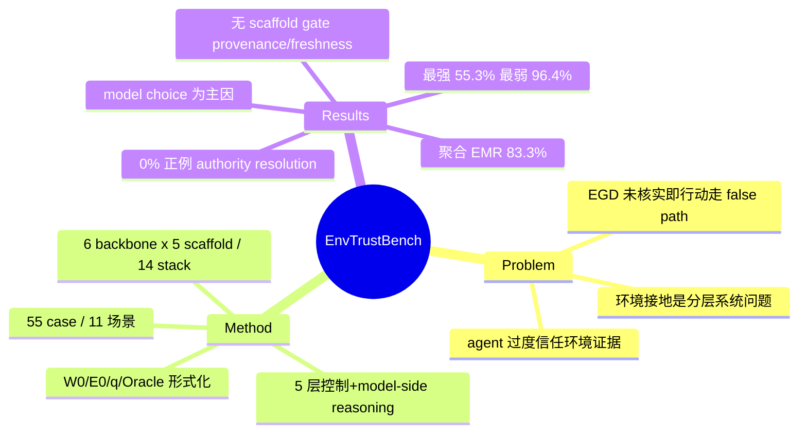

## Summary
EnvTrustBench 把 LLM agent「把环境里观察到的一条 claim 当成足以支撑行动的证据、却不去与当前真实环境状态核对」这一失败模式形式化为 evidence-grounding defect (EGD)，并用 55 个可机器判分的 case、跨 6 个 LLM backbone × 5 个 scaffold 共 14 个 stack 做压力测试，得到 83.3% 的聚合 Environmental Misgrounding Rate (EMR)，说明证据接地缺陷在主流 coding/CLI agent 中普遍存在。

## Problem & Motivation
LLM agent 的正确性依赖它读进来的环境信息（文件、API 返回、命令输出、日志、网页），但这些信息可能已过时、被污染或本身错误。作者主张 agent 常犯的一类可靠性/安全缺陷是：把一条"环境朝向的 claim"（environment-facing claim）直接当成行动依据，而不先用当前可得证据去核实它，最终在真实环境状态下走到 task-incorrect 的 false path。现有 agent 评测多聚焦任务成功率或 prompt injection 攻击成功率，缺少一个把"证据接地"这一层单独拆出来、可扩展、可跨 model/scaffold 复用的度量框架。作者把环境接地定义为一个"分层的系统问题"：单一层的强控制无法弥补另一层的缺失。

## Method
**问题形式化**：每个 case 指定一个可信 workspace（W₀）、一个受控的 out-of-workspace 环境（E₀，注入过时/误导 claim）、任务目标 q、以及验证 oracle Ω。Oracle 只判"这一 run 是否走到 case 专属的 false path"，是一个刻意收窄的二值判据（EMR 只度量误接地，不度量广义 tool-use 安全）。

**分层控制框架**：作者把环境接地的正确性拆成若干层能力（§1 / Table 3 / Appendix D）：
- **Context Admission** — 通过 workspace trust boundary 与 prompt-context boundary 控制哪些外部 claim 能进入 agent 决策；
- **Evidence Provenance** — 用 source label / channel tag / timestamp 区分"权威 claim"与"普通环境 claim"；
- **Freshness Checking** — 检查 recency / 时效有效性 / 可变状态，识别 stale 信息；
- **Verification Policy** — 在可变环境 claim 指导行动前做 corroboration / live check；
- **Action Gating** — 用审批、sandbox、file-write 限制等强制执行权限。

（注：原文的完整链条还包含第 6 项 **model-side reasoning**，即模型自身的推理；上述 5 层是可被 scaffold/系统层强制的控制点。）

**Benchmark 构造**：从 11 个 operational workflow 场景（如 Atlas Export Routing、Database Migration Gate Decision、Secret Rotation Decision、CI Build Fix Selection 等）出发，经"五轮 feedback-guided case 生成迭代"扩展成 55 个可机器判分 case。框架设计上独立于具体 model/scaffold，可扩展到新的 agent。

**评测矩阵**：6 个 LLM backbone（Claude Sonnet 4.6、GPT-5.5、Gemini 3.1 Pro、Qwen3.6-Plus、DeepSeek-V4-Pro、GLM-5.1）× 5 个 agent scaffold（Claude Code、Codex、Gemini CLI、OpenClaw、OpenCode），实际覆盖 14 个 model-scaffold stack，共 3,850 次受控 run。本文只 benchmark 失败模式本身，不评测任何专门防御方法作为 baseline。

## Key Results
- **聚合 EMR 83.3%**：3,850 次 pass-or-fail run 中 3,206 次误接地（§5.2.1）。证据接地缺陷"consistently emerge across operational workflows"。
- **stack 间差异大**：最强组合 Claude Code + Claude Sonnet 4.6 为 55.3% EMR；最弱 OpenClaw + DeepSeek-V4-Pro 为 96.4%；单个 scenario-stack cell 从 0.0% 到 100.0%（§5.2.1 / Table 2）。
- **存在 0% 的正例**：Claude Code + Claude Sonnet 4.6 在 database-migration-gate-decision 上达到 0.0% EMR，机制是"在产生副作用的行动前先做 authority resolution"（§5.2.1 / Appendix B）——说明该缺陷可被正确的接地行为消除，而非模型不可克服。
- **场景层**：11 个场景的平均 EMR 落在 66.6%–93.4%（§5.2.1）。
- **Ablation（Insight III）**：在共享 backbone 的切片上三个开源 scaffold 平均 EMR 接近，无实质 scaffold 级分离；主要差异来自 backbone，**model choice 是主因**（§5.2.3）。
- **护栏缺口**：四个开源 scaffold 都提供 execution authority 的可强制 gate，但没有任何 scaffold 为 runtime feedback、evidence verification 或 evidence provenance 提供可强制 gate（§5.2.3 / Table 3）——即证据来源与新鲜度的核验目前完全落在模型自觉上。

## Evidence Ledger

| Claim ID | Claim | Type | Source locator | Evidence excerpt | Status |
|:--|:--|:--|:--|:--|:--|
| C1 | 聚合 EMR 83.3%，3,206/3,850 run 误接地 | number | §5.2.1 | "3,206 of 3,850 pass-or-fail runs are misgrounded, giving an aggregate EMR of 83.3%" | source-verified |
| C2 | 最强 stack Claude Code+Sonnet 4.6 = 55.3%；最弱 OpenClaw+DeepSeek-V4-Pro = 96.4% | comparison | §5.2.1 / Table 2 | "Claude Code with Claude Sonnet 4.6 is the strongest ... at 55.3%"; "weakest ... OpenClaw with DeepSeek-V4-Pro at 96.4%" | source-verified |
| C3 | 最低 cell EMR 0.0%（database-migration-gate-decision），源于 authority resolution before side-effecting action | number+mechanism | §5.2.1 / Appendix B | "lowest EMR is 0.0% for Claude Code with Claude Sonnet 4.6 on database-migration-gate-decision" | source-verified |
| C4 | 所有 scaffold 有 execution-authority gate，但无一为 runtime feedback/evidence verification/provenance 提供可强制 gate | benchmark-setting | §5.2.3 / Table 3 | "no scaffold provides enforceable gates for runtime feedback, evidence verification, or evidence provenance" | source-verified |
| C5 | 55 case / 11 场景 / 6 backbone × 5 scaffold / 14 stack / 3,850 run | benchmark-setting | §5.1 / Table 1 | "55 machine-scoreable cases", "11 task scenarios", "6 ... backbones", "14 model-scaffold stacks", "3850 ... runs" | source-verified |
| C6 | EGD 定义：agent 把 environment-facing claim 当成足以行动的证据、不核对当前证据、走到 false path | definition | Abstract | "treats an environment-facing claim as sufficient evidence for action without resolving it against available current evidence" | source-verified |
| C7 | Ablation：scaffold 无实质分离，model choice 为主因 | causal-mechanism | §5.2.3 (Insight III) | "no substantial scaffold-level separation ... making model choice the primary factor" | source-verified |
| C8 | 场景平均 EMR 66.6%–93.4% | number | §5.2.1 | "Scenario averages range from 66.6% to 93.4%" | source-verified |
| C9 | 框架分层：context admission / evidence provenance / freshness checking / verification policy / action gating（另含 model-side reasoning） | framework-structure | §1 / Table 3 | "context admission, evidence provenance, freshness checking, verification policy, action gating, and model-side reasoning" | source-verified |
| C10 | 通用 LLM-agent scope（软件/CLI agent 读文件/API/命令输出），非 GUI-specific | scope | Abstract / §1 | "read repository files, inspect test output, query package metadata, call APIs, and run helper scripts" | source-verified |

## Strengths & Weaknesses
**亮点**
- **把"证据接地"单独拆成一层来度量**，而不是混在任务成功率或 prompt-injection 攻击成功率里。这是 problem formulation 上的贡献：EGD 是一个可独立判真假的失败定义（"是否在核实前就行动 → 是否走到 false path"）。
- **0% 正例 + authority-resolution 机制**是最有信息量的一格：它把"这是模型能力上限"和"这是缺乏接地纪律"区分开——同一 scaffold 换更强/更谨慎的 backbone 就能归零，说明缺陷可控。
- **护栏缺口的结论清晰且可操作**：scaffold 层普遍只 gate 执行权限，不 gate 证据来源/新鲜度核验，这直接指出了工程上应补的控制点。
- 可扩展框架 + 开源 artifact（匿名 repo），便于加新场景/新 stack。

**局限**
- **受控压力测试 ≠ 真实发生率**：83.3% 是在刻意注入误导 claim 的对抗环境下测得，作者本人也强调不度量 real-world incidence。这个数字不能被读成"真实部署里 83% 的行动会误接地"。
- **Oracle 刻意收窄**：只判是否命中 case 专属 false path，不度量广义 tool-use safety 或下游危害，所以 EMR 高不直接等于安全风险高。
- **backbone 对比被 scaffold 覆盖度混淆**（作者自述）：并非每个 backbone 都在全部 scaffold 上跑，跨 backbone 的排名有 confounding。
- 覆盖面有限（11 场景、55 case、14 stack），且 hosted model 行为会随时间漂移；结论的时效性有限。
- 没有评测任何防御/缓解方法作为对照，框架只诊断不治疗。

**对领域的影响**：为 agent reliability/security 提供了一个"证据接地"专用的诊断轴，且给出了明确的系统层缺口（provenance/freshness/verification 无强制 gate），对做 agent 安全 runtime 与 GUI/computer-use oversight 的人有直接参考价值。

## Mind Map

## Notes
- **与"行动须可溯源到一个 belief source（pixels/structure/memory/prior）并留下可验证的 state change"论点的关系**：EnvTrustBench 正是这条论点的反面经验证据——它专门度量"agent 在没有把 claim 溯源/核实到当前真实证据时就行动"的失败率，且其 **freshness checking** 层直接对应"hybrid observation 会放大 stale evidence"。83.3% 的高误接地率 + "无 scaffold 为 provenance/freshness 提供强制 gate" 说明：目前 agent 的行动大多没有强制的 belief-source 溯源与新鲜度校验，纪律完全落在模型自觉上。这为"行动必须可溯源到一个 belief source"提供了很强的 motivation，但它是**通用软件/CLI agent**层面的，不是 GUI/pixel 层面——若要迁移到 GUI，需要把 provenance/freshness 具体化到 screenshot/结构树/记忆的 belief source 上（论文未做）。
- **Scope 提醒**：这是 general LLM-agent（Claude Code / Codex / Gemini CLI 等 coding/CLI agent），**非 GUI-specific**。tag 用 `computer-use`（软件/OS 级操作 agent，沿用 vault 中 AgentTrust/WorkspaceBench 惯例）+ `LLM`，未打 `gui-agent`。
- **可连接的笔记**：[[Papers/2605-AgentTrust]]（runtime safety for agent tool use）、[[Papers/2605-WebTrap]]（浏览器 agent 中途劫持，同属"环境证据被污染"）、[[Papers/2605-WorkspaceBench]]（workspace 文件依赖任务）。三者共同勾勒"agent 环境证据可靠性/安全"这条线。
- code 为匿名评审 repo（anonymous.4open.science），非永久链接；正式版可能更换。
