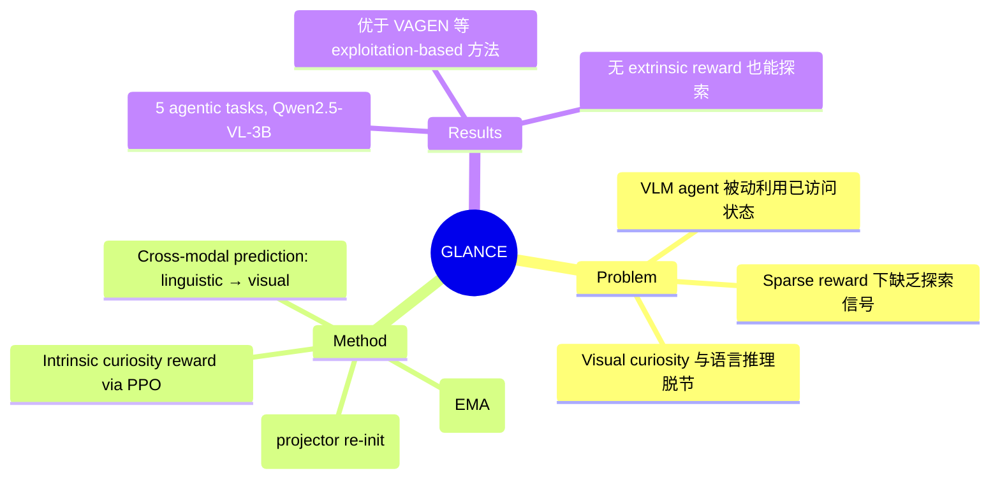

## Summary

提出 GLANCE 框架，通过将 VLM agent 的语言预测（"想什么"）与视觉现实（"看到什么"）之间的跨模态差异转化为内在好奇心信号，驱动 sparse-reward 环境下的探索式 RL 训练。

## Problem & Motivation

当前 VLM agent 通过 RL 内化 world modeling 并用 CoT 推理，但这种能力被限制在对已访问状态的被动利用上。在 sparse-reward 任务中，agent 可能学会描述"死胡同"却不知道应该探索其他路径。标准的 visual curiosity 方法（如 BYOL-Explore）只在视觉空间内预测未来，与 agent 的语言推理过程脱节，无法引导语义级别的探索。

核心问题：能否让 VLM agent 主动寻找挑战其内部 world model 的信号，实现 curiosity-driven exploration？

## Method

### GLANCE 框架（Grounding Linguistic Alignment for Curiosity Exploration）

两个并行流：

1. **Online VLM Agent**：参数 θ = (v, ℓ)，包含 visual encoder f_v 和 LLM backbone Λ_ℓ。每个 turn 生成 world modeling tokens（`<Obs>→<Res>→<Pred>`）后输出 action。取最后一个 prediction token 位置的 Transformer hidden state 作为 linguistic hypothesis h_{t+1}，经 lightweight projector g_ψ 映射到视觉空间。

2. **Momentum Target Vision Encoder**：参数 φ，结构同 online visual encoder，通过 EMA 更新 φ ← αφ + (1-α)v。执行 action 后编码下一个 observation 得到 target representation y_{t+1}。

### 跨模态预测目标

prediction loss 为 normalized MSE：
- L_explore = || ŷ/||ŷ|| - sg(y/||y||) ||²
- stop-gradient 防止 representational collapse
- 冻结 LLM 参数，只更新 projector 和 online visual encoder

### Intrinsic Curiosity Reward

r_t^i = β · L_explore(v, ψ, t)，与 extrinsic reward r_t^e 相加作为总 reward，用 PPO 优化。Extrinsic reward 包含 task reward + reason reward + format reward，采用 Bi-Level GAE 传播 advantage。

### Curriculum Exploration 机制

解决"curiosity drain"问题：由于预训练 LLM backbone 语义丰富，lightweight projector 容易快速过拟合到浅层视觉特征。方案是周期性重新初始化 projector 权重，同时保留演化的 visual encoder，迫使 projector 重新学习有意义的跨模态对齐。

## Key Results

- 在 5 个 agentic 任务上评估：Grid Puzzles（Sokoban）、3D Navigation、Object Manipulation（PrimitiveSkill）、Geometric Reconstruction（SVG）
- Backbone 为 Qwen2.5-VL-3B
- 指标：puzzle 和 embodied 任务用 average success rate，SVG 任务用 perceptual similarity（DINO + DreamSim 平均）
- GLANCE 一致性超越 exploitation-based RL 方法（包括 VAGEN 和内化 world modeling 方法）
- 跨模态 curiosity 在无 extrinsic reward 时也能学到有效探索策略
- Ablation 证实 Curriculum Exploration 对防止 curiosity collapse 至关重要

## Strengths & Weaknesses

**Strengths**:
- 思路清晰：将语言预测与视觉现实的 gap 作为探索信号，比纯视觉 novelty 更有语义意义
- 轻量架构：VLM agent 同时作为 world model 和 policy，无需额外预测网络
- Curriculum Exploration 解决了一个实际的训练不稳定问题（curiosity drain），是工程 insight

**Weaknesses**:
- Backbone 仅用 3B 模型，未验证 scaling 到更大 VLM 的效果
- Curiosity drain 的根本原因（projector 过拟合）暴露了方法对 alignment projector 的敏感性，周期性 re-init 是 workaround 而非根本解
- 未与更多 recent curiosity-driven exploration baselines 对比（如语言空间内的 curiosity 方法）
- 缺乏 failure case 分析——什么场景下跨模态 curiosity 会误导探索？

## Mind Map

## Notes

- 与 BYOL / BYOL-Explore 的关系：GLANCE 将 bootstrap latent 方法从视觉-视觉扩展到语言-视觉，本质上是 cross-modal BYOL
- "what you think is what you see" 的 framing 很好，但实际机制更像是"what you think should predict what you see"——预测误差驱动探索，而非对齐本身
- ICML 录用，说明该方向（VLM agent + RL exploration）受到认可
