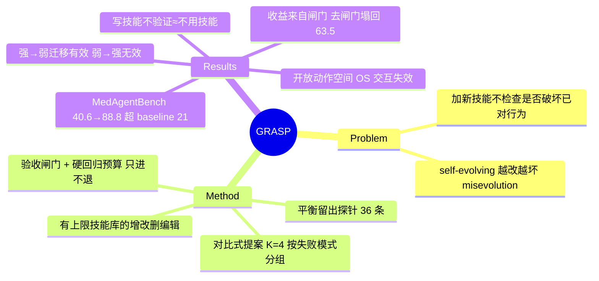

## Summary
GRASP 让 LLM agent 自我改进时不会"修好一个又弄坏另一个"：它把 agent 的技能库当成一串可增删改的编辑，每条新技能只有在一个平衡的留出小测试集上"净修好的比新弄坏的多、且绝对弄坏数不增加"时才被接受。在临床 FHIR benchmark MedAgentBench 上把 gpt-oss-120b 从 40.6% 提到 88.8%，比最强的自我改进 baseline 还高 21 分——而消融证明收益几乎全来自那道**验收闸门**，不是"会写技能"本身（不带验证地写技能，和不用技能一样没用）。

## Problem & Motivation
- LLM agent 在结构化环境里（调 API、走流程）出的错是"操作性"的，靠的是对环境的**流程知识**，不是对话能力。
- 现有自我改进方法（不断往记忆/技能库里攒自然语言经验）有个致命毛病：**加一条新经验时不检查它会不会破坏原来已经做对的行为**——修好一条轨迹的笔记，可能悄悄弄坏另一条。这正是 self-evolving agent 的"越改越坏"（misevolution）风险。
- GRASP 要解决的就是：怎么让每一步自我改进都**只进不退**。

## Method
GRASP 把"自我改进"变成对一个**有容量上限的技能库**做一串带验收的编辑（增 / 改 / 删技能）。三个关键部件：

- **对比式提案（comparative proposal）**：按失败模式分组（从最大的一组开始），每次给"技能写手"喂一组失败轨迹 + 一些成功轨迹 + 现有技能的效果统计 + 其他失败模式的标签（提醒别顾此失彼），让它写 K=4 个候选编辑。
- **留出探针（held-out probe）**：从本 epoch 早先做过的开发集里抽一个平衡小测试（默认 36 条，一半原来失败、一半原来成功，按任务类型分层），专门用来验候选编辑——它对当前这批提案永远是"没见过"的样本。
- **验收闸门 + 硬回归预算（acceptance gate + hard regression budget）**：一个候选只有同时满足两条才被接受——(1) 净修好的 > 新弄坏的；(2) 绝对弄坏的数量**不增加**（R(c) ≤ R₀）。若一个候选修好了东西但也弄坏了点，先走一步"收窄触发条件 / 加保护条款"的对比修订再重审。

## Key Results
- **主结果**：MedAgentBench 上 gpt-oss-120b 40.6%→88.8%（+48.2），比最强 baseline（Evo-MedAgent 67.8%）高 21 分；OOD 分割 8.7%→56.3%。另外 4 个模型（GPT-5.4 / GPT-4.1 / DeepSeek V4 Flash / Gemini 3.1 Flash Lite）全部涨 17.2~40.3 分。
- **消融——收益来自闸门，不是写技能**：去掉验收闸门直接掉到 63.5%（K=4）/ 40.1%（K=1）；更狠的是"配平算力"对照——花掉 GRASP 同样的探针预算但**丢掉验证结论**，成绩塌回 67-71%，和"没闸门"一个水平。也就是说 **会写技能但不验证 ≈ 不用技能**，真正干活的是那道接受/拒绝的判断。去 hard regression budget −7、去失败分组 −4.4、只加不删 −8.6。
- **跨模型迁移的不对称**：强模型写的技能库能让弱模型涨（GPT-5.4 的技能用在 gpt-oss 上 OOD 56.3%→77.8%），反过来弱→强不如模型自学。作者解释：闸门逼技能库编码的是**环境流程知识**（强模型能说清、弱模型能照做但自己想不出），而非模型自身的模式；这个不对称在任何 baseline 上都不出现。
- **什么时候不管用**：AgentBench 上 ALFWorld +28.4、WebShop +20.6（任务重复、副作用可验证时最有效），DBBench 只 +5，**OS Interaction 几乎不动（+0.9）——因为动作空间开放、后果弥散**，探针拿不到可验证信号。边界是**任务结构**（有没有可复现的失败模式 + 可验证信号），不是学科。

## Strengths & Weaknesses
**优点**：
- 直击 self-evolving agent 的核心风险（越改越坏），而且用最朴素的办法——加一道"只进不退"的验收闸门——就把问题解决了；消融干净地把收益归到这道闸门。这正是 [[Topics/SelfEvolvingAgents-Survey]] 定位的 "evolution-step verifier gating" 空白的一个具体实现。
- "会写技能 ≈ 不用技能，除非验证"是个反直觉且量化扎实的结论，对整个 memory / skill 自我改进路线是警告。
- 跨模型迁移不对称是有信息量的机制发现（技能库编码环境知识而非模型模式）。

**局限**：
- **验证很贵**：探针验证是训练期主要开销（每批 ~440 次 agent 调用，比 memory baseline 多 ~3× 算力）；live 环境里开发集贵时，缩小探针就要在闸门可靠性和成本间取舍。
- 外部效度：主战场是 curated FHIR + exact-match 打分的临床 benchmark，真实临床（不完整/矛盾记录、非标准码、多系统集成）不可外推；技能是对 benchmark 调出的策略，不是医学知识。
- 迁移不对称无法自动检测 writer-executor 是否匹配。
- 闸门只在"任务重复 + 副作用可验证"时有效，开放动作空间（OS 交互）基本不管用——既是诚实边界，也说明它不是通用自我改进方案。

**影响**：给 self-evolving / memory agent 一个可直接用的安全阀设计；"验证 gate 是收益来源、写技能本身不是"对该路线的算力/设计分配有直接指导。

## Mind Map

## Notes
- 直接填 [[Topics/SelfEvolvingAgents-Survey]] 定位的 **evolution-step verifier gating** 空白（四条演化路线中只有 tool/skill 内建验证关口）——GRASP 是 skill 路线上"内建验证关口"的干净实现，可作该 survey 新增"gating 家族"小节的代表工作。
- 与 [[Papers/2509-Misevolution]] 互补：后者实测 self-evolving 的四路径 misevolution（memory reward hacking 等），GRASP 给出 skill 路径上防 misevolution 的具体机制（硬回归预算）。
- 与 [[Ideas/HybridVerifier-GUIRuntime]]、[[Ideas/RetrievalMediated-MemoryMisevolution]] 呼应：GRASP 的"验证独立性 + 只进不退"正是 verify affordance / retrieval-mediated 防越改越坏的一个已发表参照。
- 疑问：探针从"本 epoch 早先做过的开发集"抽，是否会随 policy 提升而失效（policy-relative，见 [[Papers/2607-EvoCUA15]] 的观察）？论文用相对固定的开发集，长程在线自我改进下探针可能过期。
