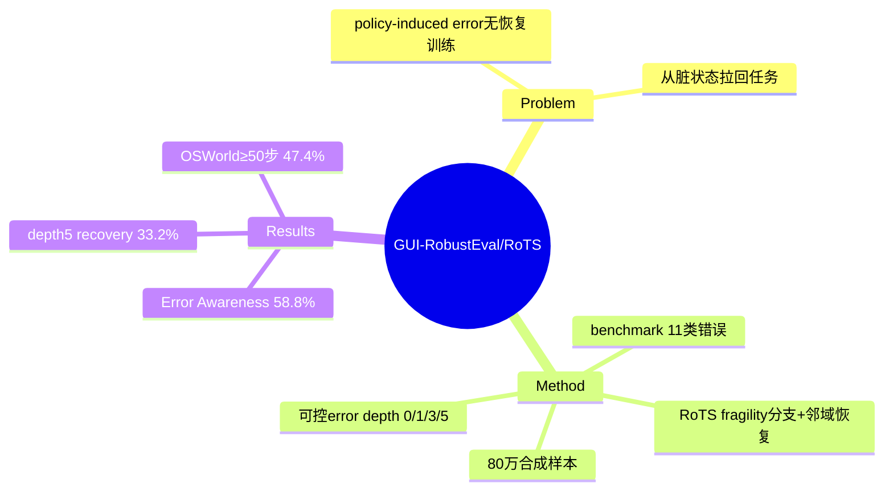

## Summary

本文提出 GUI-RobustEval——首个专门评测 GUI agent **对自身 policy-induced error 的觉察与恢复**能力的 benchmark（11 类错误、可控 error depth 0/1/3/5），并配套 Robustness-driven Trajectory Synthesis (RoTS)：从成功轨迹的高脆弱节点分支发现失败模式、再借邻近成功分支合成恢复轨迹，生成 80 万训练样本，让 RoTS-32B 在错误恢复和 OSWorld 长程任务上显著更稳。

## Problem & Motivation

GUI agent 通常用 SFT 在成功轨迹（视频/人类演示/合成）上训练，但真实执行中会犯 **policy-induced error**（自己的动作导致的错误），且训练数据几乎不含"从错误状态恢复"的示范。已有 AgentErrorBench 研究通用 LLM agent 失败，但 GUI agent 处在更复杂的多模态、视觉 grounding、状态变化环境中，错误觉察与恢复缺乏专门评测。核心问题：**agent 被"空投"到一个已经偏离预期的界面状态时，能否意识到出错、并把任务拉回正轨？**

## Method

**GUI-RobustEval benchmark（1,216 可执行 test case）** 四维度：
- **11 类 policy-induced error**：错误参数、漏必要步骤、选错 UI 元素、组合错误等
- **Error Awareness Rate**：takeover 后是否立即识别错误状态
- **Post-Error Success Rate**：能否从错误后恢复并完成任务
- **可控 error depth（0/1/3/5 步）**：环境偏离预期越深，恢复越难——量化恢复难度随 drift 增长

**Robustness-driven Trajectory Synthesis (RoTS)**——tree-based 两组件：
- **Fragility-Driven Exploration**：在成功轨迹中定位脆弱状态，从高脆弱节点主动分支发现失败模式
- **Experience-Informed Recovery**：利用邻近成功分支定位错误、合成带引导的恢复轨迹

生成 **80 万高质量样本**，同时补错误类型覆盖缺口与长程恢复需求。

## Key Results

| Benchmark | 模型 | 指标 | 数值 |
|:---|:---|:---|:---|
| GUI-RobustEval | RoTS-32B | Error Awareness | 58.8% |
| GUI-RobustEval | RoTS-32B | Post-Error Success (depth 5) | 33.2% |
| OSWorld | RoTS-32B | All-Pass@4 (50 steps) | 33.8% |
| OSWorld | RoTS-32B | Success Rate (≥50 steps) | 47.4% |
| OSWorld | RoTS-7B | Success Rate (≥50 steps) | 36.3% |

关键信号：即便专门训练，depth-5 的 post-error success 也只有 33.2%——**深度偏离后的恢复仍是硬骨头**；Error Awareness 58.8% 说明"意识到错了"这一步本身就未解决。

## Strengths & Weaknesses

**Strengths**：
- **把"错误恢复"独立成可控变量**（error depth 0→5）是好的 problem formulation——大多数 benchmark 只测"从干净起点完成任务"，本文测"从脏状态拉回"，直击真实部署高发失败
- **RoTS 的 fragility-driven 分支**用成功轨迹的邻域自动合成恢复监督，避免人工标注恢复示范，与 [[Papers/2606-XiaomiGUI0]] 的 error-driven flywheel、[[Papers/2604-VeriGUI]] 的合成失败轨迹属同一"造失败-学恢复"范式
- 数据规模大（80 万），32B 在 OSWorld ≥50 步 47.4% 是不错的长程结果

**Weaknesses / 存疑**：
- **仅限 desktop computer-use**（作者承认），mobile/edge 未评——而 mobile 的异常态分布（[[Papers/2606-XiaomiGUI0]] 14 类）与 desktop 差异大
- 跨 agent 评测需格式转换，可能引入不一致（作者承认 within-agent 趋势有效但跨 agent 绝对值存疑）
- Error Awareness 58.8% / depth-5 recovery 33.2% 的**绝对值偏低**说明方法有效但远未解决——RoTS 是"更好的训练数据"而非新机制，增量可能受限于 SFT 范式本身
- error depth 由人工注入（takeover），与自然发生的 policy error 分布是否一致未验证

**对领域的影响**：为"错误恢复能力"提供了首个可控评测协议——error depth 作为难度旋钮可成为该子方向的标准评测维度；与 D-GARA 式异常注入 benchmark 互补（那个注环境异常，这个注 policy 错误）。

## Mind Map

## Notes

- **error depth 作为难度旋钮**是可复用的评测原语——可迁移到 mobile（结合 Xiaomi-GUI-0 的异常态）、web。与 [[Papers/2604-VeriGUI]] 的 recovery success、[[Papers/2600-BeapAgentBacktrackableExecution]] 的 backtracking 一起构成"错误恢复"技术路线的三个数据点：造失败数据(RoTS) / 内建验证(VeriGUI) / 搜索式回溯(BEAP)。
- **"意识到错了"比"恢复"更早失败**：Error Awareness 58.8% 意味着 ~40% 情况 agent 根本没察觉偏离——这与 [[Papers/2503-OS-Kairos]] 的 over-execution（不评估自身 action confidence）、[[Papers/2606-AgenticAbstention]] 的"太晚 abstain"同源。错误觉察 = abstention/verification 的共同前置能力。
- 关联：[[Topics/CUA-Survey]]、[[Papers/2606-OSWorld2]]（长程 desktop）、[[Papers/2605-WorkspaceBench]]。
