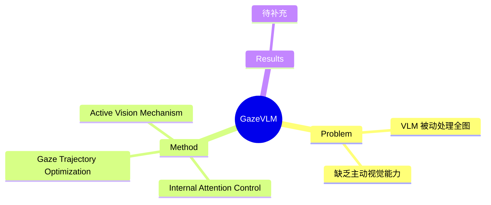

## Summary

> [未获取全文，以下内容基于早期版本 arXiv:2502.13370 及公开信息整合，2605.07817 版本可能存在差异]

GazeVLM 将人类主动视觉（active vision）原理整合到 VLM 中，通过 internal attention control 机制让模型自主决定 "where to look next"，实现细粒度视觉推理，区别于传统 VLM 被动处理整张图像的方式。

## Problem & Motivation

> [未获取全文，以下基于早期版本信息]

传统 VLM 被动地一次性处理整张图像，与人类视觉的主动感知（active perception）模式不同。人类视觉会动态聚焦于相关区域，按需收集视觉信息。GazeVLM 试图将这种主动视觉能力引入 VLM，以提升细粒度视觉推理能力。

## Method

> [未获取全文，仅基于早期版本 arXiv:2502.13370 信息]

**Internal Attention Control Mechanism**：模型内部机制决定 gaze trajectory，根据推理任务动态选择关注区域。

- **Gaze Optimization**：通过 gaze trajectory 优化实现细粒度视觉分析
- **Active Vision**：模型自主决定 "where to look next"，而非被动处理全图

> 注：2605.07817 版本标题强调 "Internal Attention Control for Multimodal Reasoning"，方法细节可能与早期版本不同

## Key Results

> [未获取全文，实验结果待补充]

待获取论文全文后补充具体 benchmark 结果和数值。

## Strengths & Weaknesses

> [未获取全文，以下为基于已有信息的初步判断]

**Strengths**：
- 将 active vision 引入 VLM 是有价值的研究方向，符合人类视觉感知机制
- internal attention control 的概念有一定新意

**Weaknesses（待验证）**：
- 需要评估 gaze trajectory 的学习效率和质量
- 相比传统 VLM 的计算开销是否合理
- 方法在不同任务上的泛化性待验证

## Mind Map

## Notes

- 早期版本 arXiv:2502.13370 标题为 "Fine-Grained Gaze Optimization for Active Vision with GazeVLM"
- 2605.07817 版本标题为 "GazeVLM: Active Vision via Internal Attention Control for Multimodal Reasoning"
- 需要获取全文对比两个版本的差异
- OpenReview 链接：https://openreview.net/forum?id=oU3tZYaFKE（可能对应早期版本）