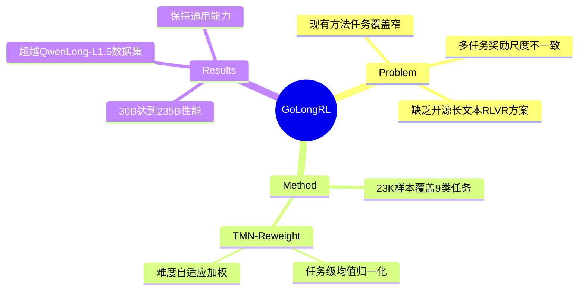

## Summary
提出 GoLongRL，一个面向能力的长文本 RL 训练方案，通过 23K 样本覆盖 9 类任务，配合 TMN-Reweight 方法解决多任务奖励尺度不一致问题，使 Qwen3-30B 达到 DeepSeek-R1 和 Qwen3-235B 级别的长文本性能。

## Problem & Motivation

> [未获取全文，仅基于 abstract]

现有长文本 RL 方法聚焦于设计复杂的检索路径，导致任务覆盖有限。长文本场景下不同任务的奖励尺度差异大（如准确率 vs. ROUGE 分数），直接用 vanilla GRPO 优化会导致某些任务主导训练，其他任务性能退化。缺乏开源的、任务覆盖全面的长文本 RLVR 数据集和训练方案。

## Method

> [未获取全文，仅基于 abstract]

**GoLongRL** 包含两个核心贡献：

1. **Capability-oriented 数据构建**：构建 23K RLVR 样本，覆盖 9 种任务类型，每种任务配备自然的评估指标（verifiable rewards）。数据来源包括开源语料和从书籍、学术论文、多轮对话生成的合成样本。完全开源数据集、构建 pipeline 和训练代码。

2. **TMN-Reweight**：结合任务级均值归一化（task-level mean normalization）和难度自适应加权（difficulty-adaptive weighting），解决异构奖励优化问题。任务级归一化对齐不同任务的奖励尺度，难度自适应加权根据样本难度动态调整权重，避免简单样本主导训练。

## Key Results

> [未获取全文，仅基于 abstract]

- **数据集质量**：GoLongRL 数据集在长文本任务上的表现超过闭源的 QwenLong-L1.5 数据集
- **模型性能**：基于 GoLongRL 训练的 Qwen3-30B-A3B 模型在长文本任务上达到与 DeepSeek-R1-0528 和 Qwen3-235B-A22B-Thinking-2507 相当的性能
- **方法有效性**：TMN-Reweight 相比 vanilla GRPO 进一步提升平均性能，同时保持或提升通用能力

## Strengths & Weaknesses

**Strengths**:
- **开源完整方案**：数据集、构建 pipeline、训练代码全部开源，可复现性强
- **任务覆盖广**：9 类任务覆盖长文本场景的多种能力需求，每个任务有自然的 verifiable reward
- **实用的多任务对齐方法**：TMN-Reweight 针对长文本 RL 的实际痛点（奖励尺度不一致）提出简洁有效的解决方案
- **小模型达到大模型性能**：30B 模型达到 235B 模型的长文本能力，证明数据和训练方法的重要性

**Weaknesses**:
- **缺少全文细节**：未获取完整论文，无法评估具体任务设计、奖励函数定义、消融实验的充分性
- **方法新颖性存疑**：任务级归一化和难度加权都是常见技巧，组合使用的创新性有限，需要看实验证明其必要性
- **通用能力保持的证据不足**：声称"通用能力保持或提升"，但未给出具体 benchmark 和数字，可能存在长文本优化牺牲短文本性能的风险
- **与 QwenLong 对比不公平**：对比闭源数据集但未说明数据量、任务分布是否可比，结论说服力有限

## Mind Map

## Notes
- 论文的核心卖点是"开源 + 任务覆盖全面"，但没有全文无法判断 9 类任务的具体设计是否真正覆盖长文本能力的关键维度
- TMN-Reweight 的技术含量不高，关键是证明其在长文本 RL 场景下的必要性——需要看消融实验
- 30B 达到 235B 性能的 claim 很吸引人，但需要确认是否在所有任务上都成立，还是只在部分长文本任务上
- 如果数据集和代码质量高，对社区价值很大；如果只是拼凑现有技巧 + 数据工程，学术贡献有限
