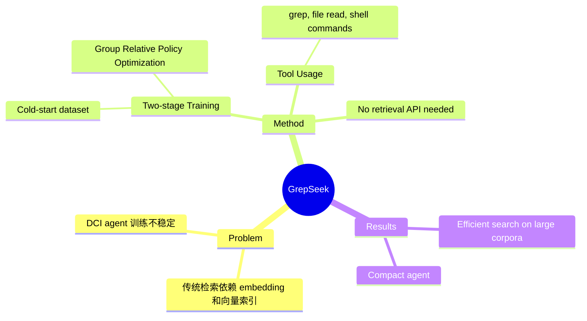

## Summary
训练紧凑型 search agent 通过 shell 命令（grep、file read 等）直接与原始文本语料库交互，无需 embedding 模型、向量索引或检索 API，使用两阶段训练管道（cold-start dataset + group relative policy optimization）解决大规模语料库上 RL 训练的不稳定性问题。

> [未获取全文，仅基于 abstract 和公开摘要信息]

## Problem & Motivation
传统检索系统依赖 embedding 模型和向量索引进行语义相似度匹配，但这增加了系统复杂度和计算成本。直接语料库交互（Direct Corpus Interaction, DCI）允许 agent 使用通用终端工具直接搜索原始文本，但在大规模语料库上用强化学习训练此类 agent 面临不稳定性挑战。如何训练高效的 DCI search agent 成为关键问题。

## Method
> [未获取全文，仅基于 abstract 和公开摘要信息]

GrepSeek 采用两阶段训练管道：

1. **Cold-start Dataset**: 构建初始训练数据集，为 agent 提供基础搜索行为
2. **Group Relative Policy Optimization (GRPO)**: 使用分组相对策略优化方法稳定 RL 训练过程

Agent 可使用的工具包括：
- `grep`: 文本模式匹配
- File read: 文件读取
- Shell commands: 通用 shell 命令
- Lightweight scripts: 轻量级脚本

核心优势是无需任何 embedding 模型、向量索引或检索 API，直接操作原始文本语料库。

## Key Results
> [未获取全文，仅基于 abstract 和公开摘要信息]

论文展示了 GrepSeek 能够有效地在大规模文本语料库上完成搜索任务，训练出的紧凑型 agent 能够找到、过滤和组合证据。具体性能指标和 baseline 对比需要参考全文。

## Strengths & Weaknesses

**Strengths:**
- **简洁性**: 移除了 embedding 和向量索引依赖，回归最基础的文本操作工具
- **可解释性**: Shell 命令的搜索过程比黑盒向量检索更透明
- **训练方法**: 两阶段管道（cold-start + GRPO）针对性地解决了 DCI agent 训练的不稳定性

**Weaknesses:**
- **适用性边界未明**: grep 等工具在语义搜索任务上的局限性（如同义词、paraphrase）是否得到充分讨论？
- **效率问题**: 相比向量索引的亚线性复杂度，直接文本搜索的可扩展性存疑，特别是在百万/亿级文档规模
- **Baseline 缺失**: 未获取全文，无法确认是否与 BM25、dense retrieval 等传统方法进行了充分对比
- **实验场景**: 需要了解在哪些类型的搜索任务上验证（fact-finding? open-domain QA? multi-hop reasoning?）

## Mind Map

## Notes
- 这个方向在 "less is more" 哲学下很有意思——用最简单的工具能走多远？但关键问题是**语义鸿沟**：grep 只能匹配字面文本，如何处理同义表达、概念泛化？
- GRPO 的稳定性改进值得关注，可能对其他 agentic RL 场景有借鉴意义
- 与 BM25、ColBERT 等稀疏/混合检索方法的对比会更有说服力
- 需要关注：在什么规模和类型的语料库上测试？latency 如何？
- **Connection**: 与 `2605-OpenSearchVL` 的检索方法对比；与 agentic search 的其他工作（如 WebGPT、ReAct-style agents）的定位差异
