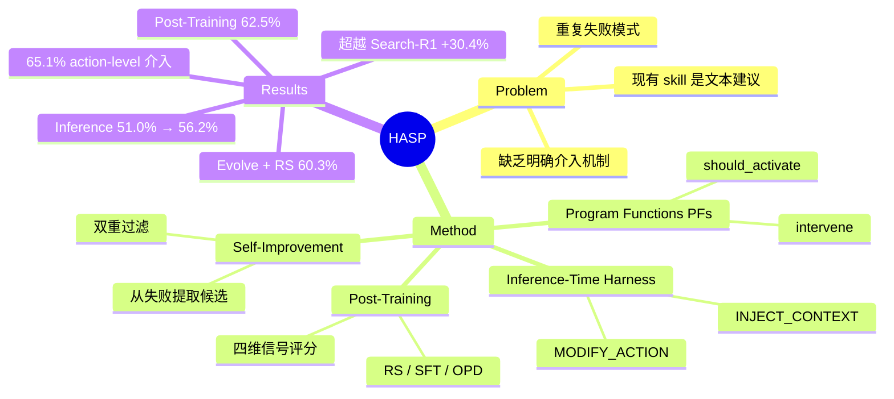

## Summary
将 skill 从文本建议升级为可执行的 Program Functions (PFs)，在 failure-prone states 主动介入修正 action 或注入 context，同时用于 inference、post-training 和 self-improvement，在 web-search、math、coding 任务上显著提升性能。

## Problem & Motivation
现有 LLM agent 系统将过往经验编码为 prompt 中的文本建议，但这种方式"largely advisory"，缺乏明确的介入机制。Agent 仍会重复出现过早终止、脆弱结论、无效循环等失败模式。核心问题：自然语言表达的可复用经验与能够可靠控制 agent 行为的经验之间存在断层。

## Method
### 核心设计：Program Functions (PFs)
HASP 将 skill 升级为**可执行的 Program Functions**——带类型的 Python 对象，包含两个方法：
- `should_activate(step_context, action_type, arg) → bool`：判断当前决策点是否需要介入
- `intervene(step_context, action_type, arg, teacher=None) → Intervention`：返回结构化介入操作

介入类型包括：
- **MODIFY_ACTION**：重写或细化下一步 action
- **INJECT_CONTEXT**：注入辅助信息供 policy 参考
- **NOOP**：不修改但记录审计日志

### Inference-Time Agent Harness
每步执行流程：base policy 提议 action → harness 检索相关 PFs → 评估激活条件 → 执行介入 → 将修正后的 action 或注入的 context 反馈给 policy。设计分离了"提议"与"修正"：policy 负责生成候选，PFs 决定是否执行、修改或增强。

当多个 PFs 可能激活时，可选用 auxiliary teacher 辅助选择，提升模糊场景下的精度。

### Skill Library 与验证
Library 从训练数据中恢复的 failure cases 初始化。每个候选 PF 必须通过**语法、接口、mock 执行验证**后才能入库，确保 library 包含可执行介入而非噪声文本。设置 rate limit 防止振荡（如 action 修改最多触发 2 次/episode）。

### Post-Training：PF-Derived Signals
每次 PF 激活产生结构化事件记录，包含触发状态、原始/修正 action、注入 context、metadata 和反馈。用四维信号评分：
- **Timing** (λ_t=0.15)：介入时机
- **Mode** (λ_m=0.10)：介入形式
- **Correctness** (λ_q=0.25)：修正是否有效
- **Outcome** (λ_o=0.50)：是否改善下游结果

Trajectory-level 分数结合任务成功率和 PF 介入质量。

三种训练方案：
1. **PF-Guided Rejection Sampling (RS)**（主方案）：按最终成功率和 PF 介入质量联合评分，保留高分 trajectory。与标准 RS 仅按正确性过滤不同，HASP 同时偏好中间决策更符合 PF 修正的 trajectory。
2. **Supervised Fine-Tuning (SFT)**：直接在 PF 修正的局部 action 上训练，按介入质量加权。
3. **On-Policy Distillation (OPD)**：在当前 policy + PFs 激活下 rollout，在 student 实际访问的状态上训练修正行为。

### Self-Improving Skill Library
固定训练间隔后，HASP 从当前 checkpoint 下的剩余失败中提取候选 PFs。防止 library 污染的双重过滤：
- **可执行验证**：检查语法、接口、mock 执行、合法返回类型
- **Teacher review**：评估候选是否捕获可复用失败模式、激活是否恰当、修复是否有用

两个阈值都必须满足才能入库。未过滤的 evolution 会导致性能剧烈下降。

## Key Results
### Inference-Time 介入（Qwen2.5-7B-Instruct backbone）
**Web-search reasoning**（HotpotQA, 2Wiki, MuSiQue 平均）：
- PF-only: 51.0% vs. ReAct Agent 31.2%, Prompt-Only Skills 20.5%
- PF + Teacher: 56.2%

**Mathematical reasoning**（AIME24, AMC23, GameOf24 平均）：
- PF-only: 35.9% vs. ReAct Agent 34.2%
- PF + Teacher: 38.8%

**Coding**（HumanEval/MBPP/BigCodeBench 平均 pass@1）：
- PF-only: 63.4%
- PF + Teacher: 68.7%

关键发现：直接修改 action 或添加 corrective context 比仅注入 skill 文本作为 prompt 有效得多。

### Post-Training（Fixed Library）
| Method | Web-search Avg | Math Avg |
|--------|---------------|----------|
| Inference only | 56.2% | 38.8% |
| + SFT | 56.8% | 40.9% |
| + RS | 59.3% | 42.7% |
| + OPD | 62.5% | 42.4% |

### Post-Training + Evolved Library
| Method | Web-search Avg | Math Avg |
|--------|---------------|----------|
| Evolve + SFT | 58.5% | 41.4% |
| **Evolve + RS** | **60.3%** | **45.4%** |
| Evolve + OPD | 56.7% | 43.9% |

**HASP-Evolve + RS** 达到最强整体结果：60.3% web-search，45.4% math，69.9% coding pass@1。

### 与 SOTA 对比
Web-search reasoning 上，HASP-Evolve + RS 超越 Search-R1 +30.4%，AgentFlow +7.1%，ReSearch +22.5%。Math reasoning 达到 45.4%（AgentFlow 51.5% 但训练设置不同）。Coding 69.9% 与 GRPO (68.4%)、P-GRPO (69.8%) 竞争。

### Ablation Studies
**信号 ablation**（HASP-Evolve + RS, web-search）：
- w/o Timing: -7.8 points (52.5%)
- w/o Mode: -15.5 points (44.8%)
- w/o Correctness: -12.1 points (48.2%)
- w/o Outcome: -12.8 points (47.5%)

说明 PF 评分必须同时捕获时机、形式、修正有效性和结果，而非仅看 outcome。

**过滤 ablation**：
| Setting | Web-search Avg | Δ |
|---------|---------------|---|
| Full filtering | 60.3% | — |
| No evolution | 59.3% | -1.0 |
| **No filtering** | **36.3%** | **-24.0** |
| Exec-only | 48.8% | -11.5 |
| Teacher-only | 47.2% | -13.1 |

未过滤的 evolution 是灾难性的。可执行验证和 teacher review 都是稳定 library 增长的必要条件。

**Inference-time 组件 ablation**：
| Setting | Web-search Avg | Δ |
|---------|---------------|---|
| Full (PF + Teacher) | 56.2% | — |
| PF only | 51.0% | -5.2 |
| Teacher only | 50.7% | -5.5 |
| Neither (ReAct) | 31.2% | -25.0 |

PFs 和 teacher 都有意义贡献，且互补。

### 机制分析
**介入模式**：所有触发的 PF 事件中，**65.1% 是 action-level**，34.9% 是 context-level 介入——说明 HASP 频繁改变可执行决策，而非仅添加指导文本。

**PF 激活集中度**：激活高度集中于少数 PFs：`decompose_complex_question` (322 次)，`insufficient_exploration` (138)，`answer_completeness` (100)。集中度随难度变化：MuSiQue 385 次激活 vs. HotpotQA 95 次，说明更难任务更依赖 PF 介入。

**Skill 内化**：post-training 后，行为修正类 PFs（如 `multi_hop_reasoning_failure`、`retrieval_failure`）在之前触发的 case 上 **100% 变沉默**；`insufficient_exploration` 30-37% 沉默；`decompose_complex_question` 很少内化（3-12% 沉默）。只有 8-38% 的准确率提升来自 PFs 不再触发的 case；更大效应来自更广泛的行为改变，包括更多 SEARCH/READ action 和更少过早 FINAL。

**恢复的失败结构**：
| Failure Family | 占比 | 典型模式 |
|---------------|------|---------|
| Reasoning drift/unsupported finalization | 31.7% | FINAL → SEARCH |
| Premature finalization | 17.8% | early FINAL → SEARCH |
| No read before final | 17.8% | no-read FINAL → SEARCH(verify) |
| Wrong entity focus | 24.1% | wrong entity → SEARCH(entity) |
| Harmful PF override | 8.7% | override → fallback |

**Prompt-equivalent skills**：仅注入固定文本（无 action 修改、无运行时状态的动态 context）的 skills 显示"limited and mixed gains"，确认 HASP 的价值来自可执行介入，而非 prompt 提醒。

## Strengths & Weaknesses
### Strengths
1. **从 advisory 到 executable 的范式转变**：PFs 是可执行对象而非 prompt 文本，这是与先前 skill-augmented 系统的根本区别。分离"提议"与"修正"使得结构化监督信号清晰可得。
2. **统一接口跨三个阶段**：同一 PF 接口无需修改即可用于 inference、post-training、self-improvement，设计模块化且优雅。
3. **多维评分捕获介入质量**：四维评分（timing, mode, correctness, outcome）超越仅看任务成功率，ablation 证明每个维度都不可或缺。
4. **严格过滤防止 library 退化**：可执行验证 + teacher review 双重门控是关键，移除任一导致 11-13 点下降；未过滤 evolution 直接崩溃（-24 点）。
5. **机制分析深入**：65.1% action-level 介入、skill 内化分析、failure structure 分解、harmful override 记录——这些细节远超常见 ablation，展示了对系统行为的深刻理解。

### Weaknesses
1. **Teacher 依赖**：更强变体需要外部 teacher 用于选择、review 或 distillation，增加成本并引入潜在偏差。论文承认这一点但未探索减少依赖的路径。
2. **策略利用 vs. 发现**：PFs 主要帮助使用现有策略而非发现根本新策略；更难任务（如 AIME24）可能需要 RL-style exploration。论文诚实承认"broader RL-style exploration may still be needed"，但未给出结合路径。
3. **OPD + Evolution 不稳定**：HASP-Evolve + OPD 在 web-search 上降至 56.7%（fixed-library OPD 为 62.5%），说明联合改变 on-policy 状态分布和 skill library 引入不稳定性。论文提及但未深入分析或解决。
4. **介入形式受限**：仅支持 action 修改和 context 注入，提升可审计性但限制介入能力。更复杂的介入（如多步修正、条件分支）无法表达。
5. **领域覆盖窄**：评估聚焦于有清晰验证信号的 benchmark 任务；迁移到开放式、长时域、弱验证环境仍未解决。Outcome 信号（λ_o=0.50）在无明确奖励的场景下如何定义？
6. **Harmful PF override 未充分处理**：8.7% 的恢复失败结构来自有害 PF 覆盖（ΔEM/ΔAcc -0.8/-0.8），但论文未提出检测或缓解机制，仅记录了问题。

### 对领域的影响
- **方法论贡献**：为 skill 系统提供了从"文本建议"到"可执行介入"的清晰升级路径，PF 接口设计可能成为未来 agent framework 的标准组件。
- **训练信号创新**：PF-derived 四维评分为 post-training 提供了比二元成功/失败更细粒度的信号，这一思路可推广到其他 agent training 场景。
- **Self-improvement 范式**：从剩余失败中提取候选 PFs + 双重过滤的 evolution 协议，为 agent 自我改进提供了可操作的框架（尽管 teacher 依赖仍是瓶颈）。
- **局限性诚实**：论文明确指出 PFs 是"exploitation not exploration"，承认 OPD + Evolution 不稳定，记录 harmful override——这种诚实在当前 agent 领域并不常见，值得肯定。

## Mind Map

## Notes
- **与 ReadPaperMachine skill 系统的对比**：HASP 的 PF 接口（should_activate + intervene）与本 vault 的 SKILL.md 协议（Steps + Guard + Verify）有相似之处——都是将经验结构化为可执行规则。区别在于 HASP 的 PFs 是运行时介入，本 vault 的 skills 是工作流编排。是否可以借鉴 HASP 的"从失败中提取 + 双重过滤"机制来演化 skill library？
- **Harmful PF override 问题**：8.7% 有害覆盖暴露了一个根本挑战——如何在没有完美 teacher 的情况下判断介入是否有益？论文的四维评分依赖 outcome 信号（λ_o=0.50），但 outcome 本身可能滞后或误导。需要更强的 counterfactual reasoning 或 online correction 机制。
- **OPD + Evolution 不稳定性**：这可能不是 bug 而是 feature——on-policy 方法本质上对分布变化敏感，而 evolution 改变了介入分布。也许需要"冻结 library → OPD 训练 → 解冻 library → evolution"的交替协议，而非同时进行？
- **与 Search-R1 的对比**：+30.4% 提升巨大，但 Search-R1 的训练设置是什么？论文未详细对比训练数据量、模型规模、计算预算。如果 HASP 用了更多 teacher queries 或更大 library，这个对比是否公平？
- **Future direction**：能否将 PF 从"人工定义 + teacher review"演化为"完全从数据中学习"？例如用 program synthesis 或 neural program induction 自动生成候选 PFs，用 meta-learning 学习 should_activate 的激活条件？
