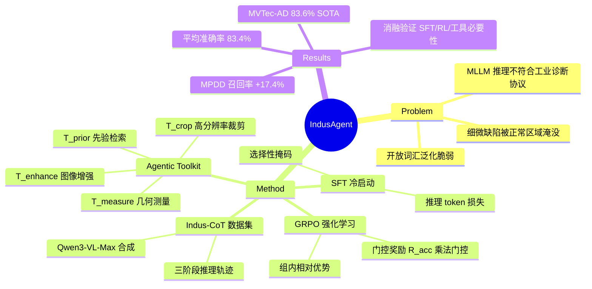

## Summary
提出 IndusAgent，一个工具增强的 agent 框架用于开放词汇工业异常检测，通过结构化推理数据集 Indus-CoT、动态工具编排（裁剪、增强、先验检索、测量）和门控 RL 目标，在五个 benchmark 上达到 SOTA 零样本性能。

## Problem & Motivation
现有 MLLM 应用于工业检测时存在三大局限：(1) 推理范式与严格的工业诊断协议不匹配；(2) 细微缺陷被大面积正常区域淹没，视觉噪声和尺度模糊导致感知稀释；(3) 能记忆预定义缺陷类别但在开放词汇场景下泛化脆弱。工业异常检测需要领域对齐的推理、局部化感知和工具辅助的证据整合。

## Method
基于 Qwen3-VL-8B 构建三阶段框架：

**Stage 1: Indus-CoT 数据集构建**  
从 Real-IAD 构建约 3,000 条结构化推理轨迹，类别不相交以防止泄漏。每条轨迹编码三阶段推理：
- Phase 1 — 全局感知与工具路由：分析全图，识别可疑区域，生成工具调用指令
- Phase 2 — 工具执行与上下文观察：工具返回互补观察（文本先验、几何测量、增强纹理图、高分辨率裁剪）
- Phase 3 — 最终诊断验证：整合所有证据，输出异常判断、位置和缺陷类型

使用 Qwen3-VL-Max 合成轨迹（仅给查询图像，无配对正常参考），通过自我纠正和 LLM-as-a-judge 提升数据质量。

**Agentic Toolkit**  
四个工具应对典型失效模式：
- **T_crop**: 从可疑区域提取高分辨率 patch，恢复细粒度缺陷
- **T_prior**: 检索正常性先验（无缺陷的几何、纹理、结构模式描述）
- **T_enhance**: 应用轻量图像处理（对比度增强、边缘提取）处理低对比度纹理变化
- **T_measure**: 计算几何关系（距离、角度、相对位置）验证错位、变形、缺失部件

统一推理公式：**O ~ π_θ(· | I⊕F, Q⊕E; T)**，结合全局图像、视觉反馈 F 和语义/定量反馈 E。

**Stage 2: Supervised Fine-Tuning (SFT)**  
用结构化工业诊断轨迹冷启动基座模型。选择性掩码策略确保模型主动内化推理逻辑而非被动记忆输入上下文。损失仅在 `<think>...</think>` 内生成的推理 token 上最小化负对数似然。这稳定了后续 RL 训练，防止 reward hacking 和格式崩溃。

**Stage 3: Agentic Reinforcement Learning**  
使用 Group Relative Policy Optimization (GRPO)，通过组内相对比较评估策略更新，无需独立 value network。每个查询采样 G 条不同轨迹，通过组内归一化计算优势。

**准确率门控奖励公式**：  
R(τ) = R_acc(τ) · (1 + α·R_loc(τ) + β·R_type(τ) + γ·R_tool(τ)) + R_format(τ)

核心创新是**乘法门控**：R_acc ∈ {0,1} 确保定位、类型预测和工具使用奖励仅在二分类异常判断正确时才计入。这防止工具滥用——agent 学习到工具仅在改善诊断结果时才有价值。

各奖励组件：
- **R_acc**: 二分类正确性（门控）
- **R_loc**: 预测与真实异常区域的 IoU
- **R_type**: 预测异常类型与真实标签的语义距离
- **R_tool**: λ·I[Δ_conf > 0] − η·|C|，奖励有益证据同时惩罚冗余调用（λ=0.3, η=0.1）
- **R_format**: 惩罚格式错误输出以防格式崩溃

## Key Results
在五个数据集（MVTec-AD, VisA, MPDD, DTD, SDD）上评估零样本分类准确率：

**主要结果（零样本分类准确率）**：
- MVTec-AD: 83.6%（超越 GPT-4.1 的 81.9%，超越 Anomaly-OV 的 74.3%）
- MPDD: 72.7%（超越 Anomaly-OV 的 70.3%）
- VisA: 76.8%（超越 Anomaly-OV 的 74.3%）
- DTD: 95.6%（超越 Anomaly-OV 的 90.7%）
- SDD: 88.9%（与 Anomaly-OV 的 88.7% 持平）
- **平均**: 83.4%（超越最佳商业 API GPT-4.1 的 77.5% 约 6%，超越最佳开源 7B 模型 Anomaly-OV 的 79.6% 约 4%）

**异常召回率**：
- 平均召回率 86.3%，在 MPDD 上比 IAD-R1 提升 +17.4%（95.4% vs 78.0%），在 DTD 上提升 +10.4%（94.1% vs 83.7%）

**消融实验**：
- 移除 SFT 导致灾难性崩溃（VisA: 76.8→55.5），确认领域对齐是绝对前提
- 移除 RL 显示 SFT 单独不足以实现开放词汇泛化（VisA: 76.8→57.6）
- 移除工具库在所有数据集上都有明显下降（MVTec: 83.6→78.1, VisA: 76.8→67.5, DTD: 95.6→87.9）
- 移除格式奖励导致最显著衰退（VisA: 76.8→65.7），因为结构化推理在没有严格输出解析时崩溃

## Strengths & Weaknesses
**Strengths**:
- **门控奖励设计精巧**：乘法门控防止工具滥用，确保工具调用与诊断改善绑定，这是 agentic RL 中少见的约束机制
- **三阶段训练清晰**：Indus-CoT 数据集 → SFT 冷启动 → GRPO 开放词汇泛化，每阶段目标明确
- **工具设计有针对性**：四个工具（裁剪、先验、增强、测量）直接对应工业检测的典型失效模式（尺度模糊、领域知识缺失、低对比度、几何验证）
- **实验全面**：五个 benchmark、多个 baseline（商业 API + 开源模型）、详细消融

**Weaknesses**:
- **Institute 信息缺失**：论文未明确列出作者机构，无法判断是学术界还是工业界工作，影响对数据集和工具可复现性的评估
- **代码未开源**：无 GitHub 链接，工具实现细节（如 T_prior 的先验库构建、T_measure 的几何计算）不透明，难以复现
- **Indus-CoT 数据集规模小**：仅 3,000 条轨迹，且依赖 Qwen3-VL-Max 合成，数据质量和多样性可能受限于合成模型的能力上限
- **工具调用开销未分析**：论文未报告推理时间、工具调用次数分布、计算成本，实际部署可行性不明
- **开放词汇泛化的边界不清**：虽然声称开放词汇，但评估仍在固定 benchmark 上，对真正未见过的缺陷类型（如新材料、新工艺）的泛化能力缺乏验证
- **与 few-shot 方法对比缺失**：仅与零样本方法比较，未探讨在有少量标注样本时 IndusAgent 是否仍有优势

**潜在影响**：
门控 RL 的思路可推广到其他需要工具辅助的 agent 任务（如代码生成、数学推理），防止工具调用与任务目标脱钩。但工业检测的特殊性（结构化诊断流程、明确的正常性先验）使得该方法在通用 agent 场景下的适用性存疑。

## Mind Map

## Notes
- 门控奖励的 α、β、γ 超参数（论文中未明确给出具体值，仅给出 λ=0.3, η=0.1）如何调优？不同数据集是否需要不同配置？
- T_prior 的先验库如何构建？是人工标注还是自动提取？先验的覆盖度和准确性如何保证？
- GRPO 的组大小 G 如何选择？更大的 G 是否能进一步提升性能？
- 与 WinCLIP、AnomalyCLIP 等基于 CLIP 的方法对比如何？这些方法也声称开放词汇能力
- 能否扩展到视频异常检测（如生产线实时监控）？时序信息如何整合到当前框架？
