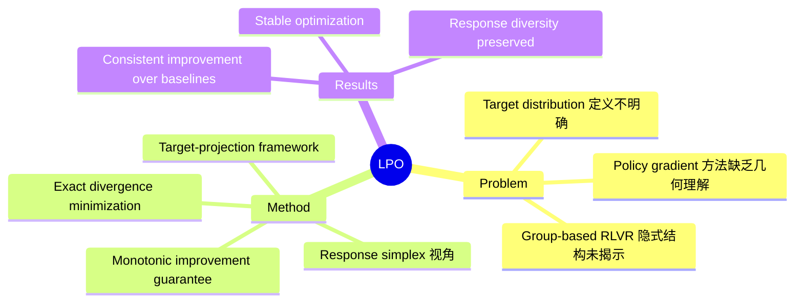

## Summary

论文揭示 group-based policy gradient 方法（如 GRPO）共享一个隐式几何结构：每个方法都隐式定义了 response simplex 上的 target distribution，并通过一阶近似向其投影。基于此洞察提出 Listwise Policy Optimization (LPO)，显式执行 target-projection：将 proximal RL objective 限制在 response simplex 上，再通过精确 divergence minimization 投影 policy。该框架提供了单调改进、bounded/zero-sum/self-correcting projection gradients，以及灵活的 divergence 选择。

## Problem & Motivation

RLVR 已成为 LLM post-training 的标准方法，group-based policy gradient（如 GRPO）通过采样一组 response 并使用 group-relative advantage 更新 policy。但这些方法的内在几何结构一直未被揭示——它们隐式定义了 target distribution 并通过某种方式向其投影，但这个"隐式 target"是什么、如何投影都不清楚。

论文的核心洞察：**理解这些方法的几何结构可以设计更显式、更稳定的优化算法**。

## Method

> [未获取全文，仅基于 abstract]

**核心框架**：
LPO 将 group-based RLVR 重新解释为 response simplex 上的 target-projection 问题：

1. **Demystify Implicit Target**：将 proximal RL objective 限制在 response simplex 上，显式揭示隐式 target distribution
2. **Exact Projection**：通过 divergence minimization（而非一阶近似）精确投影 policy

**理论保证**：
- Listwise objective 上的单调改进
- Bounded、zero-sum、self-correcting 的 projection gradients
- 解耦的 projection step 允许灵活选择 divergence（KL、reverse KL 等），每种具有不同的结构性质

## Key Results

> [未获取全文，仅基于 abstract]

- 在多种 reasoning tasks 和 LLM backbones 上，LPO 在 matched targets 下 consistently 改善训练性能，优于典型 policy gradient baselines
- 内生保持 optimization stability 和 response diversity
- 论文声称提供了 monotonic improvement guarantee

## Strengths & Weaknesses

> [未获取全文，仅基于 abstract]

**亮点**：
- 几何视角揭示 group-based RLVR 的隐式结构——这是一个方法论层面的 insight，可能启发后续工作
- 将隐式过程显式化，提供 monotonic improvement guarantee 和 gradient 结构分析
- Divergence 选择解耦，理论上可适配不同优化需求

**待验证**：
- 实验覆盖的 tasks 和 backbones 范围
- 与 GRPO/DAPO/GSPO 等 baselines 的具体数字对比
- Ablation 是否验证了 divergence 选择的实际影响
- 作者来自 11 人团队但 institution 未标注

## Mind Map

## Notes

- 与 [[Papers/2605-RolloutPassRateControl]] 相关：RolloutPassRateControl 关注 pass rate 偏斜问题，LPO 关注 target distribution 的几何结构
- 与 [[Papers/2605-PRISM]] 相关：PRISM 用 GRPO 做 RLVR，LPO 可能是替代算法
- 核心问题是：LPO 的 target definition 是否与 PRISM/RolloutPassRateControl 中的 target 有联系？
- 等获取全文后需要验证：divergence choice 的实际影响、与 GRPO 的性能差距