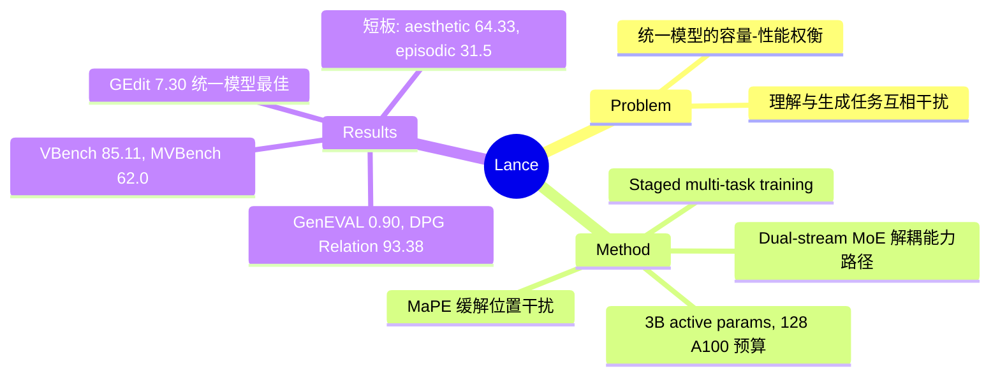

## Summary
Lance 是一个 3B 激活参数的原生统一多模态模型，通过 dual-stream MoE 架构和多任务协同训练，在单一模型中同时支持图像/视频的理解、生成和编辑。

## Problem & Motivation
现有统一多模态模型要么通过堆叠模型容量实现能力覆盖（如 Transfusion、Janus），要么在理解和生成任务间存在性能权衡。Lance 探索了一种轻量级的实用范式：不依赖暴力扩容，而是通过**统一上下文建模 + 解耦能力路径**的设计，让理解和生成任务在共享序列上协同训练，实现多任务增益而非互相干扰。

## Method
> [未获取全文，以下基于 abstract、项目主页和搜索结果综合整理]

**核心架构**：
- **Dual-stream MoE**：在共享的交错多模态序列（text + image + video tokens）上，通过专用 experts 分离语义理解和视觉生成路径，避免任务冲突
- **Modality-aware Positional Encoding (MaPE)**：缓解异构视觉 token（semantic ViT tokens、clean/noisy VAE latents）之间的位置干扰
- **统一 token 表示**：理解任务使用 semantic ViT tokens（来自 Qwen2.5-VL ViT，669M 参数），生成任务使用 VAE latents（来自 Wan2.2 VAE，~705M 参数）；LLM backbone 为 6.19B 参数的 MoT (Mixture-of-Transformer-Experts) 架构，激活参数 3B

**训练范式**：
- **Staged multi-task training**：从零训练，采用分阶段多任务配方，包含 capability-oriented objectives 和 adaptive data scheduling
- **训练预算**：128 A100 GPUs

## Key Results
> [基于项目主页 benchmark 表格]

**图像生成**：
- **GenEVAL**：0.90 overall（与最佳统一模型持平），single-object 1.00（满分），colors 0.97，position 0.87
- **DPG-Bench**：84.67 overall，**Relation 93.38**（表中最高）

**图像编辑**：
- **GEdit-Bench**：平均 7.30（**统一模型中最佳**，超过 BAGEL-7B 的 6.52 和 InternVL-U-1.7B 的 6.66/6.88）

**视频生成**：
- **VBench**：总分 85.11（统一模型最高），semantic score 84.96，subject consistency 94.52，spatial relation 93.61，multi-object 93.86

**视频理解**：
- **MVBench**：62.0 average（统一模型最佳），Moving Attribute 97.5，Object Existence 96.0，Counterfactual Inference 77.0

**弱点**：
- VBench aesthetic quality 64.33（偏低）
- MVBench episodic reasoning 31.5（明显短板）
- GEdit-Bench text_change 4.46（相比其他编辑类别较弱）

## Strengths & Weaknesses
**Strengths**：
- **轻量高效**：3B 激活参数在多个 benchmark 上超越更大的统一模型（如 BAGEL-7B），证明了多任务协同训练的有效性
- **真正的统一**：不是简单拼接理解和生成模块，而是在共享序列上通过 MoE 实现能力解耦，理论上更优雅
- **Benchmark 覆盖全面**：在图像生成、编辑、视频生成、视频理解四个维度都给出了定量结果，且多项指标达到 SOTA

**Weaknesses**：
- **技术细节不足**：项目主页和 abstract 对 dual-stream MoE 的路由机制、MaPE 的具体设计、multi-task training 的阶段划分和数据配比均未详述，可复现性存疑
- **明显短板**：aesthetic quality 和 episodic reasoning 的低分暴露了模型在长程时序推理和美学判断上的不足，可能是训练数据或目标函数的缺陷
- **与专用模型的 gap**：虽然在统一模型中表现最佳，但与专用生成模型（如 FLUX、CogVideoX）的性能差距未明确量化
- **"协同增益"的证据薄弱**：缺少 ablation 证明多任务训练相比单任务训练带来的增益，"synergy" 更像是 claim 而非 finding

**潜在影响**：
如果 dual-stream MoE + 多任务协同的范式被验证有效，可能为轻量级统一模型提供新方向。但当前缺少 ablation 和失败案例分析，难以判断哪些设计是关键、哪些是 overfitting benchmark。

## Mind Map

## Notes
- 项目主页强调 "multi-task synergy"，但未提供 ablation 证明单任务 baseline 的性能——这是验证 "协同" 的关键证据
- MaPE 的设计值得关注：如果能有效缓解异构 token 的位置干扰，可能对其他多模态架构有启发
- 3B 激活参数 + 6.19B 总参数的 MoE 配置，推理效率如何？与 3B dense model 的 latency/throughput 对比？
- aesthetic quality 和 episodic reasoning 的短板可能指向训练数据的 bias（缺少高质量美学数据和长视频推理样本）
