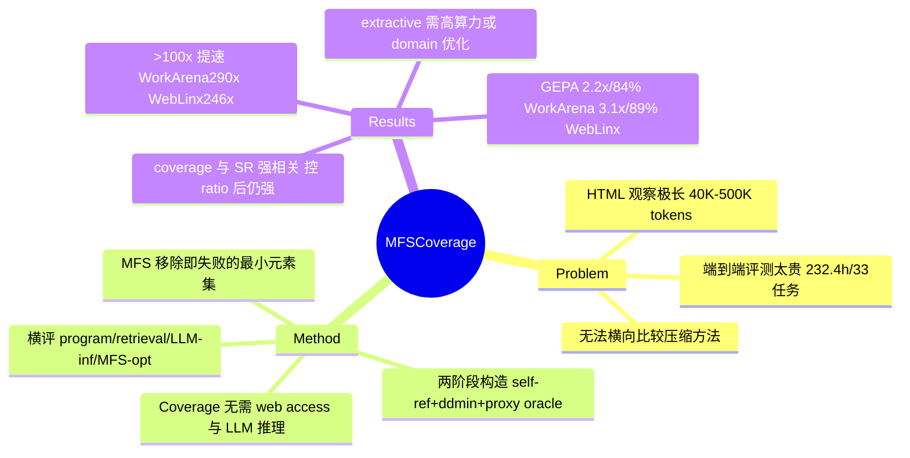

## Summary
针对 web agent 观察压缩方法“端到端评测太贵、无法横向比较”的痛点，本文提出以 Minimal Failure Set (MFS) coverage 作为无需 web access 与 LLM 推理的代理指标，在两个 benchmark 上获得 >100× 的评测提速，并验证 coverage 与端到端 success rate 强相关。基于该框架横评 11 类方法后，结论是 extractive HTML 压缩要么算力昂贵、要么依赖 domain-specific 优化才能在保持性能的同时降延迟；据此用 MFS 训练数据优化 pruning program，在 WorkArena L1 每步提速 2.2× 且保留 84% success rate、WebLinx 提速 3.1× 保留 89%。

## Problem & Motivation
LLM web agent 的 HTML 观察极长（WorkArena 上单步 40K–500K tokens），带来高算力与高延迟，因此社区提出了大量观察压缩（observation reduction）方法。但“哪种方法能在保持性能的前提下真正降低整体 agent 延迟”始终不清楚，根本障碍是端到端评测成本过高：本文实验中，在 WorkArena L1 的 33 个任务上评测 11 种方法 × 32 种配置，累计耗时 232.4 小时。缺乏廉价、可复现、可横向比较的评测手段，是这一子方向进展受阻的核心原因——这正是本文要解决的“评测 formulation”问题，而非再提一种压缩方法。

## Method
**核心思想：用“删掉哪些元素会导致任务失败”来刻画观察中真正有用的信息，把昂贵的端到端评测替换成廉价的集合覆盖判定。**

- **Minimal Failure Set (MFS) 定义**：对某一步的 HTML 观察 H_s，MFS 是“移除后会导致任务失败的最小元素集合”，形式化为 X* = argmin_{X⊆H_s, f(X)=1} |X|，其中 f(X)=1 表示删除 X 后任务失败。元素被拆解为 (i, attr) 粒度（如 (42, value) 指某按钮的 value 属性、(42, @tag) 指其 tag、(42, @text) 指其直接文本），使“压缩方法是否保留了关键信息”可在属性级判定。
- **MFS 构造（两阶段近似）**：Phase 1 用 agent 自报的 element reference 得到候选集 C_s（WorkArena 均值 6.8、WebLinx 6.3 个元素），删除后在两次独立运行中确认任务失败；Phase 2 用 ddmin（delta-debugging）迭代求 1-minimal 子集。WorkArena 上用基于 Phase 1 观察到的错误动作构造的 "proxy oracle"，把每次测试从完整轨迹重放降到单次推理，压低构造成本。最终得到的 MFS 数据集：WorkArena L1 从 321 个采样步得 59 个有效实例（平均 MFS size 1.93）、WebLinx 从 129 步得 42 个（平均 1.50）。构造是一次性成本（WorkArena 2,729 次、WebLinx 2,196 次推理），可摊薄到后续所有方法评测上。
- **Coverage 代理指标**：coverage = “压缩方法完整保留 MFS 的实例占比”。由于 MFS 预先构造好，评测某方法的 coverage 只需判定其输出是否覆盖每个实例的 MFS——**既不需要 web access，也不需要 policy model 推理**，且各实例可完全并行，这是 >100× 提速的来源。
- **横评的方法分类**：baseline（原始 HTML / Random 选择）；program-based（Pruned by AXTree 启发式）；retrieval-based（DMR 的 BM25 / Dense / QueryGen 变体）；LLM inference-based（FocusAgent、Prune4Web）；MFS-optimized（DMR finetuned、GEPA 演化式 prompt 优化）。GEPA/DMR-finetuned 直接用 MFS 训练数据来优化低延迟压缩程序。

## Key Results
- **评测提速（Table 1）**：coverage 评测 vs 端到端（Qwen3.5-122B-A10B）——WorkArena L1 为 48.2 分钟 vs 232.4 小时（≈290× 累计提速）；WebLinx 为 28.5 分钟 vs 117.0 小时（≈246×）。abstract 概括为“两个 benchmark 上 >100× 累计提速”。
- **代理有效性（§3.2, Figure 2）**：MFS coverage 与端到端 success rate **强相关**（同时报告 Pearson r / Spearman ρ / Kendall τ）；即使把 reduction ratio 作为混淆变量回归掉后（partial correlation），相关性依旧强。样本效率高：WorkArena 上仅约 4 个 MFS 实例即可达 ρ>0.7。（各面板精确相关系数见 Figure 2，本文正文未逐一列出数值。）
- **横评结论**：extractive HTML 压缩方法要在“保持性能”的同时降延迟，要么承担高算力（LLM-inference 类如 FocusAgent 单次观察需 ~105s，WorkArena 上 105.69s），要么依赖 domain-specific 优化。domain 差异显著——WebLinx 高度依赖 text 内容、WorkArena 更依赖 CSS 属性（id/class），因此 BM25/DMR 在 text-heavy 的 WebLinx 表现好但在 WorkArena 上 underperform。MFS-optimized 方法（GEPA、DMR finetuned）能在低延迟档位显著提升 coverage。
- **端到端落地（§4）**：用 MFS 训练数据优化的 GEPA（reduction ratio=0.2），WorkArena L1 每步延迟 65.7s→30.2s（2.2× faster）、保留 84% 原始 success rate；WebLinx 3.1× faster、保留 89%。policy 模型为 Qwen3.5-122B-A10B 与 MiniMax-M2.5；benchmark 为 WorkArena L1（33 任务）与 WebLinx（test-iid 采样 300 实例）。

## Evidence Ledger
| Claim ID | Claim | Type | Source locator | Evidence excerpt | Status |
|:--|:--|:--|:--|:--|:--|
| C1 | 端到端评测 11 方法 × 32 配置 × 33 个 WorkArena L1 任务累计需 232.4 小时 | number | Abstract / §1 | "evaluating 11 methods across 32 configurations on 33 tasks of WorkArena L1 required 232.4 cumulative hours" | source-verified |
| C2 | coverage 评测两 benchmark 上 >100× 累计提速；Table 1 WorkArena 48.2m vs 232.4h(≈290×)、WebLinx 28.5m vs 117.0h(≈246×) | number | Abstract / Table 1 | "290× speedup in cumulative runtime … 48.2m … 232.4h … 28.5m … 117.0h" | source-verified |
| C3 | MFS coverage 与端到端 success rate 强相关（Pearson/Spearman/Kendall），控制 reduction ratio 后仍强 | causal-mechanism | §3.2 / Figure 2 | "strong correlation between coverage and end-to-end success rate … partial correlations by regressing out reduction ratio … remains strong" | source-verified（精确系数值仅见 Figure 2 面板） |
| C4 | GEPA(ratio=0.2)：WorkArena 65.7s→30.2s(2.2×) 保留 84% SR；WebLinx 3.1× 保留 89% | number | §4 | "reduces latency from 65.7s to 30.2s (2.2× faster) while retaining 84% … On WebLinx … 3.1× … retaining 89%" | source-verified |
| C5 | extractive HTML 压缩需高算力或 domain-specific 优化才能保性能降延迟；FocusAgent ~105s；BM25 在 WorkArena underperform | comparison | Abstract / Table 2–3 | "require either high computation cost or domain-specific optimization … FocusAgent requires over 100 seconds … BM25 … underperforms on WorkArena" | source-verified |
| C6 | MFS=移除后致任务失败的最小元素集；WorkArena 59 实例(均值 1.93)、WebLinx 42 实例(均值 1.50) | benchmark-setting | §2–§3 | "the minimal set of HTML elements whose removal causes task failure … 59 … 42 valid MFS instances … 1.93 … 1.50" | source-verified |
| C7 | policy 模型 Qwen3.5-122B-A10B 与 MiniMax-M2.5；benchmark WorkArena L1(33 任务)、WebLinx(test-iid 300) | benchmark-setting | §4 | "Qwen3.5-122B-A10B … MiniMax-M2.5 … 33 tasks … 300 instances sampled from the test-iid split" | source-verified |

## Strengths & Weaknesses
**Strengths**
- Problem formulation 抓得准：把注意力从“再造一种压缩方法”转到“如何廉价可比地评测压缩方法”，这是被普遍忽略但真正卡进度的瓶颈。MFS coverage 是一个 simple / scalable 的代理——去掉 web access 与 LLM 推理，天然可并行，>100× 提速有说服力。
- 代理有效性做了应有的严谨：不仅报相关性，还用 partial correlation 把 reduction ratio 这个显然的混淆变量回归掉，且给出样本效率曲线（少量 MFS 实例即达高相关），这比很多“提个 proxy 就用”的工作扎实。
- 横评的可迁移 insight：区分了 program / retrieval / LLM-inference / MFS-optimized 四类在成本-覆盖上的权衡，并揭示 WebLinx（text-heavy）与 WorkArena（CSS-attr-heavy）的 domain 依赖——这解释了为何单一压缩方法难以跨 benchmark 通用。

**Weaknesses / 适用边界**
- 代理指标的效度上限受 MFS 构造质量约束：MFS 用 agent 自报 reference + ddmin 近似求解，且 WorkArena 依赖“proxy oracle”用单次推理替代完整轨迹——若 oracle 判失败与真实端到端失败不一致，coverage 会系统性偏差。相关性虽强但非完美（WebLinx 明显弱于 WorkArena），说明 coverage 不能完全替代端到端，尤其在多步误差累积、非“缺元素即失败”的失败模式上。
- MFS 假设“失败=缺了某关键元素”，对因 reasoning/planning 出错而非观察缺失导致的失败无解释力；coverage 只覆盖 observation 侧的信息充分性，不覆盖 policy 侧能力。
- 有效实例样本偏小（59 / 42），构造有一次性推理成本（~2.7K / 2.2K 次）；跨新 benchmark 需重新构造 MFS 才能用该框架，通用性受此约束。
- 结论 GEPA/DMR-finetuned 更优，本质是“用 MFS 训练数据优化压缩程序”——在 MFS 定义的度量上被优化的方法在 MFS coverage 上占优，存在评测与优化目标同源的循环风险；端到端 SR 结果（84%/89% 保留）是关键的对冲证据，但仍值得警惕。
- **对领域的价值**：为 web/GUI agent 的观察压缩提供了一个廉价可复现的评测底座与四类方法的成本-性能地图，属于“让后续压缩研究能快速迭代”的基建型贡献；配合同团队 2604.01535 的“表征选择取决于 model capability”结论，可组合出更完整的观察工程 mental model。

## Mind Map

## Notes
- 与同团队 2604.01535《Read More, Think More》互补：那篇讲“观察表征怎么选”（HTML vs AXTree vs diff，取决于 model capability 与 thinking budget），本篇讲“压缩方法怎么廉价评测与横比”。两篇合看可作为 web agent observation engineering 的一组参考。
- 可迁移的 pattern：用“最小失败集覆盖”作为端到端指标的廉价 proxy，这一思路可能推广到 GUI agent 的截图/AXTree 压缩、甚至 RAG context pruning 的评测——值得作为 idea 种子跟踪。
- 待核实的证据边界：Figure 2 各面板的精确相关系数（Pearson/Spearman/Kendall 数值）与 Table 2/3 的完整方法延迟表未逐一从正文核到，如需引用具体系数应回原文 Figure 2 / Table 2–3 确认。model 名（Qwen3.5-122B-A10B、MiniMax-M2.5 等）已 source-verified 存在于原文。
