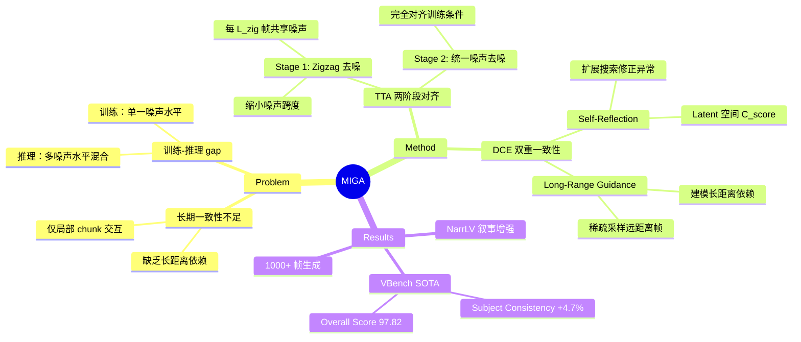

## Summary
MIGA 通过两阶段训练-推理对齐机制和双重一致性增强机制，解决了 train-free 无限帧视频生成中的训练-推理 gap 和长期一致性问题，在 VBench 上相比 FIFO-Diffusion 提升主体一致性 4.7%、背景一致性 2.0%。

## Problem & Motivation
现有视频生成模型受限于固定长度训练，难以生成长视频。Train-free 方法如 FIFO-Diffusion 通过帧级自回归实现无限帧生成，但存在两大问题：(1) **训练-推理 gap**：训练时模型只见单一噪声水平，推理时需同时处理多个噪声水平的 latent，导致内容漂移和视觉伪影；(2) **长期一致性不足**：现有方法仅依赖局部 chunk 交互，缺乏显式的长距离帧依赖建模。

## Method
MIGA 基于 FIFO-Diffusion 的噪声队列框架，引入两个核心机制：

**1. Two-Stage Training-Inference Alignment (TTA)**
- **Stage 1 (Zigzag Iterative Denoising)**：将噪声队列改为每 L_zig 个 latent 共享同一噪声水平（而非每帧递增），形成 zigzag 结构，缩小模型需处理的噪声跨度。每次迭代 dequeue L_zig 个 latent 并 enqueue L_zig 个新高斯噪声，部分完成去噪（降至 τ_e > τ_0）
- **Stage 2 (Unified Noise Level Denoising)**：Stage 1 输出的所有 latent 处于同一噪声水平 τ_{e-1}，此时用滑窗去噪完全对齐训练条件，消除 gap

**2. Dual Consistency Enhancement (DCE)**
- **Self-Reflection**：针对早期高噪声 latent，基于 latent 空间余弦相似度计算一致性分数 C_score（无需外部模型）。关键发现：高噪声 latent 和最终干净 latent 的 C_score 模式高度相关，可在早期评估一致性。当相邻 chunk 的 C_score 下降超过阈值 δ_adju 时，触发扩展搜索：生成 n_samp 个候选样本（每个与前序 guide latent 拼接后迭代去噪），选择 C_score 最高的替换原样本
- **Long-Range Frame Guidance**：针对后期低噪声 latent，在滑窗输入中稀疏采样 m_guid 个远距离先前 latent 作为 guidance，使模型能建模远距离帧依赖

**超参数**（VideoCrafter2 / Wan2.1-1.3B）：T=64/54, L_zig=4/7, τ_e=10/10, δ_adju=0.01/0.01, m_guid=6/4

## Key Results
**VBench (128 frames, VideoCrafter2-based)**：
- Subject Consistency: 97.66 (vs FIFO-Diffusion 92.92, +4.74)
- Background Consistency: 96.99 (vs 95.01, +1.98)
- Overall Score: 97.82 (vs 95.02, +2.80)
- 超越所有 baseline（FreePCA, FreeLong, FIFO-Diffusion, ScalingNoise）

**VBench (161 frames, Wan2.1-based)**：
- Subject Consistency: 96.46 (vs FIFO-Diffusion 92.67, +3.79)
- Overall Score: 97.24 (vs 95.29, +1.95)

**NarrLV**：在所有 TNA 设置和叙事维度上均优于 FIFO-Diffusion，Wan2.1-based 模型在 s_att (TNA=2) 上达到 79.32 (vs 67.77)

**Ablation**：TTA 和 DCE 分别提升 Overall Score 2.03% 和 1.73%，组合后互补增益。Stage 1 显著减少异常，Stage 2 抑制视频噪声。L_zig=4 时性能饱和，m_guid=6 最优。

**定性结果**：Wan2.1-based MIGA 生成 1000+ 帧视频，主体/背景一致性强，尽管基座模型仅支持 81 帧。

## Strengths & Weaknesses
**Strengths**：
- **理论驱动的设计**：TTA 直接针对 FIFO-Diffusion 的理论误差界（bounded by noise span）优化，zigzag 结构巧妙缩小噪声跨度，Stage 2 完全对齐训练条件
- **高效的一致性度量**：Self-Reflection 的 latent 空间 C_score 避免了 ScalingNoise 依赖外部 DINO 模型的开销，且发现高噪声与低噪声 latent 的 C_score 相关性，实现早期评估
- **显著的实证提升**：在两个基座模型（VideoCrafter2, Wan2.1）上均取得 SOTA，主体一致性提升尤为明显（+4.7%）
- **可扩展性**：支持 multi-text control（不同时间位置不同文本条件），增强叙事表达能力

**Weaknesses**：
- **物理常识缺失**：论文在 Appendix C 承认存在 physical commonsense 和 hallucination 问题，但未提供定量分析或 failure case
- **计算开销未量化**：Self-Reflection 的扩展搜索（生成 n_samp 候选）和 Long-Range Guidance（稀疏采样远距离 latent）会增加推理成本，但论文未报告 wall-clock time 或 FLOPs 对比
- **超参数敏感性**：L_zig, m_guid, δ_adju 等超参数需针对不同基座模型调优（VideoCrafter2 和 Wan2.1 的配置不同），泛化性存疑
- **C_score 相关性的适用边界**：论文称高噪声与低噪声 latent 的 C_score 相关性在噪声水平 40/50 时仍高，但未探讨更高噪声水平或不同 sampler 下的鲁棒性
- **与 training-based 方法的 gap**：Appendix 提到 Self-Forcing 等 training-based 方法，但未在主实验中对比，train-free 方法的性能上限不明

**潜在影响**：
- 为 train-free 长视频生成提供了新的优化范式（从噪声调度到训练-推理对齐），可能启发其他 diffusion-based 生成任务的 train-free 扩展
- Self-Reflection 的 latent 空间一致性度量可能适用于其他需要 test-time scaling 的生成任务

## Mind Map

## Notes
- **与 ScalingNoise 的对比**：ScalingNoise 也做 test-time scaling，但依赖外部 DINO 模型评估一致性，MIGA 的 latent 空间 C_score 更轻量。两者在 VBench 上的 gap（97.82 vs 95.95）主要来自 TTA 还是 DCE？Ablation 显示 TTA 单独可达 97.05，说明 TTA 是主要贡献
- **Zigzag 结构的理论保证**：论文引用 FIFO-Diffusion 的误差界（bounded by noise span），但未给出 zigzag 结构下的新误差界。L_zig 的选择是否有理论指导，还是纯经验调优？
- **C_score 的物理意义**：余弦相似度衡量的是 latent 方向的一致性，但视频一致性还包括颜色、纹理、运动等。C_score 为何能有效捕捉这些？是否因为 VAE latent 已编码了这些信息？
- **Multi-text control 的实现细节**：论文提到支持不同时间位置不同文本条件，但未说明如何在 zigzag 结构下处理文本切换。是否在每个 L_zig 边界切换文本？
- **与 video prediction / world model 的联系**：MIGA 本质是 conditional video generation，但其 autoregressive 结构和一致性建模与 world model 的 action-conditioned prediction 有相似之处。能否将 MIGA 的机制迁移到 world model？
