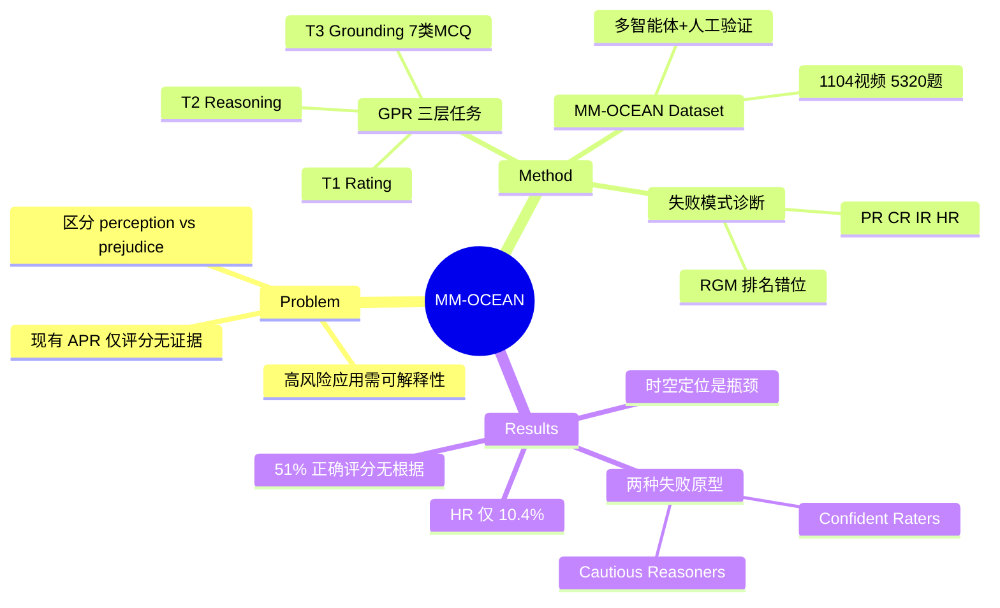

## Summary
提出 Grounded Personality Reasoning (GPR) 任务和 MM-OCEAN benchmark，要求 MLLM 不仅预测 Big Five 人格评分，还需提供时间戳标注的行为证据和推理链。评测 27 个 MLLM 发现：51% 的正确评分缺乏行为线索支撑，揭示模型普遍存在"猜对但理由错"的 prejudice 问题。

## Problem & Motivation
现有 apparent personality recognition (APR) benchmark 仅要求模型输出 Big Five 数值评分，无法区分模型是真正理解行为线索（perception）还是依赖表面相关性猜测（prejudice）。这在面试筛选、心理健康分诊等人机交互场景中存在风险，且不符合 EU AI Act 对可解释性的要求。人类准确的人格推断依赖整合微表情、姿态变化等行为微线索，而非单纯的模式匹配。

## Method
### 1. GPR 任务形式化
定义三层任务链：
- **T1 (Rating)**: 预测 Big Five 五维人格的 1-5 分序数评分
- **T2 (Reasoning)**: 生成结构化解释，包含时间戳标注的行为观察和基于证据的特质分析
- **T3 (Grounding)**: 回答 7 类线索定位选择题（Personality Attribution、Counterfactual reasoning、Temporal-Causal chains、Mixed Emotion、Micro-expression detection、Spatial Localization、Temporal-Spatial Joint grounding）

核心约束：每个特质判断必须引用至少一个观察到的行为线索（grounding constraint）。

### 2. MM-OCEAN Dataset
- **规模**: 1,104 个视频（来自 ChaLearn First Impressions V2，15 秒单人讲话片段）+ 5,320 个线索定位选择题
- **标注**: ~13.5K 人工验证的原子行为观察（跨 Expression、Action、Audio、Background 四个感知通道）+ 5,520 个特质级人格分析

### 3. 多智能体标注流程
五阶段流程，四个 LLM agent + 人工监督：
- **Stage 1 (Observer + Human)**: LLM agent 生成原子行为观察草稿，24 名训练过的人工标注员审核、修正时间戳和边界框（接受率 78.2%，14.6% 修正，5.9% 删除）
- **Stage 2 (Psychologist)**: 基于验证的观察生成 Big Five 分析和证据链
- **Stage 3 (Examiner)**: 为每个视频生成 7 类线索定位选择题（1 个正确答案 + 5 个干扰项）
- **Stage 4 (Aligner)**: 自动质量保证（确定性代码检查 + LLM 语义审核）
- **Stage 5 (Filtering + Expert Review)**: 文本泄漏过滤（删除纯文本 LLM 可答对的题目）+ 专家人工终审

### 4. 三层评估框架
- **Task 1**: 精确匹配准确率 + 序数评分的 MAE
- **Task 2**: AI-as-Judge 在四个维度（Evidence Coverage、Logical Coherence、Grounding Accuracy、Directional Accuracy）打 1-10 分
- **Task 3**: 7 类选择题的总体和分类准确率

### 5. 跨任务失败模式诊断
定义四个样本级失败率指标：
- **Prejudice Rate (PR)**: 评分正确但线索错误/无根据——"答对但理由错"
- **Confabulation Rate (CR)**: 推理听起来合理但线索错误
- **Integration-failure Rate (IR)**: 线索检索正确但最终评分错误
- **Holistic-Grounding Rate (HR)**: 三个任务同时正确

另定义 Rating-Grounding Misalignment (RGM) = 模型在 T2/T3 的平均排名 - T1 排名，检测"评分好但无法证明"的模型。

## Key Results
### 核心发现：Prejudice Gap
- **51.3% 的正确评分缺乏线索支撑**（所有模型平均 PR）
- **平均 Holistic-Grounding Rate 仅 10.4%**，最佳模型（Gemini 3 Flash）也只有 33.5%
- 传统 T1-only 评估会将 50-56% 准确率的模型视为"胜任"，但它们的 PR 范围为 40-87%

即使在闭源前沿模型（top 3）中，~14.5% 的正确评分仍无根据；开源前沿模型中这一比例升至 ~47%。

### 生态系统差距
评分和解释性能在开源/闭源间基本收敛（ΔT1 = -5.6%，ΔT2 = -3.6%），但线索检索存在显著差距（ΔT3 = -26.6%）。闭源优势集中在视觉定位簇：Spatial Localization +19.5pp，Temporal-Spatial Joint +21.8pp。

### 分类难度层级
所有 27 个模型中，稳定的难度排序：
- **最简单**: Temporal-Causal Reasoning（64.8% 平均准确率）
- **最困难**: Spatial Localization（30.7%）和 Micro-expression Localization（34.6%）

细粒度时空定位是全 benchmark 瓶颈。

### HR 作为区分性指标
Holistic-Grounding Rate 的变异系数（CV ≈ 0.93）远大于任何单任务指标（T1 CV ≈ 0.13，T2 CV ≈ 0.16，T3 CV ≈ 0.36），是最具区分度的度量。

### 两种模型原型
RGM 分析揭示两种失败模式：
- **Confident Raters**（RGM ≥ +5，5 个模型）：T1 评分好但下游失败。例：Llama-4-Maverick-FP8 在 T1 排第 4，但 T2/T3 仅排 17/19
- **Cautious Reasoners**（RGM ≤ -5，5 个模型）：定位能力强但评分差。例：Gemini 2.5 Flash 在 T1 排第 25，但 T2/T3 表现优秀

### 顶尖模型
- **总体最佳**（按 HR）：Gemini 3 Flash（33.5% HR，64.1% T1，66.5% T3）
- **开源最佳**：Qwen3.5-397B-A17B（15.9% HR，53.1% T1，48.1% T3）

推理能力强的模型（如 o4-mini）表现混合：T3 定位尚可（43.4%）但 confabulation rate 极高（71.7%），说明推理能力可能产生听起来合理但无根据的解释。

### 其他分析
- **规模扩展**: 更大的开源模型通常表现更好，但收益递减
- **代际演进**: 同系列内新一代模型有改进
- **位置偏差**: 作为选择题评估的健康信号监控
- **阈值敏感性**: HR 排名在 3×3×3 阈值扫描中保持稳定（ρ ≥ 0.92）

## Strengths & Weaknesses
### Strengths
- **问题定义清晰**: 区分 perception vs. prejudice 切中要害，grounding constraint 是关键创新
- **评估设计严谨**: 三层任务 + 四个失败模式指标形成完整诊断体系，HR 作为联合成功率是强区分性指标
- **数据质量高**: 多智能体 + 人工验证流程（78.2% 接受率）+ 文本泄漏过滤，保证标注可靠性
- **发现有冲击力**: 51% PR 和 10.4% HR 揭示传统评估的系统性高估，对领域有警示意义
- **实验全面**: 27 个模型跨 12 个系列，覆盖闭源/开源前沿，RGM 分析揭示两种失败原型

### Weaknesses
- **任务范围受限**: 仅限 15 秒单人英文讲话片段的 apparent personality，泛化性未知
- **T2 评估依赖 AI-as-Judge**: 虽有跨 judge 鲁棒性验证（ρ ≥ 0.92），但缺乏人工评估的 ground truth
- **线索定位形式化为选择题**: MCQ 是 grounding 的简化操作化，无法捕捉开放式视觉定位的全部复杂性
- **因果推断缺失**: 无法确定模型是否真正"理解"行为-特质因果关系，还是记住了 MCQ 模式
- **缺少干预实验**: 未测试修改行为线索后模型评分是否相应变化（counterfactual robustness）

### 潜在影响
- 为 MLLM 人格感知能力提供首个 grounding-aware benchmark，推动从"猜对"到"理解对"的范式转变
- Prejudice Rate 等指标可能成为高风险应用（招聘、心理健康）的监管合规工具
- 揭示细粒度时空定位是当前 MLLM 的系统性短板，为 post-training 指明方向
- 多智能体标注流程可迁移到其他需要行为-推理对齐的 benchmark 构建

## Mind Map

## Notes
- **与 GUI grounding 的类比**: 本文的 grounding constraint（评分必须引用行为线索）类似 GUI agent 中 action 必须引用 element，都是"决策-证据对齐"问题。MM-OCEAN 的 Spatial/Temporal Localization 困难与 GUI agent 的 element detection 困难本质相同——细粒度视觉定位是 MLLM 通用短板。
- **Prejudice Rate 的启示**: 51% PR 说明模型可能通过 dataset bias（如"微笑→高 agreeableness"）猜对，而非真正理解。这与 VQA 中的 language prior 问题类似——需要 counterfactual 测试验证因果理解。
- **开放问题**: 如果用 chain-of-thought prompting 或 self-consistency 能否降低 PR？论文未探索 prompting strategy 对 grounding 的影响。
- **潜在扩展**: 将 grounding constraint 推广到其他 social perception 任务（emotion、intent、deception detection），构建统一的 grounded social understanding benchmark。
