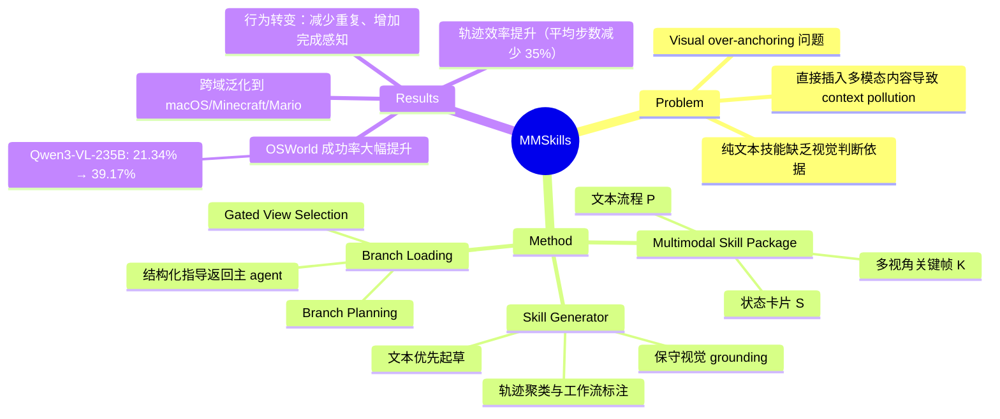

## Summary
提出 multimodal skill package 表示（文本流程 + 状态卡片 + 多视角关键帧），通过 branch loading 机制让 visual agent 在推理时按需查阅视觉证据，避免直接插入技能内容导致的 context pollution，在 OSWorld/macOSWorld/VAB-Minecraft 等 benchmark 上显著提升成功率。

## Problem & Motivation
现有 visual agent 的可复用技能主要依赖文本 prompt 或代码，但视觉任务需要状态识别和视觉证据判断——纯文本技能无法提供"对话框是否已就绪"等视觉判断依据。直接将多模态内容插入 context 会造成 context pressure 和 visual over-anchoring（参考图像覆盖当前观察）。核心挑战：(1) 多模态技能包应包含什么内容，(2) 如何从公开数据中提取，(3) 如何在推理时有效使用多模态证据。

## Method

### Multimodal Skill Package
每个 MMSkill 表示为 **M = (D, P, S, K)**：
- **D**: 技能描述符（descriptor）
- **P**: 可复用的文本流程（textual procedure）
- **S**: 运行时状态卡片集合（runtime state cards）
- **K**: 与状态卡片对齐的多视角关键帧束（multi-view keyframe bundles）

每个状态卡片 Sⱼ 包含：
- `when_to_use` / `when_not_to_use` 条件
- `visible_cues` 描述需检查的视觉证据
- `verification_cue` 用于进度/完成检查
- `available_views` (full_frame, focus_crop, before, after)

文本技能是退化情况 (D, P, ∅, ∅)；MMSkills 通过绑定流程与视觉决策证据扩展之。

### Skill Generator Pipeline
从公开非评估轨迹中提取技能，通过 meta-skill ℱ 控制的五阶段流水线：
1. **Phase 0**: 任务 embedding 和轨迹语义聚类
2. **Phase 1**: LLM 驱动的集群级技能规划，标注工作流边界
3. **Phase 2**: 去重、合并、泛化技能候选
4. **Phase 3**: 文本优先起草（描述符、流程、状态卡片，不含图像）
5. **Phase 4**: 图像 grounding 和 meta-skill 引导的审计

视觉 grounding 策略保守：仅在状态识别、转换对比或完成验证时添加视图。

### Branch-Loaded Agent Architecture
采用 **branch loading** 两阶段机制，而非直接插入技能包：

**Stage 1 (Gated View Selection)**: 临时分支根据实时观察选择相关状态卡片和视图类型，先读取描述再加载图像。若文本信息足够则不加载图像。

**Stage 2 (Branch Planning)**: 将选中证据与实时状态对齐，返回结构化指导 Gₜ = (applicable, subgoal, plan, do_not_do, verify) 给主 agent。主 agent 仍基于实时截图 grounding 动作——技能指导仅为建议性。

分支输出提供决策支持而非可执行动作，"保留流程指导的同时避免参考图像覆盖当前观察"。

## Key Results

### Benchmarks
- **OSWorld** (主要，360 个测试用例，Ubuntu 桌面应用)
- **macOSWorld** (143 个测试用例，跨 OS GUI 任务)
- **VAB-Minecraft** (VisualAgentBench 子集，物品获取)
- **Super Mario Bros** (LMGame-Bench，游戏)

### 主要结果
**OSWorld 整体成功率** (无技能 → MMSkills)：
- Gemini 3.1 Pro: 44.08% → 50.11%
- Gemini 3 Flash: 36.65% → 47.97%
- Qwen3-VL-235B: 21.34% → 39.17%
- Qwen3-VL-8B-Instruct: 10.78% → 25.40%

外部多模态知识对弱模型尤其有价值。8B 模型在 VAB-Minecraft 成功率从 23.28% 提升至 38.79%。

跨域迁移：macOSWorld、VAB-Minecraft（所有模型均提升）、Super Mario Bros 均受益。纯文本技能有帮助但"跨域不稳定，表明仅流程不足"。

**轨迹效率**：MMSkills 在所有设置中缩短交互轨迹。Qwen3-VL-235B 在 OSWorld 平均步数从 15.22（无技能）降至 9.87（MMSkills）——减少 5.35 步。

### Ablation Studies
- **技能内容消融**：移除状态卡片削弱状态判别；移除图像移除视觉 grounding 证据。两者均损害性能，确认互补作用。
- **Branch loading 消融**：
  - 直接全量加载（插入所有技能内容）因 context pollution 损害性能
  - 无视图选择的 branch loading 相比直接加载有明显提升
  - 完整两阶段设计（branch loading + 视图选择）表现最佳
  - Branch loading 即使对纯文本技能也有帮助，在多数配置中优于直接文本插入
- **技能使用动态**：MMSkills 调用频率高于纯文本技能（如 Qwen3-VL-235B 在 OSWorld：37.50% → 65.28% 调用率），表明多模态技能让外部知识更易识别为相关。Focus crop 在多数设置中主导选中视图，full-frame、before、after 视图提供补充上下文。
- **行为转变分析**：MMSkills 减少低级动作计数，抑制重复行为，增加 DONE（完成）动作。Qwen3-VL-235B 精确重复动作从 21.8% 降至 6.2%，点击占比从 75.8% 降至 63.7%。作者将此描述为"从探索性试错转向 grounded、状态感知的执行"。

## Strengths & Weaknesses

**Strengths**:
- **系统性设计**：从技能表示、生成流水线到推理机制的完整方案，multimodal procedural knowledge 的形式化清晰
- **Branch loading 机制**：优雅解决多模态技能的 context management 问题，实验证明显著优于直接插入
- **跨模型、跨域泛化**：在多个模型家族（Gemini/Qwen/GLM/Kimi）和不同任务类型（GUI/游戏）上均有提升，对弱模型增益尤其明显
- **行为分析深入**：不仅报告成功率，还分析轨迹效率、技能调用率、动作分布变化，提供对 agent 行为转变的洞察

**Weaknesses**:
- **技能质量依赖源轨迹覆盖**：自动生成流水线可能产生不完美的技能包，论文未充分讨论错误技能的影响和修复机制
- **推理开销**：两阶段 branch loading 增加计算成本，论文未量化额外延迟
- **评估局限**：当前仅限 GUI 和游戏环境，扩展到更广泛的 embodied 或安全关键场景需要更强验证和在线技能修复
- **视觉 grounding 保守性**：conservative 的视图添加策略可能遗漏有价值的视觉证据，ablation 未探索更激进的 grounding 策略

**潜在影响**：为 visual agent 的可复用知识表示提供新范式，branch loading 机制对其他需要外部多模态知识的 agent 系统有启发。对弱模型的显著增益表明显式多模态程序性知识可部分补偿有限的内部先验，为资源受限场景提供方向。

## Mind Map

## Notes
- **与 Skill1 (2605-Skill1.md) 的对比**：两篇论文都关注 visual agent 的技能，但 Skill1 聚焦 skill discovery 和 hierarchical planning，MMSkills 聚焦 multimodal skill representation 和 inference-time usage。可能存在互补性。
- **Branch loading 的通用性**：这个机制是否可推广到其他需要外部知识的 agent 场景（如 RAG-based agent、tool-use agent）？
- **技能质量保证**：自动生成的技能包如何验证和修复？是否需要 human-in-the-loop 或在线学习机制？
