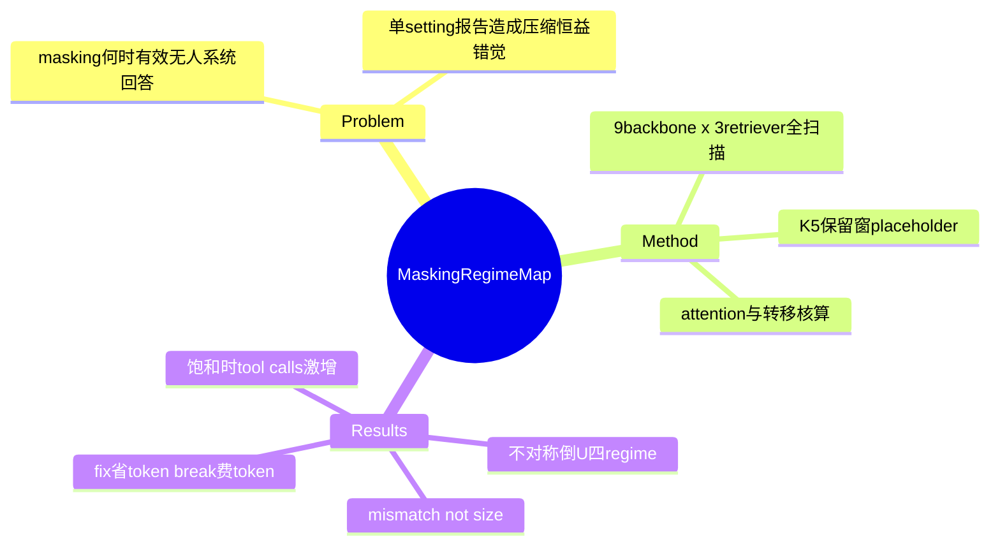

## Summary

对 long-horizon search agent 最简上下文管理手段（mask 掉最近 K=5 之外的 stale observations）的系统 regime 研究：增益随"无 CM 基线准确率"呈不对称倒 U——弱 retriever 下低平台（+6.2~6.6）、强 retriever × 中等能力模型达峰（+11.7）、模型饱和时崩塌为零甚至负（−1.1，live-web 上 −4.8）；机制是 token-for-turn 交换，决定因素是 retriever recall × 模型隐式过滤能力的交互而非任一单因素——把"context 压缩单调有益"改写为 regime 依赖的干预。

## Problem & Motivation

Search agent 跨多次 tool call 积累大量检索内容，observation masking 是最常用的省 context 手段，但"何时有效、为什么"从未被系统回答——各论文在单一 setting 里报告收益，形成"压缩总是好的"错觉。本文用 backbone（4B–284B，9 个开源模型）× retriever（BM25 / Qwen3-Emb-8B / AgentIR-4B）× benchmark（offline BrowseComp-Plus 830 题 + live GAIA 103/xBench-DeepSearch 100/BrowseComp-ZH 289）的全扫描画出 regime map。

## Method

- **干预**：保留最近 K=5 条 observations，更早的替换为固定 placeholder；**tool-call error 消息豁免不 mask**（消融证明必要）。500-turn 上限。
- **Regime 轴**：以"无 CM 时的准确率"为横轴画增益曲线，分解 retriever recall 与模型能力两个因素。
- **机制测量**：per-step attention 分解（reasoning vs observations）、页面 re-open 行为统计、query 级 wrong→correct（fix）/correct→wrong（break）转移与 token 成本核算。

## Key Results

| Regime | 条件 | 增益 |
|:--|:--|:--|
| Retriever 瓶颈平台 | BM25，recall ≤0.55 | +6.2 ~ +6.6 pts |
| **CM 最优点** | AgentIR + Qwen3.5-35B-A3B（recall 0.88，基线 62.9%） | **+11.7 pts** |
| 模型饱和 | GPT-OSS-120B + AgentIR（recall 0.92，基线 79.4%） | +0.1 pts |
| 负塌陷 | Tongyi-DeepResearch（recall 0.93，基线 80.7%） | **−1.1 pts** |

- **Live-web 塌陷更锐**：GPT-OSS-120B 在 GAIA 上被 masking 伤害 −4.8 pts。
- **规模不选 regime**：同为 35B-A3B 的 Qwen3.5 与 Qwen3.6 增益 +11.7 vs +3.7——训练状态而非参数量决定隐式过滤能力（"mismatch, not size"）。
- **机制（attention）**：reasoning 占 per-step attention 53.7% vs observations 25.6%；observation attention 高度前置（最近 10% turns 占 65%，中段塌到 ~1%）；re-open 双峰（只重开最新页与首页）。masking 删的多是模型本就不再看的内容。
- **机制（转移核算）**：fix 省 token、break 费 token；高增益 regime fix:break ≈ 3:1，饱和 regime ≈ 1:1（互相抵消）。
- **饱和的代价形态**：masking 使 tool calls 激增（GPT-OSS-120B +68.7 次/query、DeepSeek-V4-Flash-Max +57.7）——省下的 token 被换成更多 turn。
- **消融**：连 error 一起 mask → open errors 18.60%→22.61%（4B）；模糊标题迫使推断 URL → 20.75%（4B）/26.24%（9B）。
- **建议**：工程重心应从激进启发式剪枝转向 high-fidelity retrieval——提升 retriever 从根本上抬高信号上界，masking 在模型饱和时有证据误删风险。

## Evidence Ledger

| Claim ID | Claim | Type | Source locator | Evidence excerpt | Status |
|:--|:--|:--|:--|:--|:--|
| C1 | K=5 保留窗 + placeholder；error 豁免；9 backbone × 3 retriever；830/103/100/289 题 | benchmark-setting | §3 Methodology | "observation retention window of K=5" | source-verified |
| C2 | 倒 U 四点：+6.2~6.6（BM25）/+11.7（峰）/+0.1（饱和）/−1.1（负） | number | §Main Results Table 1 | "peak gain, +11.7 … recall 0.88 … 62.9%" | source-verified |
| C3 | live-web 塌陷：GPT-OSS-120B GAIA −4.8 | number | §Main Results | "harmed by −4.8 pts on GAIA" | source-verified |
| C4 | 同尺寸不同训练态增益 +11.7 vs +3.7；决定因素为 recall × 隐式过滤能力交互 | causal-mechanism | §Findings; Abstract | "interaction between retriever recall and the model's implicit filtering capacity" | source-verified |
| C5 | attention：reasoning 53.7% vs obs 25.6%；obs 前置 65%@最近 10% turns；中段 ~1% | number | §5.3.1 Fig 6 | "reasoning captures 53.7% of the per-step attention budget" | source-verified |
| C6 | fix 省/break 费；fix:break 3:1（高增益）vs 1:1（饱和） | number | §5.3 Fig 4 | "fixes outnumber breaks roughly 3:1" | source-verified |
| C7 | 饱和下 tool calls +68.7（GPT-OSS-120B）/+57.7（DeepSeek-V4-Flash-Max） | number | Table 1 | "+68.7 per query" | source-verified |
| C8 | mask error → 18.60→22.61%（4B，9B 为 20.41→24.56）；模糊标题迫使 URL 推断 → 20.75/26.24% | number | §Ablation Table 2 | "18.60% → 22.61%" | source-verified |
| C9 | 边界：仅 minimal turn-based masking；仅开源模型；descriptive 非 predictive | benchmark-setting | §Limitations | "descriptive rather than predictive" | source-verified |
| C10 | 建议转向 high-fidelity retrieval；scaffold+轨迹开源 | sota-novelty | §Conclusion | "pivot from aggressive heuristic pruning toward high-fidelity retrieval" | source-verified |

## Strengths & Weaknesses

**Strengths**：
- 把散落各论文的"masking 有效/无效"矛盾统一进一张 regime map，并用 attention + re-open + 转移核算三层机制解释——是"context 压缩单调有益"主张的系统证伪（[[Reports/2026-07-27-WebAgent-RL-and-Context-Landscape]] §4 争议行的证据）。
- "mismatch, not size" 是最有信息量的发现：同尺寸不同训练态 regime 位置不同，意味着**部署前无法仅凭模型规格决定是否开 masking**，需要按 baseline 准确率探针定位 regime。
- 与 CUA 域 [[Papers/2604-ReadMoreThinkMore]]（强模型用完整 HTML 反而更好、弱模型相反）跨域同构：两者共同把 observation reduction 从"能力优化"改写为"regime 依赖干预"，本篇额外补了机制层（attention 前置化 + fix/break 核算）。

**Weaknesses / 边界**：
- 全部实验在**文本检索型 search agent**（BrowseComp/GAIA 类）上，无 GUI/screenshot observation——对 CUA 的 observation reduction 只能作邻接可迁移证据，GUI 域的 stale screenshot masking 是否同构未测。
- 只测了最简 turn-based 策略；learned/attention-guided/semantic 策略是否改变 regime 边界留空——作者自认框架 descriptive 非 predictive。
- 无 frontier 闭源模型；饱和阈值（无 CM >70% @BrowseComp-Plus）是经验性的、benchmark 相对的。

**对领域**：为上下文管理干预建立了"先定位 regime 再决定干预"的评估范式；饱和模型 + 强 retriever 时 masking 默认应关闭。

## Mind Map

## Notes

- 入队来源：[[Reports/2026-07-27-WebAgent-RL-and-Context-Landscape]] §6 证伪型对照 top-3 之三（rationale："上下文遮蔽的有效/失效 regime 边界与机制"）。检验结果：§4 争议行"context 压缩单调有益"被 regime map 正式否定，有效区间收窄为"retriever 强 × 模型未饱和"。
- 至此 07-27 报告的证伪型 top-3（2606.15017 / 2606.24551 / 2606.00408）全部 digest 完毕，三条争议主张均获裁决。
- 对 CUA-Survey §6.7.2（observation reduction 条件性收益）：本篇与 ReadMoreThinkMore 构成跨域双数据点（search 域 + web GUI 域），且提供了 GUI 域缺失的机制测量模板（attention 前置化、re-open 双峰、fix/break 核算）——若做 GUI 版 regime map，这三个测量是现成协议。
