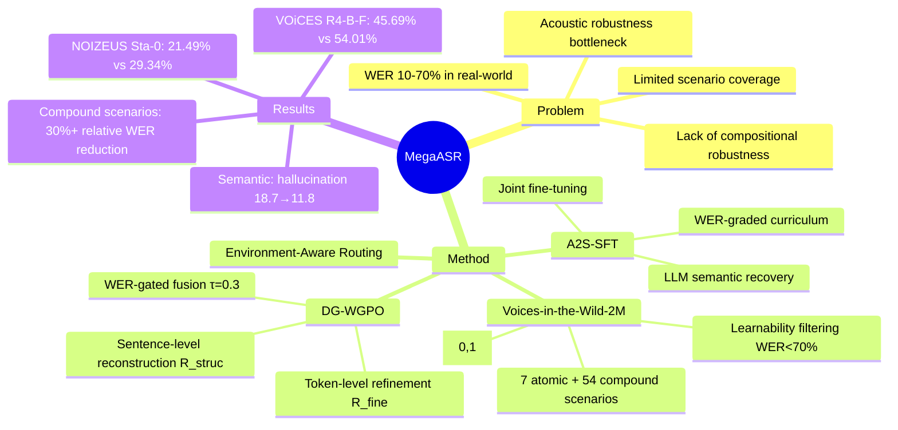

## Summary
通过构建 Voices-in-the-Wild-2M 数据集（覆盖 7 种原子声学现象和 54 种复合场景）和 Acoustic-to-Semantic Progressive SFT + Dual-Granularity WER-Gated Policy Optimization 训练框架，将 ASR 在复杂声学环境下的 WER 相对降低超 30%。

## Problem & Motivation
现有 ASR 模型在干净 benchmark 上表现良好，但在真实复杂声学环境下（噪声、混响、远场等复合干扰）性能急剧下降，WER 可达 10%-70%。核心问题是"acoustic robustness bottleneck"：模型失去声学 grounding，产生遗漏或幻觉。现有数据集存在三大局限：(D1) 场景覆盖有限，仅针对单一条件；(D2) 缺乏复合干扰的鲁棒性；(D3) 训练数据难度分布与真实场景不匹配。

## Method

### Voices-in-the-Wild-2M 数据集
通过 spectrogram-level 代码模拟构建，分四阶段：
1. **原子声学效应**：模拟 7 种经典现象（噪声、远场、遮挡、回声/混响、录音染色、电子失真、传输丢包），每种效应用专门的频谱处理 pipeline 实现，参数对齐真实录音。噪声源包括 MUSAN、DNS Challenge、ESC-50、UrbanSound8K（~42K 片段，129 小时）。干净语音来自 LibriSpeech、Common Voice、WenetSpeech、AISHELL-1。
2. **复合场景**：将 2-5 种原子效应组合成 54 种物理可信的配置（如远场+教堂回声），通过 agentic check 验证物理合理性。
3. **可控难度**：引入严重度参数 k ∈ [0,1] 控制效应强度，测试四种候选分布后采用 Linear 分布。
4. **可学习性过滤**：丢弃 WER>70% 的样本以保证训练稳定性。

最终数据集包含 2.4M 合成片段，难度显著高于现有 benchmark（Qwen3-ASR 在其上平均 WER 达 35%）。同时构建 Voices-in-the-Wild-Bench 评估集（5,000 片段，含 3,500 合成 + 1,500 真实录音）。

### Acoustic-to-Semantic Progressive SFT (A2S-SFT)
解决两个耦合瓶颈：从损坏波形提取声学证据 + 利用语义先验重建。分三阶段：
1. **WER 分级课程学习**（encoder + aligner）：从 WER<30% 逐步扩展到 WER<50% 再到 WER<70%
2. **LLM 微调**：在完整 WER<70% 样本上激活语义恢复能力
3. **联合微调**：端到端对齐 encoder、aligner 和 LLM

### Dual-Granularity WER-Gated Policy Optimization (DG-WGPO)
基于 DAPO 作为 RL backbone。核心洞察：WER<30% 时错误主要是词级混淆，WER≥30% 时转变为句级失败（幻觉、遗漏）。

**静态奖励**：
- WER 奖励：R_wer = 1 − WER(H, R)
- 反重复奖励：硬门控，超过阈值的重复 n-gram 直接清零 rollout
- 组合：R_static = R_rep · R_wer

**双粒度动态奖励**（核心组件）：
- *Token 级精炼奖励*：按编辑相似度划分替换错误（sim≥0.5 为"软"错误，否则为"硬"错误），插入/删除视为硬错误。R_fine = n_C / (n_C + n_hard + α_s · n_soft + ε)
- *Sentence 级重建奖励*：结合 LCS-based backbone agreement 和长度匹配项：R_struc = 0.5 · LCS(H,R)/|R| + 0.5 · max(0, 1 − ||H|−|R||/|R|)
- *WER 门控动态融合*：在阈值 τ=0.3 处动态切换粒度权重：
  - WER<τ：0.75·R_fine + 0.25·R_struc
  - WER≥τ：0.25·R_fine + 0.75·R_struc

**最终目标**：R = (1−α_dyn)·R_simple + α_dyn·R_dynamic，其中 α_dyn=0.6，α_s=0.4。

### Environment-Aware Routing
轻量级二分类器（基于 LoRA）预测输入是否需要 Mega-ASR 的鲁棒权重或原始 backbone，作为即插即用模块保留干净域性能。

## Key Results

**基座模型**：Qwen3-ASR-1.7B。**训练数据**：Voices-in-the-Wild-2M（SFT + RL）。RL 训练 6,000 步，lr=1×10⁻⁶，每输入 K=16 rollouts。

### 恶劣条件 ASR（Table 2）
Mega-ASR 达到最佳整体鲁棒性，平均 WER 6.70，vs. Qwen3-ASR 7.93、Whisper-Large-v3 10.72、Qwen2.5-Omni 15.14。关键场景：
- VOiCES R4-B-F：45.69% vs. 54.01% baseline
- NOIZEUS Sta-0：21.49% vs. 29.34%
- NOIZEUS 0dB：19.80 vs. 23.97（相对降低 17.4%）

### 标准 ASR（Table 3）
使用 routing 后，Mega-ASR 保持竞争力：LibriSpeech 1.63/3.37（test clean/other），FLEURS zh/en 3.86/3.17，与 Qwen3-ASR backbone 持平或更优。

### Voices-in-the-Wild-Bench（Table 4）
混合退化条件下，Mega-ASR 达到 2.73/4.57 WER（真实/合成），vs. Whisper-Large-v3 8.91/14.79——相对降低 65.8%/69.1%。

### Ablation 研究

**A2S-SFT 和 DG-WGPO 组件消融（Table 5）**：
- Qwen3-ASR baseline：VOiCES 8.94，NOIZEUS 9.45
- + SFT w/o A2S：8.31，8.79
- Mega-ASR-Base：7.59，8.12
- + vanilla GRPO (仅 R_wer)：7.73，8.11
- + vanilla DAPO (仅 R_wer)：7.62，7.98
- + DG-WGPO w/o R_rep：7.46，7.73
- + DG-WGPO w/o R_fine：7.45，7.71
- + DG-WGPO w/o R_struc：7.54，7.85（最大退化）
- + DG-WGPO w/o gated fusion：7.41，7.68
- Mega-ASR (完整)：7.35，7.64

移除 R_struc 导致最大退化，确认句级重建对中/高 WER 样本至关重要。完整系统相比 Qwen3-ASR 降低 1.59/1.81 WER。

**语义层面收益（Table 7）**：LLM-as-judge 评估显示 Mega-ASR 将幻觉从 18.7 降至 11.8，遗漏内容从 14.2 降至 5.9，语义得分从 71.3 升至 86.4。

**基于规则 vs. LLM-judge 奖励（Table 6）**：基于规则的奖励与 LLM-judge 性能相当（WER 差异 ~0.1），但速度快 3.2 倍（19.57s vs. 62.23s per step）。

**超参数敏感性（Table 8）**：α_dyn 比 α_s 更敏感。将 α_dyn 推至 0.8 在噪声子集上导致急剧退化。默认 (0.6, 0.4) 在所有子集上达到最佳或接近最佳 WER。门控阈值 τ=0.3 最优（Table 9）。

## Strengths & Weaknesses

**Strengths**：
- **数据集设计扎实**：Voices-in-the-Wild-2M 覆盖 7 种原子现象和 54 种复合场景，物理可信性验证 + 可控难度分布 + 可学习性过滤，构建流程系统且可复现
- **方法针对性强**：A2S-SFT 的三阶段课程学习和 DG-WGPO 的双粒度奖励设计直接针对声学-语义耦合瓶颈，WER 门控融合机制有明确物理直觉（<30% 词级，≥30% 句级）
- **实验全面**：12 个 baseline、3 个评估维度（标准/恶劣/复合）、详尽的 ablation（组件、超参数、奖励类型），语义层面的 LLM-as-judge 评估补充了 WER 之外的视角
- **工程实用**：Environment-Aware Routing 保留干净域性能，基于规则的奖励比 LLM-judge 快 3.2 倍且效果相当

**Weaknesses**：
- **泛化性存疑**：数据集虽覆盖 54 种复合场景，但仍是基于 7 种原子效应的排列组合，真实世界的声学退化可能包含未建模的长尾现象（如特定方言口音、极端环境噪声）。1,500 真实录音的评估集规模偏小，难以充分验证 in-the-wild 泛化能力
- **方法复杂度高**：A2S-SFT 三阶段 + DG-WGPO 多组件奖励 + Routing 模块，训练流程长且超参数多（α_dyn、α_s、τ、课程学习阈值），复现成本高。Table 8 显示 α_dyn 敏感，实际应用中可能需要针对不同 base model 重新调优
- **Baseline 选择偏弱**：对比的 12 个系统中，多数是通用多模态模型（GPT-4o、Gemini、Qwen2.5-Omni）而非专门的鲁棒 ASR 系统。缺少与其他复合声学数据增强方法（如 SpecAugment++、multi-condition training）的直接对比
- **RL 收益边际**：Table 5 显示 Mega-ASR-Base（仅 SFT）已达 7.59/8.12，完整 DG-WGPO 进一步降至 7.35/7.64，相对提升仅 3.2%/5.9%。考虑到 RL 训练的计算成本（6,000 步，每步 16 rollouts），性价比存疑
- **代码未开源**：论文声明"代码、模型和数据集将发布"，但截至投稿时未提供，无法验证实现细节和复现结果

**潜在影响**：为鲁棒 ASR 提供了系统的数据构建和训练范式，Voices-in-the-Wild-2M 的复合场景设计和双粒度 RL 奖励可能启发其他感知任务（如鲁棒视觉识别）。但方法复杂度和泛化性问题可能限制实际落地。

## Mind Map

## Notes
- 双粒度奖励的 WER 门控机制（τ=0.3）有明确物理直觉，但 Table 9 显示 τ=0.2 和 0.4 的性能差异很小（<0.2 WER），说明阈值选择可能不如论文声称的那么关键
- Voices-in-the-Wild-2M 的构建流程值得借鉴，但"物理可信性"的 agentic check 细节未披露，可能引入主观偏差
- Environment-Aware Routing 的设计巧妙，但论文未报告 routing 准确率和 latency overhead，实际部署时可能成为瓶颈
- 与 GUI Agent 研究的潜在联系：复合声学场景的建模思路可类比到复合视觉干扰（遮挡+低分辨率+运动模糊），双粒度奖励可能启发 GUI grounding 的多层次评估（元素级+布局级）
