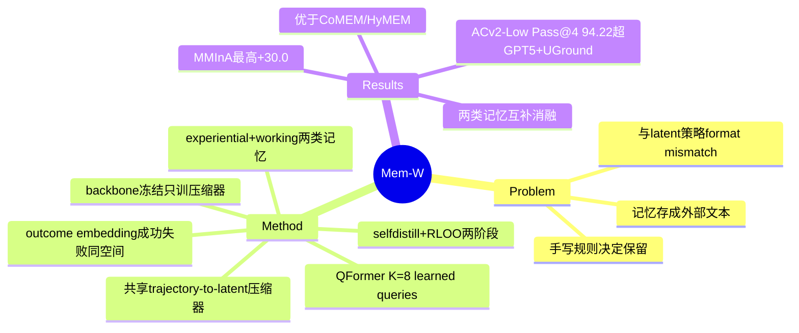

## Summary
Mem-W 把 GUI agent 的记忆从"外部人类可读文本"重构为策略实际作用的 latent embedding 序列的一部分，用一个共享的 trajectory-to-latent 压缩器把历史轨迹（experiential memory）与会话内片段（working memory）压成 soft memory tokens 直接拼进当前观测的连续 embedding。经 self-distillation + outcome-aware 训练后，在四个 web/mobile 导航 benchmark 上对多种 backbone 稳定提升，最高 +30.0。

## Problem & Motivation
GUI agent 的长程控制需要把视觉、流程、任务级证据带出"当前屏幕"这个转瞬即逝的观测窗口。但主流做法把记忆当成外部、人类可读的产物：历史被 summarize / categorize / retrieve，再以文本或结构化记录**重新插回**、由 policy 再编码一次。作者指出这造成一个**表征形式的错配（format mismatch）**——经验被存成符号/文本，而现代 GUI policy 实际是在 latent embedding 序列上决策。每次"文本记忆 → 再编码"都要跨越这个界面，且检索、摘要、分类都由手写规则决定保留什么，而非由任务成功信号端到端决定。论文把长程记忆定位成一个 **context-interface problem**：记忆该以策略母语（latent tokens）而非人类母语（text）承载。

## Method
**核心：单一 latent 压缩器（Section 3.2, Eq.4）。** 一个 trajectory-to-latent compressor `C_ϕ` 把变长的 observation-action 序列映射成固定 `K×d` 的 latent token 块，采用 Q-Former 设计（K 个 learned queries）并投影到 agent 的 embedding 空间。GUI backbone 参数 `θ` **全程冻结**，只训练压缩器参数 `ϕ`（learned queries、Q-Former 权重、投影头），因此可对已有模型做 retrofit 而不改架构。所有记忆证据以 **soft tokens** 进入 policy，直接被冻结 agent 消费。

**两类记忆，同一界面（Section 3.3）：**
- **Experiential / procedural memory `M_t^proc`（Eq.5）**：用冻结 encoder 生成 retrieval key，从外部 trajectory bank `ℬ` 检索 top-M 条相似历史轨迹并压缩。成功/失败标签通过 outcome embedding `γ(y)` 编码，使**成功与失败轨迹落在同一 latent 空间**（在线段用未知结果标记 `∅`）。
- **Working memory `M_t^work`（Eq.7-8）**：最近 L 步保留原始形式；更早的前缀切成不重叠的 W 步 chunk 分别压缩，捕捉会话内进展而不撑爆 context。

**关键点**：无论哪类记忆，每个 `K×d` 块都来自**同一个** `C_ϕ`；保留什么由端到端梯度决定，而非手写规则。

**两阶段训练（Section 3.4）：**
- Stage 1 self-distillation（Eq.11）：teacher 观测更长的原始窗口 `χ_t^raw`（`L'≫L`），student 收到 latent-augmented 输入，损失为 action 交叉熵 `ℓ_gui + λ·D_KL`，用 KL 让 latent 记忆逼近"看得更多"的 teacher。
- Stage 2 outcome-aware optimization（Eq.12）：RLOO 风格 policy gradient，terminal reward `R(τ)∈{0,1}`，对 stage-1 冻结参考策略加 KL 惩罚，把记忆过滤向"真正支撑任务成功"的证据。

**超参**：K=8 latent tokens/段，L=3 working-memory 窗口，W=4 chunk，M=5 检索轨迹。

## Key Results
- **主表提升（Table 2/3）**：MMInA-Shop 上 Mem-W-8B 达 48.50 SR（UI-Venus-1.5-8B 基线 18.50，+30.00）；Mem-W-7B（UI-TARS-1.5-7B 底座）32.50（基线 5.50，+27.00）；Mem-W-4B 40.50（Qwen3-VL-4B 基线 11.50，+29.00）。AndroidControl-v2-High Pass@1 上 Mem-W-4B 63.07（基线 49.30，+13.77）。AC-v2-Low 上 Mem-W-8B Pass@4 达 94.22，超过 GPT-5+UGround（90.00）。
- **对比 memory-augmented 方法（Figure 2, Mind2Web Info）**：Mem-W 20.8，高于 latent 基线 CoMEM(16.7) 与 hybrid HyMEM(16.7)，基线 6.4。作者归因于 dynamic working-memory 蒸馏 + outcome-aware 编码成功/失败极性。
- **消融（Table 4 / Figure 3, MMInA）**：去掉 working memory 或 experiential memory 都会掉点（UI-Venus：Full 48.5 vs w/o Working 47.5 / w/o Exp. 43.0；Qwen：Full 40.5 vs 38.5 / 35.5），两者互补而非冗余；full 配置把 Qwen 触顶 max-step 的比例从 99% 降到 22%，轨迹更果断。
- **scaling**：检索预算 M 增大提升后在 M=5–9 饱和；bank `ℬ` 从 10K→50K 持续增益（UI-Venus MMInA 37.0→50.5）。
- **效率（Table 4）**：latent 压缩带来开销（Time/Step 6.4→15.6ms），但整体 accuracy–efficiency 权衡优于更大的 GLM-4.1V-9B-Thinking / Qwen3-VL-32B。

## Evidence Ledger
| Claim ID | Claim | Type | Source locator | Evidence excerpt | Status |
|:--|:--|:--|:--|:--|:--|
| C1 | 摘要称提升"最高 +30.0" | number | Abstract | "with gains of up to +30.0" | source-verified |
| C2 | MMInA-Shop：Mem-W-8B 48.50 vs UI-Venus 18.50 (+30.00) | number | Table 3 | "UI-Venus-1.5-8B 18.50 ... Mem-W-8B 48.50 (+30.00)" | source-verified |
| C3 | MMInA-Shop：Mem-W-7B 32.50 vs 5.50 (+27.00) | number | Table 3 | "UI-TARS-1.5-7B 5.50 ... Mem-W-7B 32.50 (+27.00)" | source-verified |
| C4 | AC-v2-High Pass@1：Mem-W-4B 63.07 vs Qwen3-VL-4B 49.30 (+13.77) | number | Table 2 | "Qwen3-VL-4B 49.30 ... Mem-W-4B 63.07" | source-verified |
| C5 | AC-v2-Low Pass@4：Mem-W-8B 94.22，超 GPT-5+UGround 90.00 | comparison | Table 2 | "GPT-5+UGround ... 90.00 ... Mem-W-8B ... 94.22" | source-verified |
| C6 | Mind2Web-Info：Mem-W 20.8 > CoMEM 16.7 = HyMEM 16.7 | comparison | Figure 2 | "from 6.4 to 20.8, outperforming both CoMEM (16.7) and HyMEM (16.7)" | source-verified |
| C7 | 去掉 working / experiential memory 均掉点，两者互补 | benchmark-setting | Table 4 / §4.4 | "working memory and experiential memory are complementary rather than redundant" | source-verified |
| C8 | backbone 冻结，仅训练 Q-Former 压缩器；记忆以 soft token 入策略 | causal-mechanism | Method | "Πθ is frozen ... Only the compressor parameters ϕ are trained"; "K learned queries"; "into soft tokens" | source-verified |
| C9 | 两阶段：self-distillation(KL 对 teacher) + outcome-aware RLOO | causal-mechanism | Method/§3.4 | "teacher observes an extended raw window ... KL divergence"; Stage 2 "policy-gradient" + "R(τ)∈{0,1}" + RLOO | source-verified |
| C10 | 四 benchmark：Multimodal-Mind2Web / MMInA / GUI-Odyssey / AndroidControl-v2 | benchmark-setting | §4.1 | "Multimodal-Mind2Web", "MMINA", "GUI-Odyssey", "AndroidControl-v2" | source-verified |
| C11 | 两类记忆共享同一压缩器；outcome embedding 让成功/失败共处同一 latent 空间 | causal-mechanism | Method + Abstract | "every block ... output of the same compressor C_φ"; "attach an outcome embedding γ(y)" | source-verified |

## Strengths & Weaknesses
**亮点**
- **问题重构干净**：把"记忆"从检索/摘要工程重新表述为 context-interface 的表征错配，这是一个 first-principles 层面的 reframe，而非又一套 memory pipeline。冻结 backbone + 可插拔压缩器让主张可被多 backbone（Qwen3-VL / UI-Venus / UI-TARS）验证，提升幅度大且横跨 web+mobile，泛化证据较扎实。
- **outcome-aware 是记忆质量的关键机制**：把成功/失败极性编码进同一 latent 空间、并用 terminal reward 端到端过滤记忆，直接对"记忆里塞了无用/误导证据"这一顽疾下手；消融显示它比只做检索的 CoMEM/HyMEM 更强，说明增益来自"记什么由成功信号决定"而非单纯多喂上下文。

**局限 / 待审视**
- **可验证性被牺牲（Appendix D 自承）**：latent 记忆不可人读，无法审查某个动作到底 trace 到哪条证据；记忆结构由训练"涌现"。这在可靠性/可解释性上是实打实的退步。
- **检索 encoder 冻结、未与压缩器联合优化**；working-memory 窗口 L=3 对更长程约束可能不足（作者列为 limitation）。
- **消融只在单 backbone 变体上做**，cross-backbone 的记忆迁移性质未探索。
- 数字全部经独立 verifier 逐条核对 Table 2/3/4 与正文（见 Evidence Ledger），一致；但均为作者自评基线下的对照，非第三方独立复现。效率对比中 Time/Step 翻倍的开销在大规模部署下需要权衡。

## Mind Map

## Notes
- **thesis 关系**：相对"动作必须 trace 到一个 belief source（pixels/structure/memory/prior）并留下可验证的 state change；hybrid observation 会放大 stale evidence"——Mem-W 把 memory 提升为一等 belief source 并用 outcome-aware 训练主动**过滤 stale/误导证据**（回应了 stale evidence 放大问题），但代价是这个 belief source 变成不可人读的 latent 表征，动作到证据的 trace 与"可验证 state change"因此被削弱（Appendix D 自承牺牲 interpretability），与 thesis 的"可验证性"诉求存在张力。
- **context innovation**：不再把 GUI 历史当外部文本反复摘要/再编码，而是用共享 Q-Former 把检索到的历史轨迹与会话内片段一起压成 soft memory tokens，直接拼进观测 embedding 序列，让冻结策略以其"母语"读取过去的成功/失败/未完成进展。
- 开放问题：latent 记忆的不可审计性对 GUI agent 的 oversight/safety 是负债；是否能保留 latent 效率的同时提供"可回读"的记忆探针（probe），值得跟进。可与 CoMEM（continuous latent memory 基线）、ReasoningBank、HyMEM 交叉阅读，理清 latent-memory 谱系。
