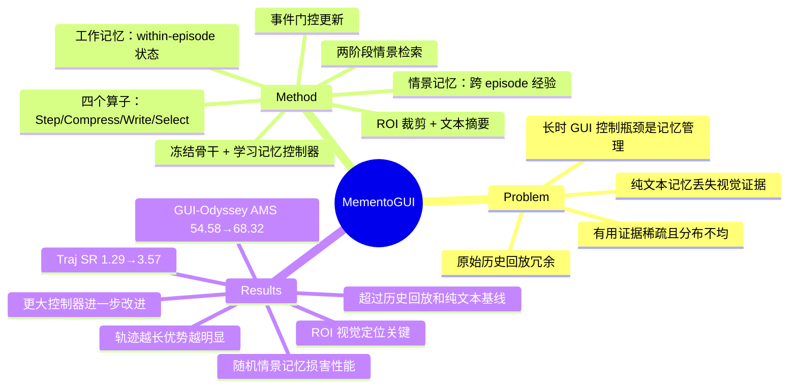

## Summary
将长时 GUI 控制重构为多模态记忆管理问题，通过学习的记忆控制器（MementoCore）在冻结的 GUI 骨干网络上实现工作记忆和情景记忆的主动管理，避免原始历史回放的冗余和纯文本记忆的视觉证据丢失。

## Problem & Motivation
现有 GUI agent 在长时任务中的瓶颈不再是单步视觉理解，而是跨多个界面转换的长期多模态状态维护。原始历史回放会用冗余截图淹没模型，纯文本记忆则丢失局部视觉证据（如特定按钮位置、UI 元素状态）。长 GUI 轨迹中有用证据稀疏且分布不均——某些步骤编码了关键任务约束或局部视觉线索，但在后续截图中消失。因此需要将长时 GUI 控制重构为记忆控制问题而非上下文长度问题。

## Method
**MementoGUI** 是一个即插即用框架，在**冻结的** GUI 骨干网络上增加 **MementoCore** 学习记忆控制器。维护两种互补记忆：
- **工作记忆（Working Memory, W_t）**：追踪任务内演化状态（within-episode）
- **情景记忆（Episodic Memory, M）**：存储已完成 episode 的可复用经验

MementoCore 使用四个任务特定的 LoRA adapter 连接到共享的冻结 Qwen3-VL 骨干，对应四个专门算子：

### 核心算子
1. **Step Processor** (`f_step`)：每步接收任务目标、当前截图、前一动作和工作记忆，输出：
   - 写入显著性分数（o_t ∈ [0,1]）
   - 事件摘要（s_t）
   - 任务相关 ROI 边界框（b_t）
   - 情景检索激活标志（γ_t）
   
   仅当显著性超过阈值 τ 时写入记忆，实现事件门控更新而非记录每一帧。

2. **WM Compressor** (`f_cmp`)：当容量超限时压缩旧工作记忆条目，生成紧凑摘要并保留视觉标识符。

3. **Episodic Writer** (`f_write`)：episode 完成后，将完整轨迹转换为紧凑的可复用记忆条目，存储元数据、embedding 和 ROI 裁剪。

4. **Episodic Selector** (`f_sel`)：两阶段检索——粗粒度 embedding 检索 + 学习的相关性过滤——选择相关的过往 episode。

### 输入构造
冻结的 GUI 骨干接收当前截图、记忆中选定的 ROI 图像和文本上下文（任务目标 + 记忆摘要）。记忆使用骨干的标准多模态对话模板序列化，无需特殊 token、投影层或架构修改。

### 训练
MementoCore 使用以下方式训练：
- **SFT**：在四个算子上使用自动策划的监督数据
- **DPO**：在 Step Processor 和 WM Compressor 上（这两个算子直接权衡信息量与上下文预算）

### 数据策划
可扩展的 pipeline 将 PSAI computer-use 轨迹转换为训练数据：
1. **预处理**：原始视频解析为帧级标注（动作发生、事件描述、ROI 框）和子目标级标注（语义任务片段）
2. **SFT 数据构造**：四个监督数据集（D_step, D_cmp, D_write, D_sel）将任务目标与结构化目标配对
3. **DPO 数据构造**：基于规则的破坏创建负样本，然后 VLM 判断过滤选择偏好输出

人工验证 200 个采样轨迹，197 个完全正确（98.5% 准确率）。

## Key Results
### 主要结果（Table 1）
MementoGUI 一致性地改进所有冻结骨干。在 GUI-Odyssey 上使用 UI-Venus-1.5-8B：
- 无历史 → 工作记忆：AMS 54.58→67.69，Traj SR 1.29→2.69
- 工作 → 工作+情景：AMS 67.69→68.32，Traj SR 2.69→3.57

这些增益超过历史回放（Pred. Hist. All: 66.31 AMS）和纯文本记忆（Text Summary: 62.18 AMS）基线。

类似模式在 MAI-UI-8B 和两个 GUI-Owl 变体上成立。32B GUI-Owl 骨干进一步受益，工作+情景达到 55.17 AMS 和 2.59 Traj SR。

### API 模型（Table 2）
工作记忆在无状态单步设置中增强专有模型：
- GPT-5.5：AMS +2.33%，MCS +129.72%
- Gemini-3.1-Pro：AMS +2.18%，TPS +38.95%，MCS +162.55%

### 扩展性（Table 5）
更大的 MementoCore 控制器（2B→4B→8B）通常改进性能，特别是在工作+情景设置中。8B 控制器在多个关键指标上达到最强结果，但增加延迟。重要的是，无需骨干微调——仅扩展控制器。

### 轨迹长度分析
Figure 3 显示 MementoGUI 在各轨迹长度区间保持更强性能，MementoGUI 与基线的差距在更长轨迹上扩大，特别是结合两种记忆类型时。

### 情景记忆库大小
Figure 4 表明更大的情景记忆库通常改进轨迹成功率，说明可复用经验主要有益于长时任务完成。

### Ablation 研究
**工作记忆中的视觉定位（Table 3）**：移除工作记忆中的 ROI 图像（保留学习控制器）显著降低性能：
- UI-Venus-1.5-8B：AMS 从 67.69 降至 64.22，Traj SR 从 2.69 降至 2.48
- GUI-Owl-1.5-8B：AMS 从 48.25 降至 47.58，Traj SR 从 1.40 降至 1.19

确认 MementoGUI 同时受益于 ROI 级定位和过滤的情景经验。

**情景检索策略（Table 4）**：使用 UI-Venus-1.5-8B 比较检索方法：
- 随机情景上下文：64.46 AMS（比仅工作记忆的 67.69 更差）
- 单阶段检索：64.40 AMS（也更差）
- 两阶段检索（完整系统）：68.32 AMS，3.57 Traj SR（最佳）

随机或未过滤的情景记忆实际上损害性能，验证了学习相关性选择的必要性。

## Strengths & Weaknesses
**亮点**：
1. **问题重构有洞察**：将长时 GUI 控制从上下文长度问题重构为记忆管理问题，抓住了稀疏视觉证据的核心矛盾
2. **即插即用设计**：冻结骨干 + 学习控制器的架构允许独立扩展记忆能力，无需重训基座模型
3. **多模态记忆有效**：ROI 裁剪 + 文本摘要的组合优于纯文本或原始截图，ablation 证据充分
4. **数据策划可扩展**：自动标注 pipeline 达到 98.5% 准确率，为训练记忆控制器提供了可行路径
5. **两阶段检索关键**：证明随机或单阶段检索会损害性能，学习的相关性过滤是必需的

**局限**：
1. **绝对性能仍低**：即使最佳设置，轨迹成功率仍在个位数（GUI-Odyssey 上 3.57%），说明长时 GUI 控制根本上仍然困难
2. **延迟开销显著**：8B 控制器将轨迹时间从 ~42s 增至 ~72s，实用性受限
3. **情景记忆增益不稳定**：某些设置中情景记忆边际收益小或无收益（如 GUI-Owl-1.5-8B Traj SR 保持 1.81），说明跨 episode 迁移的条件尚不清楚
4. **VAM 指标下降**：UI-Venus-1.5-8B 在 MementoGUI-Bench 上 VAM 从 1.80 降至 1.41，暗示语义动作匹配与其他改进存在冲突
5. **缺乏失败案例分析**：未详细讨论哪些类型的任务或界面转换仍然失败，限制了对方法边界的理解
6. **记忆容量与压缩策略未充分探索**：工作记忆容量阈值、压缩频率等超参数的影响未系统研究

**对领域的影响**：
- 为长时 GUI agent 提供了新的架构范式（记忆控制 vs. 上下文扩展）
- 证明了多模态记忆（视觉 ROI + 文本）的必要性，挑战了纯文本记忆的主流做法
- 数据策划 pipeline 可能启发其他需要轨迹级监督的 agent 任务
- 但绝对性能仍远未达到实用水平，且方法复杂度（四个专门算子 + 两阶段检索）可能限制可解释性和调试

## Mind Map

## Notes
- **与 working memory 文献的联系**：心理学中 working memory 的容量限制和主动维护机制在这里有直接对应，但论文未引用相关认知科学文献
- **情景记忆的泛化边界**：什么样的任务相似性允许跨 episode 迁移？当前两阶段检索是黑盒，缺乏可解释性
- **与 Transformer 长上下文的对比**：如果骨干本身支持 100K+ 上下文，记忆控制的优势是否仍然成立？论文未讨论
- **多模态记忆的表示学习**：ROI 裁剪是手工设计的，是否可以端到端学习视觉记忆的粒度和内容？
- **潜在改进方向**：(1) 分层记忆（短期/中期/长期）；(2) 主动遗忘机制；(3) 记忆一致性约束（避免矛盾记忆）；(4) 与 world model 结合预测未来界面状态
