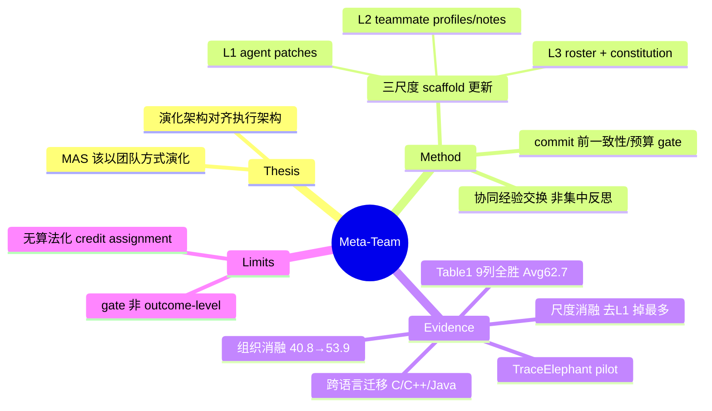

## Summary

把"自演化"的对象从单个 agent 扩展到**团队组织**：一个 MAS 完成任务后不该把全部轨迹塞给单一 analyzer 做集中反思，而应像团队一样演化——每个 agent 保留本地执行上下文、通过 post-task 通信交换加工后的分布式证据，在 agent 行为（L1）、inter-agent 协作（L2）、团队组织（L3）三个尺度上 training-free 地更新可复用的 team scaffold。核心论点是"演化架构应与执行架构对齐"（MAS 以团队方式执行，就该以团队方式演化）。Claude Sonnet 4.6 冻结底座上，Meta-Team 在 9 个 benchmark 列上均超过 9 个 baseline（平均 62.7），经验组织消融 collaborative 53.9 > centralized 49.8 > partitioned 44.5 > no-evolution 40.8 直接证明协同交换的净增益。

## Problem & Motivation

主流 self-evolving agent 工作要么演化单体（model/memory/skill），要么把 MAS 的多条轨迹汇集到一个中心 analyzer 做全局反思。作者指出后者有结构性缺陷：(i) 集中式 analyzer 面对 >128K 的长 MAS 轨迹时定位失败会失败点归因困难；(ii) 把分布式的团队执行强行压成单点反思，丢掉了 agent 间的局部上下文与协作证据。既然 MAS 的**执行**是分布式协作，其**演化**也应保持同构——这是 "evolve as a team" 的动机。作者用一个独立的 failure-attribution pilot 支撑这一点（见 C3）。

## Method

**三尺度 training-free 演化（不更新任何 LLM 参数）**：以 Claude Sonnet 4.6 为冻结底座（temperature 0.2、max_tokens 32768），演化只更新可复用的 team scaffold：
- **L1 Agent-level**：单 agent 行为的 patch（agent patches）。
- **L2 Interaction-level**：inter-agent 协作方式（teammate profiles、collaboration notes）。
- **L3 Team-level**：团队组织本身——引入新角色 / 删除冗余角色 / 重组协作结构 / 修订 shared constitution。§4.4 观察到在 96K context 上演化引入两个额外 worker，解释了它在最长 context（256K）设定最有效。

**协同经验组织（本文核心机制）**：任务后不做集中式全局反思，而是每个 agent 保留本地执行上下文，通过 post-task 通信交换**加工后的分布式证据**，据此产出上述三尺度更新。Algorithm 1 的三个演化算子 Ω_L1 / Ω_L2 / Ω_L3 均为 LLM 反思算子。

**commit 前 validation（Appendix D）**：更新提交前检查 role consistency、tool availability、formatting validity、budget constraints；演化中若请求 retry，仅在预算允许时执行且 retry 成本计入 evolution budget。**注意其性质**：这是格式/一致性/预算级的 gate，**不是**基于 held-out 性能回归的 outcome-level 验证。

**评测设置（§4.1）**：每个 benchmark/subset 留出约 20 个 instance 作 evolution set，在**不相交的 held-out split** 上评测且冻结所有学到的 artifact，结果报 avg@3。§4.5 的预算实验把 evolution budget 压到主设置的 1/3，Meta-Team 在四个设定上取得最佳 performance-cost 权衡。

## Key Results

- **主榜（Table 1）**：Meta-Team 在全部 9 个 benchmark 列上均为最优（Ansible 53.9 / Qute. 66.2 / DepMig. 45.6 / CrossR. 43.3 / **LOCA Val 87.9** / **GAIA Val 77.3** / LoCoBench-Feat. 67.1 / Refact. 67.0 / ResRub. 55.8，Avg 62.7），超过 SA / MAS / AggAgent / OWL / AOrchestra / AgentSquare / ReCreate / AgentNet / MASFly 全部 9 个 baseline。Appendix E 明示 Qute./CrossRepo/GAIA 三列增益 "positive but not statistically significant"，仅方向性领先。
- **经验组织消融（Table 2，Ansible/ResRub）**：no-evolution 40.8/49.5 < partitioned 44.5/51.0 < centralized 49.8/52.9 < **collaborative 53.9/55.8**——协同交换（本文机制）对集中式与孤立式均有净增益。
- **尺度消融（Table 3）**：Full 53.9/55.8；去掉 L1（agent）48.5/47.9（Ansible −5.4 / ResRub −7.9，贡献最大）；去掉 L2 50.7/54.4；去掉 L3 51.9/52.1。
- **跨语言迁移（§4.4, Figure 3b）**：在 Python 上演化后，Meta-Team 在 C/C++/Java 的 Feature Implementation 与 Cross-File Refactoring 上仍稳超 single-agent 与 fixed MAS（Feat.Impl：C 58.4 / C++ 58.8 / Java 59.4）。
- **failure-attribution pilot（§3.1, Appendix C, Figure 1b）**：在 TraceElephant（220 条真实 MAS 失败轨迹，来自 Captain-Agent 85 / Magentic-One 91 / SWE-Agent 44）上，collaborative scheme 在长短轨迹段的定位准确率都最好——>128K 段 collaborative Agent-Acc 60.8 / Step-Acc 19.6 高于 local 58.2/17.6 与 global 43.1/9.8。

## Evidence Ledger

| Claim ID | Claim | Type | Source locator | Status | 修订 |
|:--|:--|:--|:--|:--|:--|
| C1 | 全部 9 个 benchmark 列均超 9 个 baseline，Avg 62.7 | comparison | §4.2, Table 1 | source-verified | Qute./CrossRepo/GAIA 增益 "not statistically significant"（App E） |
| C2 | Table 1 数值 Ansible 53.9 / ResRub 55.8 正确，但 GAIA 列归属 | number | Table 1 | **contradicted→已修正** | GAIA Val = **77.3**；87.9 是 **LOCA-Bench Val**。次优归属亦修正：Ansible 次优 AggAgent 49.6、ResRub 次优 AOrchestra 51.5 |
| C3 | failure-attribution pilot：TraceElephant 220 traces；>128K collaborative 最优 | comparison | §3.1, App C, Fig 1b | **contradicted→已修正** | 220 traces 与"collaborative 最优"成立，但 digest 六数字全错。实际 >128K：collab 60.8/19.6、local 58.2/17.6、global 43.1/9.8；≤128K：collab 77.5/45.0、global 72.5/43.3、local 64.1/35.0。且 >128K 段 local>global（与 digest 相反） |
| C4 | 尺度消融 Full 53.9/55.8；w/o L1 48.5/47.9（贡献最大）；w/o L2 50.7/54.4；w/o L3 51.9/52.1 | number | Table 3, §4.3 | source-verified | 去 L1 掉 Ansible 5.4 / ResRub 7.9 |
| C5 | 组织消融 no-evo 40.8/49.5 < partitioned 44.5/51.0 < centralized 49.8/52.9 < collaborative 53.9/55.8 | number | Table 2 | source-verified | — |
| C6 | Claude Sonnet 4.6 冻结底座，training-free，只更新 scaffold | benchmark-setting | §4.1, App A, §3.2 | source-verified | 原文未用 "training-free" 字面，语义等价 |
| C7 | L3 可增删角色/重组协作/改 constitution；96K 引入 2 worker，最长 context 最有效 | benchmark-setting | §3.2, §4.4 | source-verified | — |
| C8 | Python→C/C++/Java 迁移领先 | comparison | §4.4, Fig 3b | **contradicted→已修正** | 迁移成立，但"约 10pt"错：对 SA 仅约 4–6pt，对 vanilla MAS 约 6.5–10pt（仅 Java-vs-MAS 近 10）；图只对比 SA 与 MAS 两个 baseline |
| C9 | 约 20 held-out instance/benchmark，冻结 artifact，avg@3；预算 1/3 最佳权衡 | benchmark-setting | §4.1, §4.5 | source-verified | — |
| C10 | 无显式 gate 准则、无算法化 per-agent credit assignment | negative | App D, Alg 1, App C | **contradicted→已修正** | 前半失效：Appendix D **存在**显式 commit 前检查（role consistency / tool availability / formatting validity / budget），但性质为一致性/预算级，**非** outcome-level held-out 验证。后半收窄后成立：Ω_L1/L2/L3 均 LLM 反思算子，演化管线内无算法化 credit assignment（App C 的加权投票 w=c(1+αr) 仅用于 TraceElephant 归因实验，不用于自身演化） |

> 核验边界：全文（含 Appendix A–F，Figure 1b/3b 直读 PNG）经独立 verifier 对照 arXiv v1 HTML 核验；10 claim 中 6 source-verified、4 contradicted→已按原文修正。headline 数字 53.9/77.3/87.9/40.8 与 Claude Sonnet 4.6 底座另经 main-loop curl 复核一致。

## Strengths & Weaknesses

**亮点**：
- **问对了问题**：把"演化对象"从 model/memory/skill 扩展到**团队组织**这一新轴，且"演化架构应与执行架构对齐"是可证伪的机制主张，用组织消融（40.8→44.5→49.8→53.9）给了直接证据——协同经验交换确实优于集中式反思。
- **failure-attribution pilot 有说服力**：不是拍脑袋说"集中式不好"，而是先在 TraceElephant 上证明分布式定位在长轨迹段更准，再据此设计演化机制，动机-方法闭环完整。
- training-free、冻结底座，收益不依赖参数更新，工程可落地性好；held-out split + 冻结 artifact + avg@3 的评测协议相对严谨。

**局限**：
- **无算法化 credit assignment**：per-agent 的功过归因靠 LLM 反思讨论涌现，而非算法（C10）——这正是 [[Papers/2606-MLASSelfEvolvingSafety]] 指出的攻击面：无 outcome-level gate 的 shared constitution 更新，单次错误可 lineage-persistent 地污染全队。
- **gate 只是一致性/预算检查**：Appendix D 的 validation 不含性能回归验证，无法抵御 [[Papers/2606-CodeSelfReviewCollapse]] 的 rubber-stamp 退化——collective discussion 式自 gate 是否稳健，本文未测。
- **部分增益不显著**：三列 benchmark 的领先 "not statistically significant"，迁移领先幅度也被 digest 高估（实际对强 baseline 仅 4–6pt）。
- 长 context 增益部分来自"多加两个 worker"（§4.4），与"更好的协同演化"混杂，未做算力/角色数对齐消融。

## Mind Map

## Connections

- [[Papers/2606-MLASSelfEvolvingSafety]] — MLAS 攻击面矩阵：shared constitution 是全队可写 prompt，Meta-Team 无 outcome-level gate 的 L3 更新正落在 Collective×Commit 攻击面上。
- [[Papers/2606-CodeSelfReviewCollapse]] — rubber-stamp 定理直接质疑 Meta-Team 的 collective-discussion 式自 gate 能否抵抗 self-review 退化。
- [[Papers/2512-GenEnv]] / [[Papers/2605-SEAL]] — co-evolution 的另一根轴：演化对手是环境（GenEnv 难度 / SEAL observation）vs 队友（Meta-Team 团队组织）；§8 按此二分组织。
- [[Papers/2607-MetaSkillEvolve]] — 同为多尺度递归演化，但 MetaSkill 演化 skill/meta-skill、Meta-Team 演化团队组织，可对读"演化对象层级"。
- [[Topics/SelfEvolvingAgents-Survey]] — 本文填补该 survey Open Problems 中"multi-agent co-evolution 无实证"的空白，归 §8 协同演化章。

## Notes

- code 已开源（github.com/zz-haooo/Meta-Team），是候选 repo-digest 对象——尤其可查 Ω_L1/L2/L3 反思算子与 Appendix D validation 的具体实现，验证 gate 是否真如论文所述只做一致性检查。
- 引用 Table 1 时务必用 GAIA=77.3（不是 87.9，后者是 LOCA-Bench）；引用迁移幅度时用"对 single-agent 约 4–6pt"而非 digest 的"约 10pt"。
