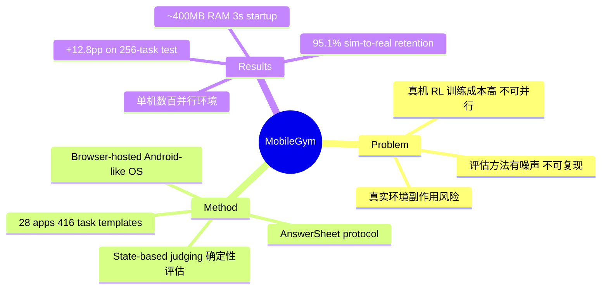

## Summary

MobileGym 是一个浏览器托管的轻量级 Android 模拟平台，通过 JSON 状态检查实现确定性任务验证，支持低成本并行 rollout，专为 mobile GUI agent 的 RL 训练与评估设计。

## Problem & Motivation

> [未获取全文，部分内容基于公开信息]

Mobile GUI agent 研究面临三大困境：真实设备上的 RL 训练成本高昂且难以并行化；现有评估方法（视觉或 LLM judge）存在噪声和不确定性；真实环境中的应用更新和网络波动导致结果不可复现。此外，在真机上测试 agent 存在误发消息、误操作购买等不可控副作用风险。这些问题使得 scalable online RL for everyday apps 长期处于 "out of reach" 状态。

## Method

> [未获取全文，部分内容基于公开信息]

**核心设计**：
- **Browser-hosted simulation**：完全在浏览器中运行的 Android-like OS，绕过专有后端，单实例仅占 ~400 MB 内存，启动时间 ~3 秒
- **State-based judging**：每个任务配备脚本化 judge，直接检查最终 JSON 状态而非依赖视觉模型，消除评估歧义并提供 dense programmatic rewards
- **AnswerSheet protocol**：结构化协议避免自由文本匹配失败，支持检测意外副作用
- **Functional backend modeling**：对 28 个应用（含 WeChat、Alipay、Calendar、Contacts、Clock、Weather、bilibili、Reddit 等社交/电商/系统应用）进行功能覆盖模拟

**MobileGym-Bench**：
- 416 个参数化任务模板（256 test + 160 train）
- 覆盖 28 个应用
- 支持环境完全控制（语言、时间、电池、位置、应用状态）

**RL Training 支持**：
- 低成本并行 rollout（单机可运行数百个并行环境）
- Deterministic evaluation 使 RL 训练可验证
- 案例：GRPO on Qwen3-VL-4B-Instruct

## Key Results

> [未获取全文，部分内容基于公开信息]

**Sim-to-Real Transfer**：
- GRPO 训练在 256-task test set 上获得 **+12.8 pp** 提升
- 在 59-task real-device subset 上，真机执行**保留了 95.1% 的仿真侧训练增益**

**效率指标**：
- 单浏览器实例：~400 MB RAM
- 环境启动时间：~3 秒
- 支持单机数百并行环境

**评估组件**：
- Trajectory-length checks
- Failure-recovery examples
- VLM judge error analysis

## Strengths & Weaknesses

**Strengths**：
- **方法简洁有效**：state-based judging 直接解决了 vision/LLM judge 的噪声问题，是 first-principles thinking 的体现
- **真正的 scalability**：浏览器方案 + 低资源占用使并行 RL 训练从 "不可能" 变为 "可行"，资源效率是真实设备的数百倍
- **95.1% sim-to-real retention**：这个数字极为亮眼，说明 functional modeling 抓住了本质交互逻辑
- **开源生态友好**：GitHub 代码 + 28 个应用覆盖，降低了 mobile agent 研究门槛

**Weaknesses**：
- **Fidelity 边界不明确**：functional modeling 必然有简化，哪些真实世界的复杂性被忽略了？59-task subset 是否覆盖了足够的 corner cases？
- **Backend update 问题未彻底解决**：真实应用仍会更新，模拟器需要持续维护才能保持 sim-to-real 对齐
- **任务模板依赖人工**：416 个模板的构建成本多高？能否自动生成或扩展？
- **评估仅限 closed-loop**：state-based judge 适合明确目标任务，但 open-ended exploration 或长尾任务如何评估？

**Impact**：为 mobile GUI agent 的 online RL 训练提供了第一个真正可行的基础设施，可能加速该领域从 prompting-based 向 RL-trained 范式的转变。但需警惕 "在模拟器上刷分" 陷阱——真实世界的鲁棒性需持续验证。

## Mind Map

## Notes

- **与 AndroidEnv/MiniWob++ 的区别**：MobileGym 主打 verifiability（JSON state judge）+ lightweight（browser-based），而非像 AndroidEnv 那样追求完整真机模拟
- **RL 方法选择**：论文用 GRPO，但平台本身应该支持任意 RL 算法。想了解 on-policy vs off-policy 的 sample efficiency 对比
- **Benchmark 设计值得细看**：256 test / 160 train 的划分依据是什么？train set 是否覆盖了足够的 compositional generalization？
- **Scalability 天花板**：单机数百环境，集群能到多少？bottleneck 在哪？
- **下游应用潜力**：除了 RL 训练，这个平台是否也适合 self-play、adversarial testing、或作为 LLM agent 的 testbed？
