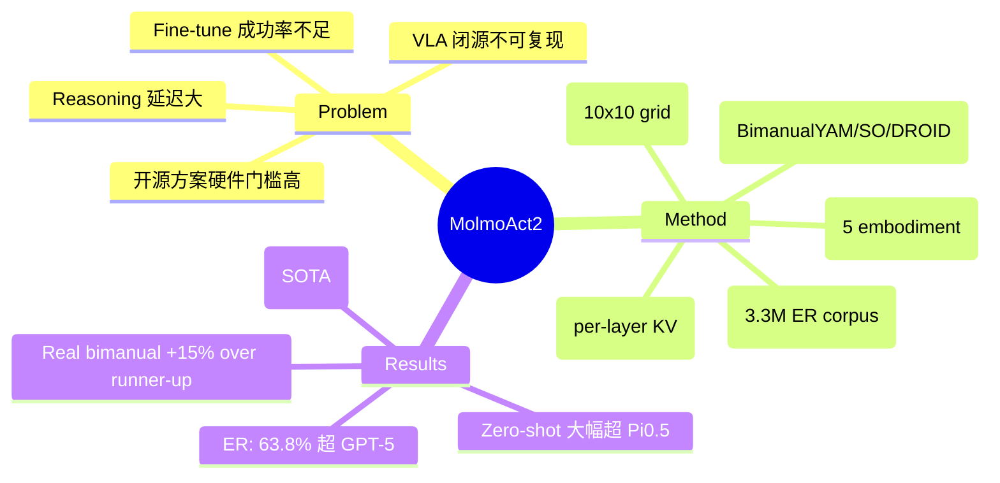

## Summary

MolmoAct2 是一个面向真实世界部署的全开源 VLA 系统，通过五大维度（专用 VLM backbone、大规模数据集、开源 action tokenizer、flow-matching 架构、自适应深度推理）全面提升 embodied manipulation 性能，在 7 个仿真与真实 benchmark 上超越强基线（包括 Pi0.5），是迄今最全面的开源 VLA 实证研究。

## Problem & Motivation

当前 VLA 模型面临四重困境：(1) 闭源前沿模型不可复现；(2) 开源替代方案硬件门槛高；(3) reasoning-augmented 策略延迟过大；(4) fine-tune 后的成功率仍不理想。MolmoAct2 旨在系统性地解决这些问题，打造一个**全开源、可部署、跨 embodiment** 的 action reasoning 模型。

## Method

### 1. Molmo2-ER: Embodied Reasoning VLM Backbone

- 基于 Qwen3-4B (Molmo2) 构建，新增 **3.3M 样本** 的 embodied reasoning 语料，覆盖 6 大支柱：Image Embodied QA (1.33M)、Image Pointing (780K)、Image Detection (100K)、Video Embodied QA (703K)、Multi-image/Ego-Exo (700K)、Abstract Reasoning (150K)
- **两阶段训练**：Stage 1 在 ER 语料上 specialize 20K steps；Stage 2 混合 ER 与原始多模态数据 rehearse 1.5K steps（46% embodied + 46% general + 8% NLP）
- 在 13 个 embodied reasoning benchmark 上平均 63.8%，超越 GPT-5 (57.9%) 和 Gemini Robotics ER-1.5 (61.3%)

### 2. 三个新数据集

| 数据集 | 规模 | 亮点 |
|:------|:-----|:-----|
| **BimanualYAM** | 720h, 34.5K demos, 28+ tasks | 最大开源双臂数据集，成本 <$6K |
| **SO-100/101** | 从 1,222 个公开 LeRobot 数据集中筛选 | 38K episodes, 19.8M frames，四阶段质量过滤 |
| **DROID** | 74,604 episodes, 17.7M frames | 扩展语言标注（95% episodes 3 条指令），idle-frame 过滤 |

语言标注统一用 Qwen3.5-27B 重标注，unique labels 从 22% 翻倍至 46%。

### 3. OpenFAST Action Tokenizer

- 遵循 FAST 范式：频域变换 → 量化 → BPE，2048-token 动作词表
- 训练于 1M 动作序列（YAM 30% + SO 30% + DROID 30% + 其他 10%），覆盖 5 种 embodiment
- 标准化流程：1s 动作窗口、32D pad、1-99 percentile 归一化、gripper 独立处理

### 4. Flow-Matching Action Expert 架构

- **DiT 风格** 36 层 action expert，建模 flow-matching velocity field
- **Per-layer KV-cache conditioning**：VLM 每层的 K/V 经线性投影后作为 action expert 的 cross-attention 条件
- 残差分支使用 AdaRMS（DiT-style shift/scale/gate from time embedding）
- **Knowledge insulation**：post-training 阶段 detach VLM→expert 的梯度路径
- 训练流程：Pretrain 200K steps（离散 autoregressive）→ Post-train 100K steps（+flow loss）→ Fine-tune（embodiment-specific, K=8）

### 5. MolmoAct2-Think: 自适应深度推理

- 将深度图量化为 10×10 grid × 128 codebook entries 的离散 token
- **时序冗余利用**：相邻帧 RGB patch cosine similarity < 0.996 时才重新预测深度 token，其余从 cache 回放
- 推理时：首帧完整预测，后续帧只 decode 变化区域，减少不必要的 token 生成

## Key Results

### Embodied Reasoning (Molmo2-ER)
- 13 benchmark 平均 63.8%，超越 GPT-5 (57.9%) 和 Gemini Robotics ER-1.5 (61.3%)
- 在 9/13 benchmark 上排名第一

### Zero-Shot 部署
| Benchmark | MolmoAct2 | Pi0.5-DROID | 提升 |
|:----------|:----------|:------------|:-----|
| MolmoSpaces (sim) | **37.7%** | 34.5% | +3.2 |
| MolmoBot (sim) | **20.6%** | 10.0% | +10.6 |
| Real DROID | **87.1%** | 45.2% | +41.9 |
| Real SO-100/101 | **56.7%** | 45.3% | +11.4 |

### Fine-tune 后 (LIBERO)
- MolmoAct2-Think 达到 **98.1%** 平均，超越 GR00T N1.7 (97.0%)、Pi0.5 (96.9%)
- Object 子集 100.0%、Long-horizon 95.4%

### 真实世界 Bimanual YAM
- 8 个 in-the-wild 任务平均比 runner-up 高 **15%**

## Strengths & Weaknesses

**Strengths:**
- **系统性极强**：从 backbone 训练到数据集构建到 tokenizer 到架构到推理优化，全链路开源，堪称 VLA 领域的"系统工程范本"
- **数据贡献突出**：BimanualYAM (720h) 是最大开源双臂数据集，SO-100/101 的社区数据筛选流程可复用
- **真实世界验证扎实**：not just simulation，real robot 实验跨 DROID、SO-100/101、Bimanual YAM 三种硬件
- **Molmo2-ER 超越 GPT-5/Gemini ER**：在 embodied reasoning 上用 4B 模型击败闭源大模型，embodied data recipe 有参考价值
- **自适应深度推理**设计优雅，利用时序冗余减少推理开销，是 reasoning VLA 的好方向

**Weaknesses:**
- **计算成本依然高**：Pretrain + Post-train + Fine-tune 总计约 9,200+ H100 GPU hours，虽然开源但复现门槛不低
- **Zero-shot 泛化仍脆**：作者自己也承认 "zero-shot performance remains brittle"，MolmoSpaces Open 任务仅 9.5%（Pi0.5 为 22.7%）
- **SO-100/101 真实世界部分任务退化**：Stack blocks (20%) 和 Block in box (33.3%) 明显弱于 Pi0 (6.7%/90.0%)，说明社区数据质量筛选仍不够
- **推理延迟未充分报告**：flow-matching expert 增加了推理开销，虽然提到了 CUDA Graph 优化但缺少具体 latency 数字对比
- **与 GR00T N1.7 差距极小**：LIBERO 上 98.1% vs 97.0%，增量有限，但 GR00T 是闭源——开源 vs 闭源的对比需要更审慎

## Mind Map

## Notes

- Molmo2-ER 的 embodied reasoning 数据 recipe（6 大支柱、两阶段 specialize-then-rehearse）对 VLM 具身化训练有较强参考价值，值得单独深入
- OpenFAST 作为开源 action tokenizer 可能成为社区标准组件
- 自适应深度推理（MolmoThink）的思路可以推广到其他需要 dense prediction 的 VLA 场景
- BimanualYAM 数据集的低成本采集协议（<$6K, 720h）对社区贡献大
- 整体是一个 engineering 贡献为主的工作，architecture novelty 有限（flow-matching + KV conditioning 已有先例），但系统整合和开源程度值得肯定
