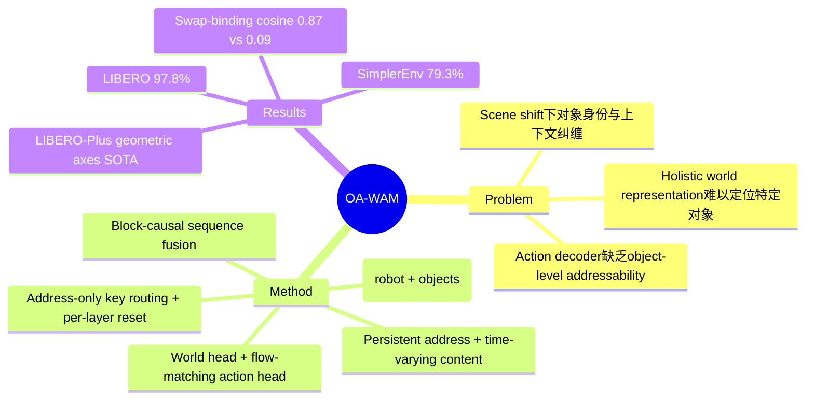

## Summary

OA-WAM 提出 object-addressable 的世界-动作联合模型，通过将场景分解为 N+1 个 slot（1 robot + N object）并用 persistent address vector 实现对象级别的可寻址性，在 LIBERO 上达到 97.8%、SimplerEnv 上 79.3%，slot intervention 测试的 swap-binding cosine 达 0.87（holistic baseline 最高仅 0.09）。

## Problem & Motivation

World Action Model (WAM) 通过联合预测场景演变和机器人动作来增强 VLA policy，但现有方法通常将预测的世界表示为 holistic images、video tokens 或 global latents。当指令引用特定对象时，这些表示难以被 action decoder 准确定位，尤其在场景变化（scene shifts）下，对象身份与上下文纠缠在一起。这导致策略在物体位置、外观变化等扰动下鲁棒性不足。

## Method

**核心设计：Object-Addressable Slot Decomposition**

1. **场景表示**：将每帧分解为 N+1 个 slot state，包含 1 个 robot slot 和 N 个 object slots。每个 slot 包含：
   - **Persistent address vector**：标识"是哪个对象"（不变的身份编码）
   - **Time-varying content vector**：编码"该对象当前状态"（动态变化）

2. **Block-causal sequence fusion**：将 text、image、proprioception、past-action tokens 与 slot states 融合，在 block-causal 序列中处理

3. **双头预测**：
   - **World head**：预测下一帧的 slot states
   - **Flow-matching action head**：在同一 forward pass 中解码 16-step continuous action chunk

4. **Addressability enforcement**（关键机制）：
   - Cross-slot attention 通过 address-only keys 路由
   - 在每个 transformer layer 重置 address slice
   - 分离"对哪个对象操作"（address）和"该对象当前状态"（content），无需额外 tokens

## Key Results

| Benchmark | OA-WAM | 备注 |
|:----------|:-------|:-----|
| LIBERO | 97.8% | 匹配 strong VLA/WAM baselines |
| SimplerEnv | 79.3% | 匹配 strong baselines |
| LIBERO-Plus geometric axes | SOTA | 最相关子集上达到 state-of-the-art |
| LIBERO-Plus 7-axis aggregate | competitive | 七轴总体上保持竞争力 |
| Slot intervention swap-binding cosine | **0.87** | holistic baseline 最高仅 0.09 |

**Causal slot-intervention test** 是最值得注意的实验：swap-binding cosine 0.87 vs holistic baseline 的 0.09，说明 object-addressable 设计确实在表示层面实现了对象级别的可寻址性，而非仅仅是 end-to-end 性能的提升。

## Strengths & Weaknesses

**Strengths:**

- **优雅的 address-content 分离**：persistent address vector（身份）+ time-varying content（状态）的设计直觉清晰，借鉴了 object-centric learning（如 Slot Attention）的思想，但专门为 action grounding 设计
- **无额外 token 开销**：通过在每层重置 address slice 实现可寻址性，不增加序列长度
- **Joint world-action 单次前向**：world head 和 action head 共享 forward pass，计算效率高
- **Causal intervention 验证**：swap-binding 实验直接验证了 slot 语义的正确性，比单纯的 benchmark 数字更有说服力

**Weaknesses:**

- **Benchmark 增量有限**：LIBERO 97.8% 和 SimplerEnv 79.3% 是"匹配"而非"显著超越"强 baseline，说明在标准 benchmark 上的优势不明显
- **N+1 slot 假设**：需要预先知道对象数量 N，在开放世界场景中这本身就是难题。论文未讨论如何处理动态对象数量或遮挡情况
- **Object segmentation 前置依赖**：slot decomposition 隐含假设已经完成了 object detection/segmentation，这个 pipeline 的鲁棒性如何？
- **Scene perturbation 验证有限**：LIBERO-Plus 的 geometric axes 上 SOTA，但 7-axis aggregate 仅"competitive"——说明在非几何维度的扰动下改进有限
- **Scalability 未知**：大量 object slots 时 attention 的计算复杂度和 address 崩溃（address collapse）问题未在 abstract 中提及

## Mind Map

## Notes

- Object-addressable 的设计思路与 Slot Attention / Object-Centric Representation 一脉相承，但将其应用于 action generation 是有意义的延伸
- Swap-binding cosine 是个不错的诊断工具，可以推广到其他 object-centric 方法的评估
- Flow-matching action head 在 WAM 框架中的应用值得关注，这是 action generation 领域的趋势
- 需要全文确认：slot 数量 N 是固定还是动态？object slots 如何初始化？这些细节决定了方法的实用性
