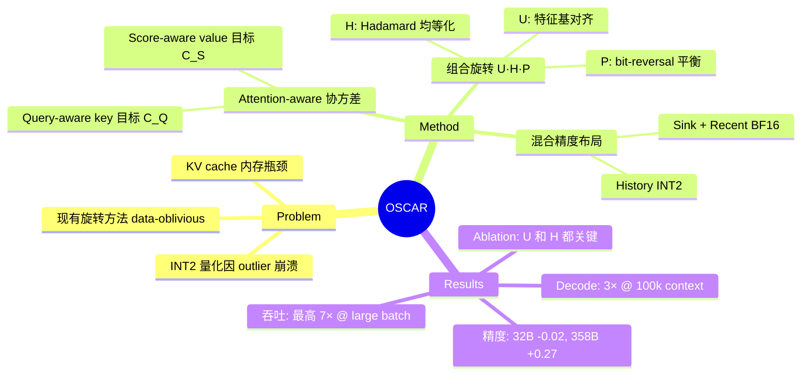

## Summary
通过 attention-aware 协方差分析设计旋转矩阵，将 KV cache 量化到 INT2 而不损失精度，在 4B-358B 模型上实现 ~8× 内存压缩和最高 7× 吞吐提升。

## Problem & Motivation
长上下文 LLM 推理的瓶颈在 KV cache 内存占用，随序列长度、batch size、层数线性增长。INT2 量化虽能大幅压缩，但 KV 激活存在严重的 channel-wise outlier，导致量化尺度被极值主导，正常值被压缩到极少的有效 level。现有旋转方法（如 Hadamard）是 data-oblivious 的——它们平滑激活分布但不考虑 attention 真正关心的是什么。核心洞察：**attention 操作的是 key 和 value 诱导的相关性和 score-weighted 交互，而非它们的原始欧氏表示**。

## Method
### 核心思想
OSCAR 离线估计 attention-aware 的协方差结构，推导固定旋转矩阵和裁剪阈值。旋转与 attention 实际消费的协方差结构对齐，而非与原始 cache 重建对齐。

### 理论动机
对于 key，下游 logit 失真为 $\|QK^\top - Q\hat{K}^\top\|_F^2 = \text{tr}((K-\hat{K})Q^\top Q(K-\hat{K})^\top)$，由 query 协方差 $Q^\top Q$ 控制，而非 $K^\top K$。对于 value，$\|SV - S\hat{V}\|_F^2 = \text{tr}((V-\hat{V})^\top S^\top S(V-\hat{V}))$，依赖 attention score 加权，而非原始 value 重建。

### 离线校准
- **Query-aware key 目标协方差**：$C_Q = \frac{1}{N}\sum_{n=1}^N q_n^\top q_n$，特征分解 $C_Q = U_Q \Lambda_Q U_Q^\top$，旋转矩阵 $R_k := U_Q$
- **Score-aware value 目标协方差**：$C_S = \frac{1}{N}V^\top S^\top S V$，特征分解 $C_S = U_S \Lambda_S U_S^\top$，旋转矩阵 $R_v := U_S$

### 组合旋转
最终旋转由三个正交因子组成：
$$R_K = U_Q \cdot H_{\text{Had}} \cdot P_{\text{br}}, \qquad R_V = U_S \cdot H_{\text{Had}} \cdot P_{\text{br}}$$

- **$U_Q$ / $U_S$**：attention-aware 特征基（从目标协方差的 PCA 得到），将 channel 与 query-importance 方向对齐
- **$H_{\text{Had}}$**：Hadamard 变换，进一步重分配 channel 能量。Lemma 1 证明它使每个 channel 的 importance metric 均等化：$(H_{\text{Had}}^\top \Lambda_Q H_{\text{Had}})_{ii} = \frac{1}{d}\text{tr}(\Lambda_Q)$，同时以 $1/\sqrt{d}$ 的幅度抑制 K-side outlier
- **$P_{\text{br}}$**：bit-reversal 置换，平衡量化分组间的 importance。确保对任意 power-of-two 分组大小 $G$，top-$d/G$ 特征向量落在 $d/G$ 个不同分组中，每组一个

### 理论最优性（Theorem 1）
在 "frozen-error surrogate" 目标 $\tilde{\mathcal{L}}_K(R_k) = \text{tr}(R_k^\top C_Q R_k E_K)$ 和 $\tilde{\mathcal{L}}_V(R_v) = \text{tr}(R_v^\top C_S R_v E_V)$ 下，假设 frozen residual 协方差在 ambient basis 中是对角的，$R_k = U_Q$ 和 $R_v = U_S$ 是各自 surrogate 在校准数据集上的最小化器。

### 系统设计
- **混合精度布局**：前 $S_0$ 个 token（attention sink）+ 最近 $W$ 个 token 用 BF16，中间历史 token 用 INT2
- **Fused Triton kernel**：prefill 时写入旋转、裁剪、量化后的 INT2 值（4 个 2-bit 值打包到 1 字节）；decode 时解包、应用 scale/zero、浮点累加
- **Value 旋转吸收**：$R_V$ 吸收到模型投影权重中，实现计算节省和延迟降低

## Key Results
### 精度对比（5 benchmarks：AIME25, GPQA-Diamond, HumanEval, LiveCodeBench v6, MATH500）
- **Qwen3-4B-Thinking**：BF16 75.64 → OSCAR 71.86（-3.78），QuaRot-INT2 仅 1.40（-74.24）
- **Qwen3-8B**：BF16 70.84 → OSCAR 69.42（-1.42），QuaRot-INT2 仅 10.14（-60.70）
- **Qwen3-32B**：BF16 74.19 → OSCAR 74.17（-0.02），QuaRot-INT2 仅 7.90（-66.29）
- **GLM-4.7-FP8（358B）**：BF16 77.89 → OSCAR 78.16（+0.27），QuaRot-INT2 75.14（-2.75）

OSCAR 是唯一在 ~2-bit 下保持 BF16 竞争力的方法，在 32B 和 358B 模型上基本持平 BF16，同时每个 KV 元素使用 ~7× 更少的 bit。

### 长上下文鲁棒性（RULER-NIAH）
- **Qwen3-4B-Thinking**：QuaRot-INT2 在短上下文就崩溃；OSCAR 在 4k 保持 99.7，32k 87.6，128k 39.5（BF16 为 81.0）
- **Qwen3-8B**：QuaRot-INT2 在 16k 后崩溃；OSCAR 在 32k 保持 86.3，128k 45.0
- **GLM-4.7-FP8**：三种方法都保持强劲，OSCAR 匹配 BF16 直到 128k

### 系统性能
- **端到端吞吐**（32 并发请求，8K input/1K output）：
  - Qwen3-4B-Thinking：BF16 41.1 tok/s/user → OSCAR 63.3（+54%）
  - Qwen3-8B：BF16 35.8 → OSCAR 52.5（+47%）
- **Decode 速度**（batch size 1，prefix cache hit）：
  - 30k context：1.98× speedup
  - 60k context：2.52× speedup
  - 100k context：3.08× speedup
- **Batch size scaling**（GLM-4.7-FP8，100k input）：
  - BS=1：2.83× speedup
  - BS=32：7.83× speedup（BF16 在更小 batch size 就 OOM）

### Ablation 研究
- **旋转分解**（Qwen3-8B）：
  - Full OSCAR（$U \cdot H_{\text{Had}} \cdot P_{\text{br}}$）：70.01
  - w/o $P_{\text{br}}$：68.00
  - w/o $H_{\text{Had}}$：51.74
  - w/o $U$（QuaRot + $P_{\text{br}}$）：32.82
  - 无旋转：4.23
  - 用 $K^\top K$/$V^\top V$ PCA 目标（而非 attention-aware）：31.12
  
  Attention-aware 特征基 $U$ 和 Hadamard $H_{\text{Had}}$ 都贡献显著。Attention-aware 目标大幅优于原始 cache 重建目标。

- **Sink 和 recent window 大小**（Qwen3-4B-Thinking）：
  - (0, 0)：0.00
  - (32, 128)：67.69
  - **(64, 256)**：**71.86**（默认配置）
  - (128, 512)：72.96
  - (256, 1024)：73.08
  
  在 (64, 256) 处出现明显拐点——更小的窗口损失精度，更大的窗口改进微小但 BF16 内存显著增加。

## Strengths & Weaknesses
### 亮点
1. **理论驱动的设计**：从 attention 的实际消费模式（query 协方差、score 加权）推导旋转目标，而非盲目优化 cache 重建 MSE。Theorem 1 提供理论保证
2. **工程完备性**：production-ready 系统，兼容 paged KV-cache 和 prefix cache，custom Triton kernel 集成到 SGLang/vLLM
3. **极致压缩下的精度保持**：在 2.28 BPE 下，32B 模型精度损失仅 0.02 点，358B 模型甚至略有提升（+0.27）。这是首个在 INT2 下不崩溃的方法
4. **系统收益显著**：~8× 内存压缩、最高 7× 吞吐提升、3× decode 加速，在长上下文和大 batch size 场景下优势明显
5. **Ablation 严谨**：分解旋转的三个组件（$U$、$H_{\text{Had}}$、$P_{\text{br}}$），证明每个都不可或缺；对比 attention-aware 和 raw-cache 目标，差距巨大（70.01 vs 31.12）

### 局限
1. **需要离线校准**：每个模型/层需要一次性校准 pass（虽然只需 ~8k token），旋转矩阵必须预计算。这增加了部署复杂度
2. **理论假设的实际偏差**：Theorem 1 假设 frozen residual 协方差在 ambient basis 中是对角的，但实际并非如此。论文承认这是 surrogate 而非真实目标
3. **Q 和 K 协方差不对齐的发现未充分利用**：论文发现 $C_Q$ 和 $\Sigma_K$ 的 top-8 特征向量 self-alignment 仅 0.05-0.15（接近随机），这验证了需要 Hadamard 来独立抑制 K-side outlier。但这一发现可能暗示更深层的设计空间（如分别优化 K 和 V 的旋转策略），论文未探索
4. **长上下文性能仍有差距**：在 128k context 下，OSCAR 在 RULER-NIAH 上的表现（39.5/45.0）仍显著低于 BF16（81.0），说明极长上下文下量化误差累积仍是问题
5. **缺少与其他 INT2 方法的对比**：主要 baseline 是 QuaRot-INT2（崩溃）和 INT4 方法（Saw-INT4、TurboQuant）。缺少与其他可能的 INT2 设计（如 channel-wise INT2、mixed-precision INT2/INT4）的对比

### 对领域的影响
- **KV cache 量化的新范式**：从 "data-oblivious rotation" 转向 "attention-aware covariance alignment"，为后续工作指明方向
- **使能长上下文 LLM 部署**：在单 H100 上支持 100k context 的 $2^8$ 并发请求，显著降低长上下文推理的硬件门槛
- **理论与工程的结合**：不仅有理论分析（Theorem 1、Lemma 1），还有完整的系统实现和 kernel 优化，是 systems for ML 的优秀案例

## Mind Map

## Notes
- **与 QuaRot 的本质区别**：QuaRot 用 Hadamard 平滑分布，但不知道哪些方向对 attention 重要。OSCAR 先用 PCA 找到 query/score-weighted 的主方向，再用 Hadamard 均等化。这解释了为什么 QuaRot-INT2 崩溃而 OSCAR 不崩溃
- **Frozen-error surrogate 的合理性**：虽然假设 residual 协方差对角化不严格成立，但 Figure 8 显示 OSCAR 的 raw K-MSE/V-MSE 不一定比 baseline 小很多，但经过 attention 后的误差（$QK^\top$、$SV$、attention output）差距显著。这说明 surrogate 优化了正确的下游量
- **Sink + Recent window 的设计**：(64, 256) 的配置在 32k generation 下仅占 0.24% 的 BF16 KV，但带来 71.86 的精度（vs. (0,0) 的 0.00）。这说明 attention sink 和 recent token 对精度至关重要，但不需要很大
- **Value 旋转吸收的巧妙**：$R_V$ 吸收到投影权重中，意味着 decode 时不需要对 value 做旋转，直接用量化后的 INT2 value 计算。这既节省计算又降低延迟
- **校准数据的鲁棒性**：Table 7 显示校准数据的 domain（MMLU vs. WikiText）和 token 数（2k-32k）对最终精度影响不大（70.59-71.01），说明方法对校准数据不敏感
- **潜在改进方向**：
  1. 探索 adaptive rotation（per-layer 或 per-head）而非 fixed rotation
  2. 研究 Q 和 K 协方差不对齐的更深层含义，可能设计更精细的 K-side 旋转
  3. 在极长上下文（>128k）下进一步优化，缩小与 BF16 的差距
  4. 与 mixed-precision INT2/INT4 结合，动态选择量化精度
