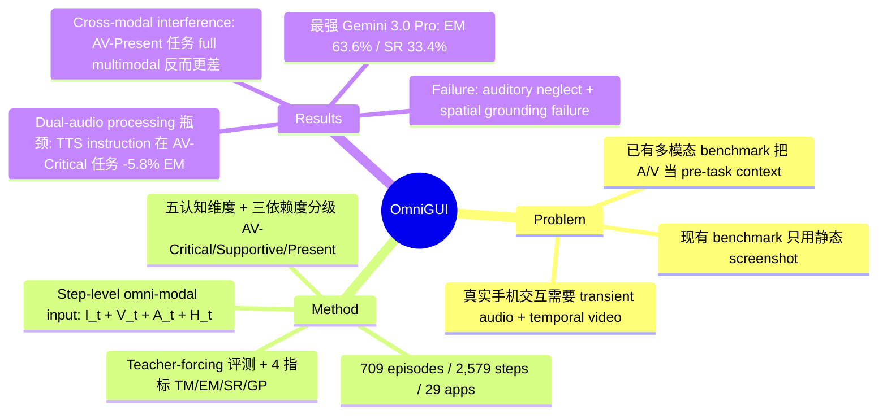

## Summary

首个 step-level 的 omni-modal 手机 GUI agent benchmark，要求模型在每个 action step 同时处理 image、video、audio 三模态输入；709 episodes / 2,579 steps 覆盖 29 个 app，按 AV-Critical / AV-Supportive / AV-Present 三档标注多模态依赖度；最强模型 Gemini 3.0 Pro 仅达 63.6% step-level EM，ablation 实验揭示 cross-modal interference 和 dual-audio processing 是核心瓶颈。

## Problem & Motivation

现有 GUI agent benchmark 几乎全部依赖静态 screenshot 作为输入，但真实手机交互包含大量 transient audio cues（通知音、语音指令、媒体播放状态）和 temporal video dynamics（UI 动画、视频播放进度、动态内容变化），这些信号与 action timing 紧密耦合，无法用单帧图像捕捉。已有多模态 benchmark（如 VideoWebArena、GUI-World）虽引入 audio/video，但将其作为 pre-task reference 而非 step-level synchronous input，无法评估模型对"此刻此秒"的多模态状态的感知能力。OmniGUI 填补这一空白，提供 continuous interleaved multimodal inputs at every action step。

## Method

### Benchmark 形式化

将手机 GUI 交互建模为序列决策过程。在每个 step *t*，agent 接收观测状态 S_t = (I_t, V_t, A_t, H_t)：

- **I_t**：当前高分辨率 screenshot
- **V_t**：从上一 action 到当前 step 的 temporal video clip
- **A_t**：同步 audio stream（系统音、媒体播放、语音指令）
- **H_t**：历史 action trajectory {a_1, ..., a_{t-1}}

Agent 预测 action a_t，从 13 个 action primitive 中选择（NONE、TAP、DOUBLE_TAP、LONG_PRESS、各方向 SWIPE、INPUT、BACK、HOME、TASK_COMPLETE、TASK_IMPOSSIBLE），坐标归一化到 [0,1000]×[0,1000]。

### 数据集构建

- **规模**：709 expert-demonstrated episodes（2,579 action steps），覆盖 29 个 app（15 中文 + 14 英文）
- **采集**：10 名 5+ 年 Android 经验的 native 用户，按 top-down HCI taxonomy 设计任务，在真实 Android 设备上录制 30 FPS 屏幕视频 + 内部音频 + touch events
- **任务分类**：按五个认知维度标注
  1. **Localization**（20.5% episodes / 446 steps）：从视觉或听觉描述定位空间坐标
  2. **Semantic Understanding**（19.3% / 530 steps）：理解文本/视觉/语音语义进行多步规划
  3. **Cross-modal Discrimination**（19.9% / 514 steps）：综合 video、audio、text 的互补信息
  4. **Temporal Reasoning**（22.0% / 617 steps）：追踪动态 UI 变化和事件序列
  5. **Instant Response**（18.3% / 472 steps）：对瞬态听觉或视觉 cue 快速反应

### 多模态依赖度分级

按 objective information availability（非模型表现）将 episodes 分为三档：

- **AV-Critical**（29.8% / 803 steps）：仅凭 screenshot 无法确定正确 action，decision-critical 信息只存在于 audio 或 video 中
- **AV-Supportive**（32.4% / 860 steps）：screenshot 足够但 audio/video 提供佐证上下文，降低歧义
- **AV-Present**（37.8% / 916 steps）：纯静态 UI 任务，audio/video 不含任务相关信息

Inter-annotator agreement Cohen's κ = 0.84（100 episodes 随机子集）。

### 评测协议

采用 step-level teacher-forcing：模型在每步接收 ground-truth history 并预测下一 action，隔离 per-step perception 能力，避免 cascading error。四个指标：

1. **Type Match (TM)**：action primitive 预测准确率
2. **Exact Match (EM)**：action type + parameters 均正确（坐标需落在 ground-truth bounding box 内）
3. **Success Rate (SR)**：episode 所有 step 均达 EM 才算成功
4. **Goal Progress (GP)**：episode 中 EM 正确步数占比

### 评测模型

- **Proprietary**：Gemini 3.0 Pro/Flash、Gemini 2.5 Pro/Flash
- **Open-source**：Qwen3-Omni、MiniCPM-o 4.5、VITA-1.5、Baichuan-Omni-1.5
- GPT-4o 因 Chat Completions API 不支持 interleaved raw audio-visual ingestion 而未纳入

统一 prompt（system + user message），greedy decoding（temperature 0.0），max tokens 4096。

## Key Results

### 整体表现

- **最强模型** Gemini 3.0 Pro：EM = 63.6%，SR = 33.4%
- **次强** Gemini 3.0 Flash：EM = 61.3%，SR = 30.3%
- **最强开源** Qwen3-Omni：EM = 32.3%，SR = 5.1%
- 其他开源模型 SR ≤ 1.1%，表现严重不足

### 认知维度分解

模型在静态 Localization 任务表现最好（Gemini 3.0 Pro: 76.2% EM），在 Cross-modal Discrimination（59.1% EM）和 Temporal Reasoning（61.8% EM）上最差，验证了整合动态时序和听觉 cue 的难度显著更高。

### Ablation 实验

**模态消融**：系统性 mask audio 和 video，验证 dependency taxonomy：

- AV-Critical 任务：移除 audio+video 导致最大性能下降（Gemini 3.0 Pro: −9.0% EM）
- AV-Present 任务：移除模态几乎无影响（Gemini 3.0 Pro: −0.3% EM）

**Cross-modal interference 发现**：对 Gemini 2.5 Flash 和 Qwen3-Omni，在 AV-Present 任务上提供完整多模态输入反而*降低*性能。Gemini 2.5 Flash 的 EM 从 49.9%（image-only）降至 40.8%（I+A+V），说明 task-irrelevant multimodal signals 会负面影响 action prediction accuracy。

**指令模态（Text vs. TTS）**：将文本指令替换为 TTS 音频：

- AV-Present 任务：TTS 几乎无惩罚（Δ ≈ 0.1% EM）
- AV-Critical 任务：TTS 导致显著下降（Gemini 3.0 Pro: −5.8% EM）

表明模型在 concurrent dual-audio processing（spoken instruction + environmental audio + dynamic video）时能力不足。

### Failure Cases

1. **Auditory Neglect**：Vimeo app 任务要求在旁白暂停时点击"Share"，模型在持续语音期间正确预测 NONE，但在音频暂停发生时未能触发 TAP，无法"将 step-level acoustic state change 映射到对应 action execution"。

2. **Spatial Grounding Failure**：Red Bull TV 任务要求听到解说员声音时激活字幕，模型正确识别 TAP 但预测坐标 (200,2400) 远离 ground-truth bounding box (1050,2100)，说明即使多模态理解成功，precise spatial grounding on complex visual interface 仍是挑战。

## Strengths & Weaknesses

**Strengths**：

1. **问题设定精准**：首次在 step-level 引入 continuous interleaved multimodal inputs，填补了 GUI agent benchmark 的关键空白——现有工作要么只用 screenshot，要么把 audio/video 当 pre-task context，都无法评估"此刻此秒"的多模态感知能力。
2. **Dependency taxonomy 设计严谨**：AV-Critical / AV-Supportive / AV-Present 三档分级基于 objective information availability 而非模型表现，Cohen's κ = 0.84 说明标注可靠；modality ablation 实验完美验证了分级有效性（AV-Critical 任务 mask 后性能大跌，AV-Present 任务几乎不受影响）。
3. **Cross-modal interference 发现有价值**：Gemini 2.5 Flash 在 AV-Present 任务上 full multimodal 反而比 image-only 差 9.1%，这是反直觉但重要的 architectural bottleneck，为未来 omni-modal model 设计指明方向（需要 task-irrelevant signal filtering 机制）。
4. **Dual-audio processing 瓶颈清晰**：TTS instruction 在 AV-Critical 任务上导致 −5.8% EM，说明当前模型无法同时处理 spoken instruction + environmental audio + dynamic video，这对 voice-controlled GUI agent 是致命弱点。

**Weaknesses**：

1. **评测协议局限**：step-level teacher-forcing 虽然隔离了 per-step perception 能力，但无法评估 agent 在 autonomous rollout 中的 error recovery 和 long-horizon planning 能力。SR = 33.4% 看似很低，但这是在"每步都给正确历史"的理想条件下；真实部署时 cascading error 会让成功率更惨。
2. **模型覆盖不全**：GPT-4o 因 API 限制未纳入，但它是 GUI agent 领域的重要 baseline；Claude 3.5 Sonnet、Gemini 2.0 Flash Thinking 等也未测试。开源模型中缺少 Qwen2.5-VL、InternVL 等近期强 baseline。
3. **数据规模偏小**：709 episodes / 2,579 steps 对于 benchmark 来说不算大，尤其是分到 29 个 app 后每个 app 平均只有 24 episodes；五个认知维度每个只有 400-600 steps，细分到 AV-Critical / AV-Supportive / AV-Present 后样本更少，统计显著性可能不足。
4. **Failure case 分析浅**：只给了两个定性案例（auditory neglect + spatial grounding failure），缺少系统性错误分类统计（如"模型在哪类 audio cue 上最容易失败""哪类 video dynamics 最难追踪"）；也没有分析 cross-modal interference 的具体 pattern（是 audio 干扰 vision 还是 video 干扰 audio？）。
5. **与真实部署的 gap**：benchmark 使用 expert-demonstrated episodes，任务都是"可完成"的；但真实用户指令可能 ambiguous、impossible、或需要 clarification，这些 out-of-distribution 场景未覆盖。

**潜在影响**：

- 对 GUI agent 方向：OmniGUI 会成为评估 omni-modal GUI agent 的标准 benchmark，尤其是 voice-controlled mobile assistant、accessibility tool、multimodal automation 等场景。
- 对 VLM 方向：cross-modal interference 和 dual-audio processing 瓶颈为 omni-modal model architecture 设计提供了明确优化目标（需要 modality gating、task-relevance filtering、concurrent audio stream separation 等机制）。
- 对 benchmark 设计：step-level synchronous multimodal input 的范式可能影响未来 embodied AI、web agent、desktop automation 等领域的 benchmark 设计。

## Mind Map

## Notes

- **与已有 GUI benchmark 的关系**：OmniGUI 与 OSWorld、AndroidWorld、GUI-Odyssey 等的核心区别在于 step-level synchronous multimodal input；后者要么只用 screenshot（OSWorld、ScreenSpot），要么把 video/audio 当 episode-level context（VideoWebArena、GUI-World）。OmniGUI 的 AV-Critical 任务（29.8%）是其他 benchmark 完全无法评估的。
- **Cross-modal interference 的 implication**：Gemini 2.5 Flash 在 AV-Present 任务上 I+A+V 比 I-only 差 9.1%，这不是"模型不够强"而是"模型缺少 task-irrelevant signal filtering 机制"。未来 omni-modal model 需要 explicit modality gating（类似 attention mask 但跨模态）或 task-relevance prediction module。
- **Dual-audio processing 是 voice-controlled agent 的死穴**：TTS instruction 在 AV-Critical 任务导致 −5.8% EM，说明当前模型无法 concurrent process spoken instruction + environmental audio。这对 Siri/Google Assistant 类 voice agent 是致命问题——用户说话时如果有背景音乐/通知音/视频播放，模型就会混淆。
- **Teacher-forcing 的利弊**：优点是隔离 per-step perception、避免 cascading error、保证 reproducibility；缺点是无法评估 error recovery、long-horizon planning、dynamic replanning。未来需要 interactive rollout 评测补充（但会牺牲 reproducibility）。
- **数据规模 vs. 标注质量 tradeoff**：709 episodes 不算大，但 step-level 标注 I_t + V_t + A_t + bounding box + dependency level 的成本极高；五认知维度 + 三依赖度分级的设计比单纯堆数量更有研究价值。这是 benchmark 设计的经典 tradeoff。
