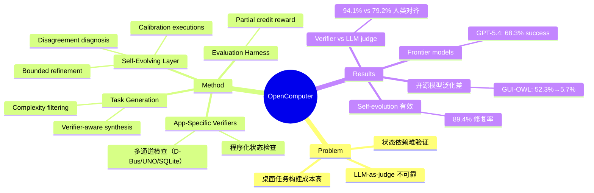

## Summary
提出 OpenComputer，一个以 verifier 为核心的 computer-use agent 评测框架，通过 app-specific 的程序化状态检查器（而非 LLM-as-judge）构建可验证的桌面任务环境，覆盖 33 个应用和 1000 个任务，实验显示硬编码 verifier 与人类判断对齐度达 94.1%（LLM judge 仅 79.2%），且开源模型在真实桌面任务上表现大幅低于 OSWorld 分数。

## Problem & Motivation
Computer-use agent 的训练和评测受限于构建真实、可复现桌面环境的成本。单个任务需要手动设计目标、准备环境状态（文件、配置、浏览器数据等）、确保软件状态一致性，过程繁琐且难以标准化。更关键的是，桌面任务的成功往往依赖应用状态、文件内容、元数据或持久化副作用，而非仅凭截图可见。LLM-as-judge 存在 prompt 敏感、观测不完整、模型偏见等问题，可能奖励视觉上看似正确但底层状态错误的结果。现有工作将 verification 视为下游细节，而非环境构建的组织原则。

## Method
OpenComputer 将 verification 作为核心设计原则，包含四个紧密耦合的组件：

### 1. App-Specific State Verifiers
为每个支持的应用构建合成 Python verifier 模块，运行在 sandbox 内，暴露 CLI 子命令并输出 JSON。Verifier 覆盖所有可靠检查的状态表面，包括内容状态、偏好设置、插件、历史记录、书签、文件 I/O、项目结构、媒体状态、图形属性和元数据。

**检查通道**因应用而异，可能包括浏览器调试协议、D-Bus、LibreOffice UNO、基于 SQLite 的配置数据库、无障碍状态或直接文件解析。验证基于实际可观测状态，而非启发式匹配。

**Endpoint 构建流程**：枚举可检查的状态表面 → 映射到具体验证通道 → 实现查询和检查 endpoint 并输出结构化 JSON → 在应用特定的 README 中记录。

**Verifier 测试协议**：将 verifier 视为软件制品，包含 endpoint 引用、书面测试计划和实时集成测试，覆盖预期断言、真实 fixture、正负样例、JSON 有效性检查和常见失败模式。失败的 endpoint 进入 debug-fix-retry 循环。

### 2. Self-Evolving Verification Layer
初始 verifier 生成后，通过自演化循环提升可靠性：

- **Calibration executions**：每个应用运行约 15 个简单到中等难度的任务，由 SOTA agent 执行，缓存完整轨迹和最终环境状态。
- **Disagreement diagnosis**：LLM evaluator 对相同最终状态生成 criterion-level 的参考判决。Comparator 将其与程序化 verifier 输出对齐，识别分歧并分类为真实 agent 失败或 verifier 侧错误。
- **Bounded verifier refinement**：仅允许修改验证栈（checker 代码、endpoint 实现、文档），不得修改缓存的轨迹、sandbox 状态或任务规范。迭代直到 verifier 与参考判断一致，或耗尽固定预算。

### 3. Task Generation Pipeline
通过 verifier-aware 的合成流程生成任务：

1. **Proposal**：Generator 从真实用户目标提议候选任务，不直接依赖可用 verifier endpoint，鼓励多样性。
2. **Filtering**：按复杂度（优先多步骤工作流，处于难度上半区）和数据可生成性过滤候选。
3. **Verification grounding**：若预期状态可被现有 endpoint 检查，保留任务；若可检查但尚未暴露，扩展 verifier 添加新 endpoint。
4. **Environment materialization**：生成并打包所需文件、文件夹、配置、工件。

每个最终任务存储为 τ=(x,e,c)，其中 x 是面向用户的指令，e 初始化 sandbox，c 指定可执行的成功标准。

### 4. Evaluation Harness and Reward Computation
评测时，harness 将 verifier 和任务制品上传到新 sandbox，启动目标应用，运行 screenshot-action 循环。完成后，在 sandbox 内执行任务 checker 命令。任务奖励为 R = N_pass/N_total，支持机器可检查的部分分数。

## Key Results

### 主要性能（1000 任务，33 应用）

| Model | OSWorld | Success Rate | Avg Steps | Time/Step | Avg Reward |
|-------|---------|-------------|-----------|-----------|------------|
| GPT-5.4 | 75.0% | 68.3% | 19.0 | 16.5s | 88.4% |
| Claude-Sonnet-4.6 | 72.5% | 64.4% | 31.5 | 20.8s | 76.6% |
| Kimi-K2.6 | 73.1% | 58.8% | 35.7 | 33.0s | 70.7% |
| Qwen-3.5-27B | 56.2% | 32.3% | 33.1 | 57.3s | 59.4% |
| Gemini-3-Flash | – | 16.4% | 25.4 | 9.0s | 37.0% |
| EvoCUA-8B | 46.1% | 10.9% | 67.0 | 9.7s | 38.1% |
| Qwen-3.5-9B | 41.8% | 7.8% | 39.3 | 17.8s | 31.7% |
| GUI-OWL-1.5-8B | 52.3% | 5.7% | 73.6 | 9.43s | 27.8% |

- GPT-5.4 最佳但仍有近 1/3 任务失败
- 开源模型从 OSWorld 分数大幅下降（GUI-OWL-1.5-8B 从 52.3% 降至 5.7%），泛化能力有限
- Partial credit 显著高于 success rate（GPT-5.4: 88.4% vs 68.3%），表明 agent 常完成大部分但非全部子任务

### Ablation: Hard-Coded Verifier vs. LLM-as-Judge（120 任务，人工标注）

| Metric | LLM Judge | Hard-coded Verifier |
|--------|-----------|-------------------|
| Task-level alignment | 79.2% (95/120) | 94.1% (113/120) |
| Checklist agreement | 92.2% | 97.3% |

硬编码 verifier 与人类判断对齐度显著更高，尤其在密集桌面界面中，语义重要的错误往往视觉上微小。对于终端密集型应用，差距更大，因为成功依赖于滚动日志或不同时可见的工件。

### Ablation: GUI vs. CLI Agents（14 应用，343 个 CLI 兼容任务）

| Setting | Model | Success Rate | Time |
|---------|-------|-------------|------|
| GUI | GPT-5.4 | 75.2% | 288s |
| GUI | Claude Sonnet 4.6 | 73.0% | 622s |
| CLI | Claude Sonnet 4.6 (Code) | 67.2% | 141s |

GUI agent 通过率更高，但 CLI agent 速度显著更快（141s vs 288-622s），反映绕过 screenshot-action 循环的效率优势。

### Self-Evolving Verification Layer 效果
450 次 calibration 执行中，159 次出现分歧，76 次归因于 checker 侧错误。自演化流程修复了 68/76（89.4% 修复率）：
- 47 次在 1 轮内修复
- 15 次在 2 轮内修复
- 6 次在 3 轮内修复
- 8 次在预算内未修复

Human-checker 对齐度从演化前 85.2% 提升至 94.1%（+8.9%）。

## Strengths & Weaknesses

**Strengths:**
- **Verification 作为一等公民**：将 verifier 从下游细节提升为环境构建的组织原则，是范式转变。硬编码 verifier 与人类判断对齐度（94.1%）远超 LLM judge（79.2%），尤其在状态依赖的桌面任务中。
- **Self-evolving layer 实用**：89.4% 的 checker 错误修复率和 +8.9% 的对齐度提升证明了自动化 verifier 改进的可行性。
- **揭示泛化问题**：开源模型在 OpenComputer 上的表现（5.7%-32.3%）与 OSWorld 分数（41.8%-56.2%）的巨大差距，暴露了现有 benchmark 的过拟合风险。
- **Partial credit 有信息量**：Avg Reward 指标揭示 agent 常完成大部分子任务但卡在最后一步，比二元 success rate 更细粒度。
- **基础设施价值**：支持 SFT 数据收集、RL 训练（机器可检查奖励）、rejection sampling，不仅是评测工具。

**Weaknesses:**
- **Verifier 覆盖边界**：17 个生成任务因无法完全硬编码验证而被排除（如 Draw.io 中箭头是否"视觉上和语义上连接两个特定框"）。对于需要几何或视觉判断的任务，程序化验证存在固有局限。
- **应用 schema 漂移风险**：Verifier 可能查询过时的数据库 schema（如 darktable 案例中 tag 定义从 library.db 迁移到 data.db），虽然 self-evolving layer 可检测和修复，但需要持续维护成本。
- **终端可观测性限制**：截图仅捕获一个滚动位置和一个窗格布局，视觉 judge 无法评估完整执行历史。虽然硬编码 verifier 可解决，但也意味着某些任务类型天然不适合纯视觉评测。
- **Frontier model 仍不够**：GPT-5.4 在 68.3% success rate 下仍有 1/3 任务失败，且 Avg Reward 88.4% 意味着即使"接近成功"的任务也有 11.6% 的 check 未通过。端到端可靠性远未饱和。
- **开源模型崩溃式下降**：GUI-OWL-1.5-8B 从 OSWorld 52.3% 降至 5.7%，Qwen-3.5-9B 从 41.8% 降至 7.8%，表明这些模型可能过拟合了 OSWorld 的特定任务分布或环境设置，跨 benchmark 泛化能力堪忧。

**潜在影响:**
- 为 computer-use agent 研究提供了可扩展的评测和训练基础设施，verifier-grounded 范式可能成为未来 benchmark 设计的标准。
- 揭示的泛化问题警示社区：在单一 benchmark 上的高分不等于真实桌面任务能力，需要更多样化的评测集。
- Self-evolving verification layer 的成功为自动化 benchmark 维护提供了思路，可能降低长期维护成本。

## Mind Map

## Notes
- **与 OSWorld 的关系**：论文多次对比 OSWorld 分数，但未详细说明 OpenComputer 与 OSWorld 在任务分布、应用覆盖、环境设置上的具体差异。开源模型的巨大性能落差可能源于：(1) OSWorld 任务更简单或更模式化；(2) 开源模型在 OSWorld 训练集上过拟合；(3) OpenComputer 任务更接近真实用户工作流。需要进一步分析任务难度分布。
- **Verifier 可扩展性**：33 个应用平均 17.7 个 endpoint，意味着每个新应用需要实现约 18 个检查函数。虽然有测试协议和自演化机制，但初始 verifier 开发成本仍然不低。未来是否可以通过 LLM 辅助生成 verifier 代码，或从应用 API 文档自动合成 endpoint？
- **CLI vs GUI 的启示**：CLI agent 速度快但准确率略低（67.2% vs 75.2%），可能因为 CLI 缺少视觉反馈导致错误累积。是否可以设计 hybrid agent，在关键步骤用 GUI 确认，其余用 CLI 加速？
- **Partial credit 的训练价值**：Avg Reward 指标不仅用于评测，也可作为 RL 训练信号。相比二元奖励，细粒度反馈可能加速策略学习。但需要注意 reward shaping 是否引入 bias（如 agent 学会完成容易的 check 而放弃困难的）。
- **17 个被排除任务的性质**：论文提到因无法完全硬编码验证而排除 17 个任务，但未给出具体例子（除了 Draw.io 箭头连接）。这些任务是否代表了一类重要的用户需求？如果是，纯程序化验证的范式可能遗漏关键能力维度。
