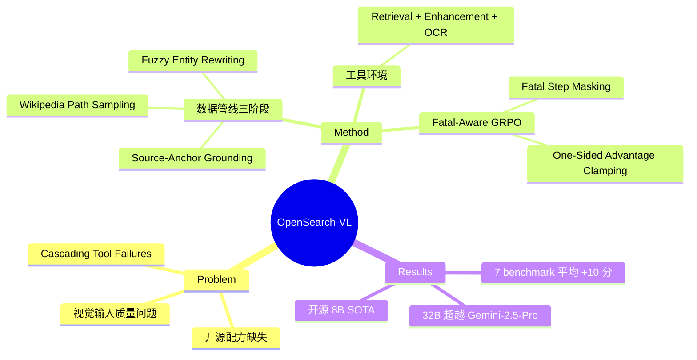

## Summary

OpenSearch-VL 提供首个完全开源的 Multimodal Deep Search Agent 训练配方，覆盖数据管线（36k SFT + 8k RL 轨迹）、工具环境（检索+增强+OCR）和训练算法（Fatal-Aware GRPO）三部分。核心创新是 multi-turn fatal-aware GRPO：通过 fatal step masking 和 one-sided advantage clamping 处理 cascading tool failures，避免整条轨迹因中间失败而完全丢失有效前缀。在 7 个 benchmark 上平均提升 10+ 分，与闭源商业模型性能相当。

## Problem & Motivation

现有 frontier multimodal search agents（如商业搜索助手）的训练数据、代码和轨迹均为闭源，社区缺乏可复现、可分析的完整配方。具体挑战包括：

1. **高质量训练数据稀缺**：需要多跳推理和工具使用的轨迹数据难以获取
2. **真实视觉输入缺陷**：模糊、低分辨率、透视畸变等质量问题
3. **RL 训练的 Cascading Failure 问题**：长程工具调用中，一个工具失败会级联导致后续步骤全部失败，整条轨迹被判无效，有效推理前缀被浪费

这篇工作与 agentic RL 领域的 credit assignment 问题高度相关——如何将稀疏终点奖励合理分配到中间步骤，尤其是处理失败轨迹中的有效前缀。

## Method

### 1. Data Curation Pipeline（三阶段）

**Stage 1: VQA Construction**
- **Wikipedia Path Sampling**：从 Wikipedia 超链接图中采样 2-4 hop 的多跳实体路径，分配 anchor（视觉入口）、bridge nodes（中间实体）、answer node（目标属性）三种功能角色
- **Fuzzy Entity Rewriting**：将实体名替换为关系/属性描述，防止 shortcut retrieval。重写需满足：答案不变、唯一性、不泄露实体名
- **Source-Anchor Visual Grounding**：anchor 实体位于路径起点（而非答案附近），要求 agent 识别视觉 anchor 并沿关系链推理

**Stage 2: Filtering & Enhancement**
- 合并 LiveVQA、FVQA、WebQA 数据集
- 使用 frozen Qwen3-VL-32B 两阶段难度过滤：移除无需工具即可回答的样本，移除单次图像搜索即可解决的样本
- 10% 数据施加可控退化（模糊、下采样、透视畸变），配合增强工具标注，鼓励 "think-with-image" 行为

**Stage 3: Multi-turn Trajectory Synthesis**
- Claude Opus 4.6 对真实工具环境生成 K=5 条 rollout
- 两阶段拒绝过滤：答案正确性（GPT-4o judge）+ 过程质量（GPT-5.4 judge 评分工具使用、逻辑一致性、无无效重复）
- 最终产出 36,592 条高质量轨迹，平均 6.3 步工具调用

### 2. Tool Environment

| 功能类别 | 工具 | 用途 |
|---------|------|-----|
| Retrieval | TextSearch, ImageSearch | 获取外部证据 |
| Image Enhancement | Sharpen, SuperResolution (EDSR), PerspectiveCorrect | 补救低质量输入 |
| Attention & Parsing | Crop, OCR | 局部定位和细粒度内容提取 |

### 3. Training Algorithm

**Stage 1: Supervised Fine-Tuning**
- 标准 autoregressive SFT，监督 reasoning traces 和 tool invocations
- Tool observations 仅作为 conditioning context，不参与 loss（retrieved-token masking）

**Stage 2: Multi-Turn Fatal-Aware GRPO**
- **Composite Multi-Turn Reward**：format reward（结构完整性，乘法门控）+ accuracy reward（二元终态，GPT-4o judge）+ query-quality reward（过程信号，GPT-5.4 四维评分：相关性、递进性、信噪比、跨模态互补使用），accuracy 权重 α=0.8
- **Fatal-Aware Token Masking**：定义 fatal step index f_i 为首次出现连续 3 次工具执行错误的步骤。Mask 掉 fatal step 之后的所有 token（loss 置零），保留有效前缀可训练
- **One-Sided Advantage Clamping**：对于 fatal 轨迹，若 advantage > 0（前缀优于组内均值），保留用于强化；否则 clamp 到零，避免无效惩罚

## Key Results

**Main Results (Table 2)**

| Model | SimpleVQA | VDR | MMSearch | LiveVQA | BrowseComp-VL | FVQA | InfoSeek | Avg |
|-------|-----------|-----|----------|---------|---------------|------|----------|-----|
| OpenSearch-VL-8B | 71.6 | 20.8 | 64.5 | 59.6 | 37.6 | 71.5 | 70.2 | **56.6** |
| OpenSearch-VL-30B-A3B | 74.9 | 33.5 | 68.7 | 67.4 | 41.1 | 73.2 | 72.4 | **61.6** |
| OpenSearch-VL-32B | 76.2 | 33.8 | 72.3 | 70.5 | 43.8 | 74.7 | 74.8 | **63.7** |

- OpenSearch-VL-30B-A3B 相比 Qwen3-VL-30B-A3B agentic baseline 提升显著（47.8 → 61.6，+13.8 avg）
- OpenSearch-VL-32B 超越 Gemini-2.5-Pro direct-reasoning（46.0 avg）
- 开源 8B 模型超越前 SOTA 开源 8B agent（SenseNova-MARS-8B 52.7 avg）+3.9 分

**Ablation (8B model)**

数据管线消融：
- 移除 source-anchor grounding：avg -11.5
- 移除 fuzzy entity rewriting：avg -10.3
- 移除 staged filtering：avg -8.2
- 移除 enhancement subset：avg -1.3

RL 配方消融：
- SFT only：64.6
- Vanilla GRPO：67.6 (+3.0)
- Hard masking (Vision-DeepResearch baseline)：67.7 (+0.1 vs vanilla，几乎无增益)
- Fatal masking only：69.1 (+1.5 vs vanilla)
- Fatal masking + one-sided clamping（完整方法）：**71.8** (+4.2 vs vanilla GRPO)

## Strengths & Weaknesses

**亮点**：
- **开源完整性**：首个覆盖数据、代码、模型的全流程开源配方，填补社区空白
- **Fatal-Aware GRPO 设计巧妙**：one-sided clamping 避免有效前缀被无效惩罚，相比 hard masking（Vision-DeepResearch）提升 4.1 分，证明方法有效性
- **Source-Anchor Grounding 设计精巧**：anchor 位于路径起点而非答案附近，强制 agent 进行真正的多跳推理而非 shortcut retrieval
- **数据管线消融充分**：各组件贡献清晰量化（-11.5/-10.3/-8.2/-1.3）

**局限**：
- **依赖闭源模型做 judge**：GPT-4o judge accuracy、GPT-5.4 judge process quality——评分成本高且本身不可复现，形成"开源配方依赖闭源评估"的悖论
- **Judge 仅评估文本 query**：视觉操作（crop、enhancement）的质量未纳入奖励信号，reward 存在盲区
- **Institution 未标注**：arXiv 页面未列出作者机构，透明度不足
- **训练成本高**：RL 阶段需 10 天 × 64 H20 GPU
- **外部工具环境漂移**：搜索排序变化、fetch 失败等导致可复现性挑战，作者也承认这一点

**对 Agentic RL 领域的启示**：
- 与 SOLAR-RL 的 first failure point detection 异曲同工：OpenSearch-VL 用 fatal step masking 处理 cascading failures，SOLAR-RL 用 first failure point 做 credit assignment——两者都在解决同一问题
- One-sided advantage clamping 是对 hard masking 的有效改进，值得在其他 agent RL 场景验证

## Mind Map

## Notes

- 与 [[2604-SOLAR-RL]] 的 first failure point detection 思路高度相似，但应用场景不同（search agent vs GUI agent），技术实现也不同（fatal step masking + one-sided clamping vs validity detection + reward alignment）
- Query-quality reward 使用 GPT-5.4 judge——这是 GPT-5 系列的明确引用，值得追踪
- Data pipeline 的 fuzzy entity rewriting 和 source-anchor grounding 是防止 shortcut 的关键设计，可借鉴到其他多跳推理任务
- 建议对比 [[2604-RAGEN2]] 和 [[2604-WorldR1]] 确认 agentic RL 的最新进展