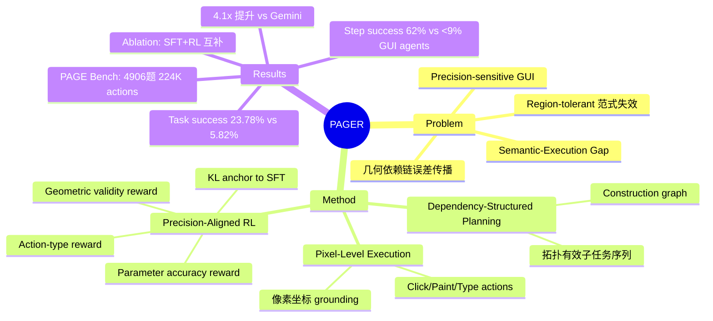

## Summary
提出 precision-sensitive GUI 任务范式，指出现有 region-tolerant 范式在几何作图等需要精确点击的任务上失效。构建 PAGE Bench（4,906 题、224K 像素级标注），提出 PAGER agent 通过 dependency-structured planning + pixel-level execution + precision-aligned RL 将 task success 从 <6% 提升至 23.78%。

## Problem & Motivation
现有 GUI agent 采用 region-tolerant 范式（点击组件边界内任意位置即可），但在几何作图等 precision-sensitive 任务中失效：必须精确点击连续画布上的特定点，且几何对象间存在拓扑依赖（如线段依赖端点），局部坐标误差会通过依赖链传播导致级联失效。作者发现 **Semantic-Execution Gap**：模型能理解操作类型（action type accuracy >88%）但无法精确执行（task success <6%）。

## Method
**PAGER** 将几何作图分解为两阶段：

1. **Dependency-Structured Planning**：从问题归纳 construction graph，识别几何对象及其依赖关系，生成拓扑有效的子任务序列（依赖对象先于被依赖对象构造）。

2. **Pixel-Level Execution**：将每个子任务 ground 到具体 GUI action（click / paint / type），action 表示为 `(operation_type, object_type, parameters)`，parameters 包含像素坐标、几何参数、视觉样式、标签位置。

**训练流程**：
- **Pixel-Grounded SFT**：将 GeoGebra 几何坐标投影到像素空间，最大化 reference action 的 log-likelihood。建立 executable action grammar 但存在 exposure bias（训练时看 reference canvas，推理时看 self-generated canvas）。
- **Precision-Aligned RL**：用复合 reward 缓解 exposure bias：
  - λ_a：action-type matching reward（操作类型正确性）
  - λ_p：parameter accuracy reward（参数距离的指数衰减，click 用 bounding box、paint 用像素距离、type 用文本一致性）
  - λ_g：geometric validity reward（对比渲染结果与 reference 的 anchor 位置、关系、布局）
  - 加 KL divergence 项锚定 SFT policy 以保留可执行性

**Error Propagation Model**：形式化误差如何通过依赖链传播，用 Jacobian 矩阵捕获构造依赖，证明 precision-aligned training 的必要性。

## Key Results
**PAGE Bench**：4,906 几何题（4,443 train / 463 test），53,277 高层任务，224,497 低层 action（47.73% click、40.31% paint、11.97% type），94.11% 题目为中高难度。

**主要结果**（Overall score = 综合指标）：

| Model | Action Acc | Param Acc | Step Success | Task Success | Overall |
|-------|-----------|-----------|--------------|--------------|---------|
| Claude-Sonnet-4.6 | **95.85** | 42.51 | 42.51 | 1.11 | 18.03 |
| GPT-5.4 | 88.34 | 59.82 | 59.82 | 4.54 | 21.07 |
| Gemini-3.1-Pro | 94.60 | **66.68** | **66.66** | 5.82 | 24.36 |
| PAGER | 82.62 | 62.76 | 62.20 | **23.78** | **29.52** |

- **Semantic-Execution Gap 显著**：Claude action accuracy 95.85% 但 task success 仅 1.11%
- PAGER task success 比最强 baseline（Gemini-3.1-Pro）高 **4.1×**
- 对比 GUI-specialized agents（UI-TARS / OS-ATLAS），PAGER 将 step success 从 <9% 提升至 62%+

**Ablation**：

| Variant | Overall | Task Success |
|---------|---------|-------------|
| SFT only | 20.47 | 4.48 |
| w/o RL_param | 20.07 | 5.62 |
| w/o RL_action | 24.52 | 15.90 |
| Full PAGER | **29.52** | **23.78** |

- SFT 提供强执行先验（48.47 param accuracy）
- 去掉 parameter-accuracy RL 几乎无变化，说明仅 action-level 正确性无法保持几何结构
- 去掉 action-type RL 仍有提升，说明连续空间精度是核心
- 两个 RL reward **互补**：action-type 稳定语义执行顺序，parameter-accuracy 提升点级控制

**Human Evaluation**：自动指标与人类判断相关性 r=0.9397，证明 benchmark 捕获真实几何有效性。

## Strengths & Weaknesses
**Strengths**：
- **问题定义清晰**：precision-sensitive GUI 是真实痛点，Semantic-Execution Gap 用数据说话（Claude 95% action accuracy vs 1% task success）
- **方法设计合理**：dependency-structured planning 防止级联错误，precision-aligned RL 直接优化几何有效性而非代理指标
- **Benchmark 质量高**：224K 像素级标注，closed execution loop 保证可执行性，94% 中高难度题目有区分度
- **Ablation 充分**：证明 SFT + RL 两阶段必要性，两个 RL reward 互补

**Weaknesses**：
- **领域局限**：仅在 GeoGebra 平面几何验证，泛化到 CAD / 图表编辑 / 科学可视化需要额外 action grammar 和 validity rules
- **Failure case 分析浅**：case study 指出"参数不稳定 + 约束保持弱"，但未深入分析哪些几何关系（共线 / 垂直 / 相切）最难保持，哪些依赖链长度导致误差爆炸
- **与 GUI-specialized agents 对比不公平**：UI-TARS / OS-ATLAS 等未在几何任务上训练，step success <9% 可能因 domain mismatch 而非方法缺陷
- **RL reward 设计启发式**：λ_a / λ_p / λ_g 权重如何选择？geometric validity reward 的 anchor / relation / layout 如何定义？缺少消融
- **推理成本未报告**：dependency-structured planning 是否需要多轮 LLM 调用？pixel-level execution 的 latency？

**潜在影响**：
- 为 precision-sensitive GUI（CAD / 图表 / 科学绘图）提供新范式
- Semantic-Execution Gap 概念可推广到其他需要精确控制的 agent 任务（机器人操作 / 代码编辑）
- PAGE Bench 可作为 GUI agent 的 hard benchmark，区分"能点对按钮"和"能精确控制"

## Mind Map

## Notes
- **与 [[2506-macOSWorld- A Multilingual Interactive Benchmark for GUI Agents]] 对比**：macOSWorld 是 region-tolerant 范式的典型 benchmark，PAGER 指出这类 benchmark 无法评估 precision-sensitive 能力
- **与 [[ScaleInvariant-Grounding-GUI]] idea 关联**：PAGER 的 pixel-level execution 面临 scale variance 问题（窗口大小变化导致坐标映射失效），可能受益于 scale-invariant grounding
- **与 [[ForkPoint-CreditAssignment-GUI]] idea 关联**：PAGER 的 RL 用 geometric validity reward 做 credit assignment，但未显式建模 fork point（哪一步开始偏离正确轨迹）
- **疑问**：为什么 parameter accuracy reward 的 ablation（w/o RL_param）几乎无效果？是否因为 geometric validity reward 已隐式包含参数精度信号？
- **启发**：Semantic-Execution Gap 可能在其他 agent 任务中普遍存在——模型"知道做什么"但"做不到"。可以用类似 precision-aligned RL 的思路优化 low-level control
