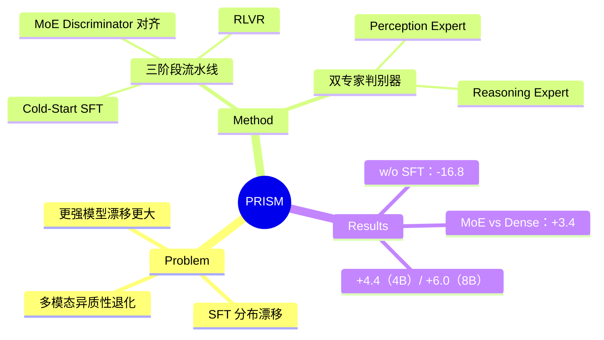

## Summary
提出 PRISM 三阶段后训练流水线，在 SFT 和 RLVR 之间插入分布对齐阶段。通过 MoE discriminator 的对抗式 on-policy distillation，解决 SFT 导致的分布漂移问题，在 Qwen3-VL 上比标准 SFT→RLVR 基线提升 +4.4（4B）和 +6.0（8B）平均准确率。

## Problem & Motivation
SFT 采用 uniform token-level imitation，不区分过程和结果，导致模型学习表面模式而非真实推理能力。这种分布漂移在多模态场景更严重——视觉 grounding 和逻辑推理以不同方式退化。作者观察到"反直觉现象"：离线监督可能让模型处于"妥协状态"——既不匹配示范分布也不保留原始分布。更强的基座模型漂移代价更大。

## Method
PRISM 三阶段流水线：

**Stage 1: Cold-Start SFT**
- 构建高质量多模态推理语料，筛选强模型通过率为 0 的问题
- Gemini 3 Flash 生成解答，三阶段过滤（格式/LLM 验证/正确性）
- 113K 精选样本（107K 用于 SFT，6K 高质量用于 alignment/RL）+ 1.26M 公开示范 = ~1.37M 总量
- 全参数 SFT，1 epoch

**Stage 2: Distribution Alignment via On-Policy Distillation**
- **MoE Discriminator**：双专家架构——Perception Expert (D_v) 评估视觉描述 grounding，Reasoning Expert (D_r) 评估推理链一致性
- 组合分数：r(x,y) = α·D_v(x,c) + (1-α)·D_r(x,t)
- **对抗训练**：discriminator 用 Bradley-Terry loss 训练，policy 用 GRPO 从 discriminator reward 优化
- 故意移除 KL 正则化（会阻碍纠正 SFT 分布漂移）
- 交替更新 policy 和 discriminator，500 steps

**Stage 3: RLVR**
- 用 6K 保留样本，按难度筛选（pass rate ∈ [0.2, 0.8]），得到 ~2K 样本
- 算法无关，测试了 GRPO/DAPO/GSPO
- 1500 steps

## Key Results
**Qwen3-VL-4B**：PRISM+GRPO 66.2 vs SFT→GRPO 61.8 (+4.4)；PRISM+DAPO 66.3；PRISM+GSPO 65.8

**Qwen3-VL-8B**：PRISM+GRPO 69.3 vs SFT→GRPO 63.3 (+6.0)；PRISM+DAPO 68.9；PRISM+GSPO 68.7

**Ablation（4B + GRPO）**：
- MoE vs Dense discriminator：66.2 vs 62.8 (−3.4)
- w/o Alignment：61.8 (−4.4)——退化为标准 SFT→RLVR
- w/o SFT：49.4 (−16.8)——对抗训练完全崩溃
- Text-only discriminator：62.3——产生"鹦鹉对齐"，听起来像监督但缺乏真实视觉感知

**分析**：Perception expert 早收敛、Reasoning expert 晚收敛且有震荡，证实多模态漂移的异质性。Token 效率分析显示 PRISM 生成的推理更简洁。

## Strengths & Weaknesses
**亮点**：
1. 问题诊断精准——指出 SFT 分布漂移在多模态场景的异质性（视觉 vs 推理），并用 MoE 解耦纠正
2. Ablation 设计扎实——特别是 w/o SFT 的 -16.8 跌幅证明 alignment 不能跳过 SFT 冷启动，MoE vs Dense 的 -3.4 说明单判别器会混淆信号
3. 三阶段框架清晰——alignment 的价值在下游 RLVR 才体现，不是独立目标

**局限**：
1. MoE discriminator 用四个 Qwen3-VL-2B，增加了训练复杂度——对比 dense 方案的计算开销未量化
2. 依赖 Gemini 3 Flash 生成示范，方法可复现性受限——如果 supervision 本身有 bias 会怎样？
3. 只测试了 Qwen3-VL，其他 VLM 架构是否受益未验证
4. 6K 样本筛到 2K 用于 RLVR，样本效率的代价是什么？更大数据量下 alignment 是否还有必要？

**疑问**：
- 移除 KL 正则化的设计——在某些任务上可能导致 mode collapse？
- Discriminator 和 Policy 交替更新的频率敏感度？

## Mind Map

## Notes
- 思考：on-policy distillation 作为中间阶段而非终点的思路是否可迁移到其他模态？比如 audio-LLM？
- 相关工作：跟 LLM 的 on-policy distillation（GKD、MiniLLM）的关系——本文定位为 alignment stage 而非 terminal objective
- 实验细节：perception expert 早收敛、reasoning expert 晚收敛的发现很有价值——暗示 future work 可以做更细粒度的专家调度